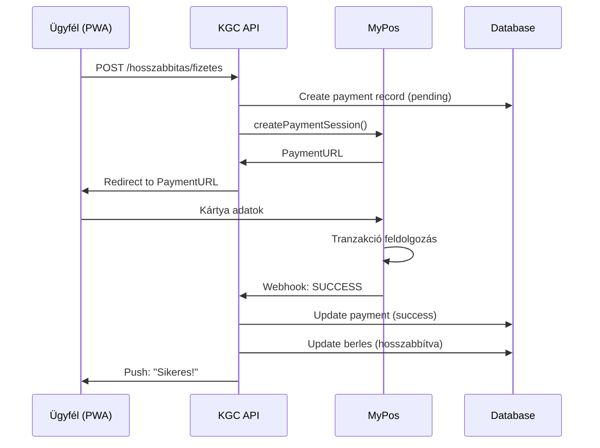

# ADR-005: MyPos Payment Token Storage Strategy

**Státusz:** Accepted
**Dátum:** 2025-12-08
**Döntéshozók:** Architect, PM, Security Lead
**Kapcsolódó:** ADR-002 (Offline Strategy)

---

## Kontextus

A KGC ERP v3 rendszerben bevezetésre kerül a **kártyás kaució kezelés** MyPos integráción keresztül. Az ügyfél megjegyzése:

> *"Kaució: egy hónapja szerződtünk a MyPos-al, ahol van lehetőség kártyára visszatenni pénzt. Ez lehetőséget ad, hogy a kauciót kártyával fizessék, de ebben az esetben 2% kényelmi díj kerülne levonásra..."*

A kaució visszatérítéséhez szükséges a **payment token** (kártya azonosító) tárolása, ami biztonsági és compliance kérdéseket vet fel.

---

## Döntési Kérdés

**Hogyan tároljuk biztonságosan a MyPos payment tokeneket a kaució visszatérítés céljából?**

---

## Döntési Tényezők

1. **PCI-DSS Compliance** - Kártya adatok tárolása szigorú szabályozás alá esik
2. **Token Élettartam** - MyPos tokenek 30-180 napig érvényesek
3. **Visszatérítési Követelmény** - Ugyanarra a kártyára kell visszafizetni
4. **GDPR** - Személyes adat tárolási jogalap
5. **Költség** - Implementációs és audit költségek

---

## Vizsgált Opciók

### Opció A: Titkosított Tárolás (Javasolt)

**Leírás:** A payment token AES-256-GCM titkosítással tárolva a saját adatbázisban.

```sql
CREATE TABLE MYPOS_PAYMENT (
  payment_id INT AUTO_INCREMENT PRIMARY KEY,
  tenant_id UUID NOT NULL,
  berles_id INT NOT NULL,
  transaction_id VARCHAR(100) NOT NULL UNIQUE,
  payment_token_encrypted VARBINARY(512) NOT NULL,  -- AES-256-GCM
  payment_token_iv VARBINARY(16) NOT NULL,          -- Initialization Vector
  amount DECIMAL(10,2) NOT NULL,
  fee_amount DECIMAL(10,2) DEFAULT 0,
  created_at DATETIME DEFAULT CURRENT_TIMESTAMP,
  refund_status ENUM('pending', 'refunded', 'failed', 'expired') DEFAULT 'pending',
  refunded_at DATETIME NULL,
  refund_amount DECIMAL(10,2) NULL,
  token_expiry DATE NOT NULL,
  FOREIGN KEY (berles_id) REFERENCES BÉRLÉS(berles_id),
  INDEX idx_mypos_berles (berles_id),
  INDEX idx_mypos_refund_status (refund_status),
  INDEX idx_mypos_expiry (token_expiry)
);
```

**Titkosítási Architektúra:**

```
┌─────────────────────────────────────────────────────────────┐
│                    TITKOSÍTÁSI FOLYAMAT                     │
├─────────────────────────────────────────────────────────────┤
│                                                             │
│  MyPos API ──► payment_token ──► AES-256-GCM ──► DB        │
│                                       │                     │
│                                       ▼                     │
│                              ┌─────────────────┐            │
│                              │ Encryption Key  │            │
│                              │ (ENV / Vault)   │            │
│                              └─────────────────┘            │
│                                                             │
│  VISSZAFEJTÉS (csak visszatérítéskor):                     │
│                                                             │
│  DB ──► encrypted_token ──► AES-256-GCM decrypt ──► MyPos  │
│                                                             │
└─────────────────────────────────────────────────────────────┘
```

**Előnyök:**
- ✅ Teljes kontroll az adatok felett
- ✅ Offline módban is működik (token már tárolva)
- ✅ Egyszerűbb implementáció

**Hátrányok:**
- ❌ PCI-DSS SAQ-D audit szükséges lehet
- ❌ Kulcskezelési felelősség
- ❌ Biztonsági kockázat ha a kulcs kompromittálódik

---

### Opció B: MyPos Tokenization Service

**Leírás:** Csak egy referencia ID tárolása, a tényleges token a MyPos rendszerében marad.

```sql
CREATE TABLE MYPOS_PAYMENT (
  payment_id INT AUTO_INCREMENT PRIMARY KEY,
  tenant_id UUID NOT NULL,
  berles_id INT NOT NULL,
  mypos_reference_id VARCHAR(100) NOT NULL,  -- Csak referencia!
  amount DECIMAL(10,2) NOT NULL,
  fee_amount DECIMAL(10,2) DEFAULT 0,
  created_at DATETIME DEFAULT CURRENT_TIMESTAMP,
  refund_status ENUM('pending', 'refunded', 'failed') DEFAULT 'pending',
  ...
);
```

**Előnyök:**
- ✅ PCI-DSS compliance a MyPos felelőssége
- ✅ Nincs érzékeny adat a rendszerben

**Hátrányok:**
- ❌ Függőség a MyPos API-tól (offline nem működik)
- ❌ Magasabb API költségek
- ❌ Nem biztos, hogy a MyPos támogatja ezt a modellt

---

### Opció C: Nincs Token Tárolás

**Leírás:** Minden visszatérítés manuális banki átutalással.

**Előnyök:**
- ✅ Nincs biztonsági kockázat
- ✅ Nincs compliance követelmény

**Hátrányok:**
- ❌ Lassú visszatérítés (1-3 munkanap)
- ❌ Manuális adminisztráció
- ❌ Rossz ügyfélélmény

---

## Döntés

**Választott opció: Opció A - Titkosított Tárolás**

### Indoklás

1. **Üzleti igény:** Az azonnali visszatérítés (ugyanarra a kártyára) kritikus ügyfélélmény szempont
2. **Offline támogatás:** ADR-002 szerint a rendszer offline módban is működik, token tárolás nélkül ez nem lehetséges
3. **Költség-haszon:** A titkosított tárolás egyszerűbb és olcsóbb, mint external tokenization

### Biztonsági Követelmények

| Követelmény | Megoldás |
|-------------|----------|
| Titkosítás | AES-256-GCM |
| Kulcs tárolás | Environment variable VAGY AWS KMS / Azure Key Vault |
| Kulcs rotáció | 90 naponta |
| Hozzáférés | Csak a backend service account |
| Audit log | Minden token hozzáférés naplózva |
| Token expiry | Automatikus `expired` státusz 180 nap után |

---

## Implementációs Terv

### 1. Adatbázis Séma

```sql
CREATE TABLE MYPOS_PAYMENT (
  payment_id INT AUTO_INCREMENT PRIMARY KEY,
  tenant_id UUID NOT NULL,
  berles_id INT NOT NULL,

  -- MyPos tranzakció azonosító
  transaction_id VARCHAR(100) NOT NULL UNIQUE,

  -- Titkosított token (AES-256-GCM)
  payment_token_encrypted VARBINARY(512) NOT NULL,
  payment_token_iv VARBINARY(16) NOT NULL,
  payment_token_tag VARBINARY(16) NOT NULL,  -- GCM auth tag

  -- Összegek
  amount DECIMAL(10,2) NOT NULL,             -- Kaució összeg
  fee_amount DECIMAL(10,2) DEFAULT 0,        -- 2% díj
  refund_amount DECIMAL(10,2) NULL,          -- Visszatérítendő (amount - fee)

  -- Státusz
  refund_status ENUM('pending', 'refunded', 'failed', 'expired') DEFAULT 'pending',

  -- Időbélyegek
  created_at DATETIME DEFAULT CURRENT_TIMESTAMP,
  token_expiry DATE NOT NULL,
  refunded_at DATETIME NULL,

  -- Audit
  refund_attempts INT DEFAULT 0,
  last_error VARCHAR(500) NULL,

  FOREIGN KEY (berles_id) REFERENCES BÉRLÉS(berles_id) ON DELETE RESTRICT,
  INDEX idx_mypos_berles (berles_id),
  INDEX idx_mypos_refund_status (refund_status),
  INDEX idx_mypos_expiry (token_expiry)
);
```

### 2. Titkosítási Kód (Pseudocode)

```typescript
// Titkosítás (kaució felvételkor)
function encryptPaymentToken(plainToken: string): EncryptedToken {
  const key = getEncryptionKey();  // ENV vagy Vault
  const iv = crypto.randomBytes(16);
  const cipher = crypto.createCipheriv('aes-256-gcm', key, iv);

  const encrypted = Buffer.concat([
    cipher.update(plainToken, 'utf8'),
    cipher.final()
  ]);
  const tag = cipher.getAuthTag();

  return { encrypted, iv, tag };
}

// Visszafejtés (visszatérítéskor)
function decryptPaymentToken(encrypted: EncryptedToken): string {
  const key = getEncryptionKey();
  const decipher = crypto.createDecipheriv('aes-256-gcm', key, encrypted.iv);
  decipher.setAuthTag(encrypted.tag);

  const decrypted = Buffer.concat([
    decipher.update(encrypted.encrypted),
    decipher.final()
  ]);

  // AUDIT LOG
  logTokenAccess(encrypted.payment_id, 'decrypt', getCurrentUser());

  return decrypted.toString('utf8');
}
```

### 3. Token Expiry Kezelés

```sql
-- Napi job: lejárt tokenek megjelölése
UPDATE MYPOS_PAYMENT
SET refund_status = 'expired'
WHERE token_expiry < CURDATE()
  AND refund_status = 'pending';

-- Értesítés küldése lejárat előtt 7 nappal
SELECT * FROM MYPOS_PAYMENT
WHERE token_expiry = DATE_ADD(CURDATE(), INTERVAL 7 DAY)
  AND refund_status = 'pending';
```

---

## Következmények

### Pozitív
- Azonnali visszatérítés lehetséges
- Offline módban is működik
- Teljes kontroll az adatok felett

### Negatív
- PCI-DSS SAQ-D kérdőív kitöltése szükséges lehet
- Kulcskezelési felelősség
- Biztonsági audit ajánlott évente

### Kockázatok

| Kockázat | Valószínűség | Hatás | Mitigáció |
|----------|--------------|-------|-----------|
| Kulcs kompromittálódás | Alacsony | Kritikus | KMS használat, rotáció |
| Token lejárat | Közepes | Közepes | Értesítések, manuális fallback |
| MyPos API változás | Alacsony | Magas | Verziókövetés, tesztek |

---

## Kapcsolódó Döntések

- **ADR-002:** Offline Strategy - Token tárolás szükséges offline működéshez
- **ADR-006:** Audit Trail - Token hozzáférések naplózása

---

## Függőben Lévő Kérdések

1. ⏳ **PCI-DSS:** Kell-e hivatalos audit? (Ügyfél kérdés #2)
2. ⏳ **Token élettartam:** 30, 90, vagy 180 nap? (Ügyfél kérdés #4)
3. ⏳ **KMS provider:** AWS KMS vagy Azure Key Vault?

---

---

## Bővítés: Online Fizetés Bérlés Hosszabbításhoz (2026-01-10)

### Kontextus

Az ADR-043 (Bérlés Hosszabbítás Self-Service) bevezeti az online fizetési lehetőséget a bérlés hosszabbításához. A meglévő MyPos integrációt ki kell egészíteni a következő use case-szel:

**Ügyfél igény:**
> "Felmerül a kérdés, tud-e úgy fizetni, hogy nem jön be. Ehhez bankkártyás fizetési szolgáltatás szükséges."

### Új Funkciók

#### 1. Online Fizetési Link Generálás

```typescript
interface HosszabbitasFizetes {
  berles_id: string;
  uj_visszahozas: Date;
  osszeg: number;
  redirect_url: string; // Visszatérési URL sikeres fizetés után
}

// MyPos hosted payment page használata
async function generatePaymentLink(fizetes: HosszabbitasFizetes): Promise<PaymentLink> {
  const response = await myposClient.createPaymentSession({
    amount: fizetes.osszeg,
    currency: 'HUF',
    order_reference: `HOSSZ-${fizetes.berles_id}-${Date.now()}`,
    customer_trx_id: fizetes.berles_id,
    url_ok: `${fizetes.redirect_url}?status=success`,
    url_cancel: `${fizetes.redirect_url}?status=cancelled`,
    url_notify: `${API_BASE}/webhooks/mypos/hosszabbitas`,
    language: 'HU'
  });

  return {
    payment_url: response.PaymentURL,
    session_id: response.SessionID,
    expires_at: new Date(Date.now() + 30 * 60 * 1000) // 30 perc
  };
}
```

#### 2. Webhook Feldolgozás

```typescript
// POST /webhooks/mypos/hosszabbitas
async function handleHosszabbitasWebhook(payload: MyPosWebhook) {
  const { order_reference, status, transaction_id } = payload;

  // Parse: HOSSZ-{berles_id}-{timestamp}
  const berles_id = order_reference.split('-')[1];

  if (status === 'SUCCESS') {
    // 1. Bérlés hosszabbítás véglegesítés
    await berlesService.hosszabbitasVegrehajtas(berles_id, {
      transaction_id,
      fizetesi_mod: 'online'
    });

    // 2. Push notification ügyfélnek
    await notificationService.send(berles_id, {
      type: 'hosszabbitas_sikeres',
      message: 'A bérlés hosszabbítás sikeresen megtörtént!'
    });

    // 3. Email értesítés boltnak
    await emailService.sendToStore(berles_id, 'berles_hosszabbitva');
  } else {
    // Fizetés sikertelen
    await berlesService.hosszabbitasSikertelen(berles_id, {
      error: status,
      transaction_id
    });
  }
}
```

#### 3. Adatbázis Bővítés

```sql
-- Hosszabbítás fizetési rekord
CREATE TABLE berles_hosszabbitas_fizetes (
  id UUID PRIMARY KEY DEFAULT gen_random_uuid(),
  berles_id UUID NOT NULL REFERENCES berles(id),
  hosszabbitas_log_id UUID NOT NULL REFERENCES berles_hosszabbitas_log(id),

  -- MyPos session
  mypos_session_id VARCHAR(100) NOT NULL,
  mypos_transaction_id VARCHAR(100),

  -- Összegek
  osszeg DECIMAL(10,2) NOT NULL,

  -- Státusz
  status VARCHAR(20) DEFAULT 'pending', -- pending, success, failed, expired
  created_at TIMESTAMP DEFAULT NOW(),
  completed_at TIMESTAMP,
  error_message VARCHAR(500),

  -- RLS
  partner_id UUID NOT NULL REFERENCES partner(id)
);
```

#### 4. Flow Diagram



### Biztonsági Megfontolások

| Szempont | Implementáció |
|----------|---------------|
| HTTPS only | Minden redirect és webhook HTTPS-en |
| Webhook validáció | MyPos signature verification |
| Idempotency | transaction_id alapú duplikáció szűrés |
| Session timeout | 30 perc a fizetési link érvényessége |

### Kapcsolódó PRD

- FR105: Online bankkártyás fizetés hosszabbításhoz
- FR106: Jogi figyelmeztetés megjelenítése

### Kapcsolódó ADR

- ADR-043: Bérlés Hosszabbítás Self-Service

---

## Változásnapló

| Verzió | Dátum | Változás |
|--------|-------|----------|
| 1.0 | 2025-12-08 | Első verzió - Proposed státusz |
| 1.1 | 2025-12-09 | Státusz: Accepted |
| 1.2 | 2026-01-10 | Online Fizetés Bérlés Hosszabbításhoz bővítés (FR105) |
