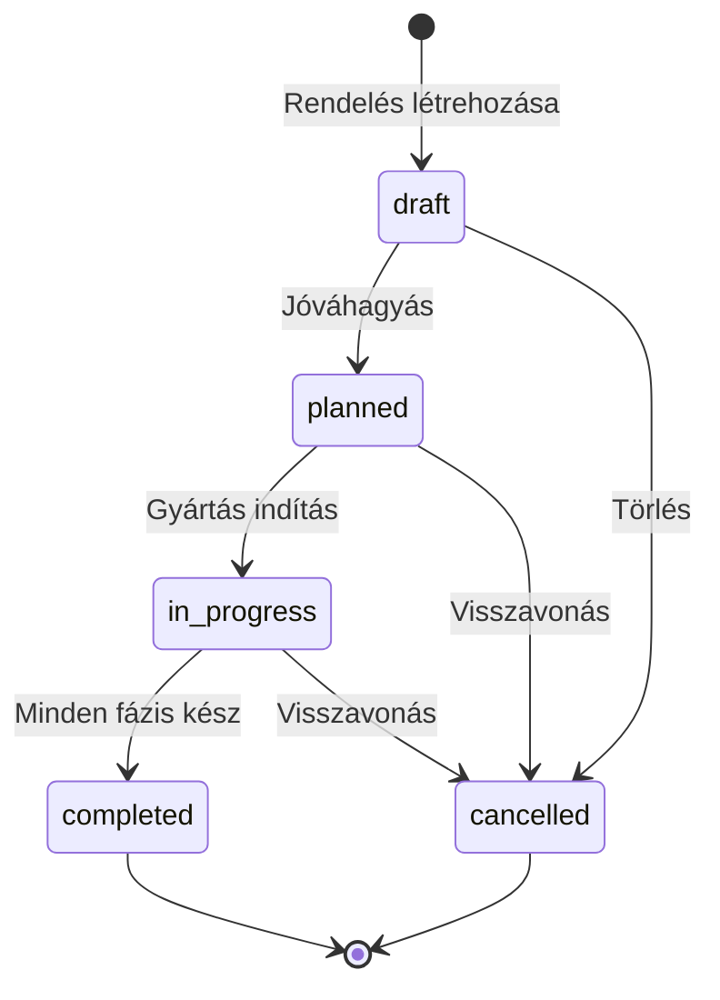
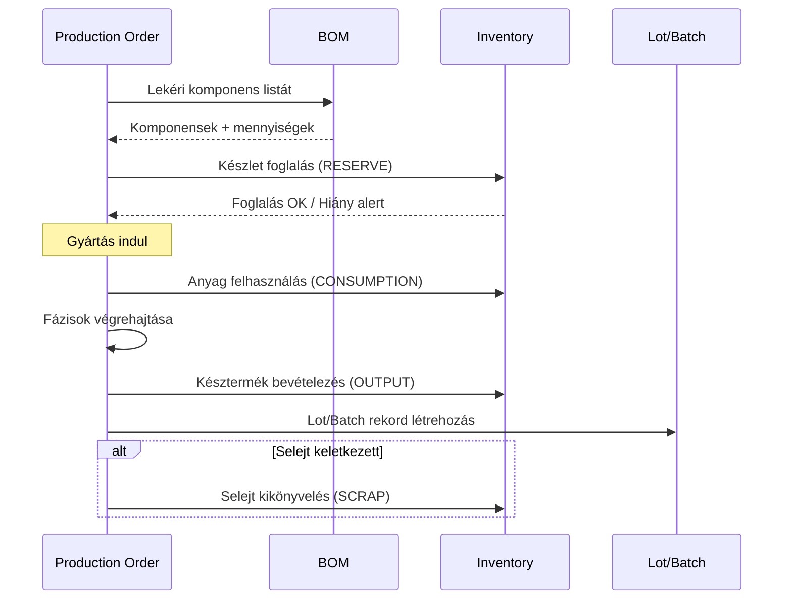

# ADR-038: Gyártás Modul (Manufacturing Module)

**Státusz:** Accepted
**Dátum:** 2026-01-06
**Döntéshozók:** Architect, PM
**Kapcsolódó:** ADR-001 (Multi-tenancy), ADR-014 (Moduláris Architektúra), PRD FR84-FR90
**Prioritás:** Fázis 2 (Pályázati követelmény - NEM MVP)

---

## Kontextus

### Üzleti Probléma

A KGC ERP rendszernek pályázati követelmények miatt gyártási/termelési modullal kell rendelkeznie. A KGC üzleti modelljében a "gyártás" az alábbi tevékenységeket jelenti:

| Típus | Leírás | Példa |
|-------|--------|-------|
| **Összeszerelés** | Komponensekből összeállított termékek | Komplett gépcsomag (alapgép + tartozékok) |
| **Kit/Csomag** | Logikailag összekapcsolt termékek | Szerszám készlet, tartozék csomag |
| **Felújítás** | Bérelt/használt gép restaurálása | Használt gép újraértékesítésre |
| **Egyedi konfiguráció** | Ügyféligény szerinti összeállítás | Speciális géppakk nagy ügyfeleknek |

### Jelenlegi Helyzet

- Nincs BOM (Bill of Materials) kezelés
- Nincs gyártási rendelés workflow
- Termék törzsadat nem támogat összetett termékeket
- Lot/batch tracking nem létezik

---

## Döntési Kérdés

**Hogyan valósítsuk meg a gyártási modult úgy, hogy:**
1. Megfeleljen a pályázati követelményeknek
2. Illeszkedjen a meglévő multi-tenant architektúrába
3. Integrálódjon az Inventory modullal
4. Egyszerű maradjon (nem full-scale MRP/MES)

---

## Döntési Tényezők

1. **Pályázati megfelelés** - A modul létezése szükséges, de nem kell teljes ERP szintű MRP
2. **Multi-tenant** - BOM lehet központi (public schema), gyártási rendelés tenant-specifikus
3. **Inventory integráció** - Készletmozgások szinkronban a gyártással
4. **Egyszerűség** - Nincs kapacitástervezés, nincs routing, nincs gépkarbantartás
5. **Bővíthetőség** - Későbbi bővítés lehetősége (Phase 3+)

---

## Vizsgált Opciók

### Opció A: Minimális BOM + Egyszerű Production Order

**Leírás:** 2 szintű BOM hierarchia, alapvető gyártási rendelés státusz követéssel.

**Előnyök:**
- Gyors implementáció
- Alacsony komplexitás
- Pályázati minimum teljesül

**Hátrányok:**
- Komplex összeállításokat nem támogat
- Fáziskövetés hiánya
- Nincs lot tracking

---

### Opció B: Teljes MRP Rendszer ❌

**Leírás:** Kapacitástervezés, routing, gépkarbantartás, MES integráció.

**Előnyök:**
- Ipari standard
- Minden funkció

**Hátrányok:**
- Túl komplex a KGC use case-hez
- Hosszú implementációs idő
- Magas költség

---

### Opció C: Középút - Multi-level BOM + Fázisok + Lot ✅ VÁLASZTOTT

**Leírás:**
- Multi-level BOM (2-3 szint)
- Gyártási rendelés fázisokkal
- Lot/batch tracking
- Selejt kezelés
- Nincs kapacitástervezés/routing

**Előnyök:**
- Pályázatnak megfelel
- Használható funkciók
- Reális implementációs effort
- Bővíthető későbbi fázisban

**Hátrányok:**
- Néhány komplex gyártási folyamatot nem támogat
- Manuális kapacitáskezelés

---

## Döntés

**Opció C: Középút** - Multi-level BOM, gyártási fázisokkal és lot tracking-gel.

---

## Architektúra

### Adatmodell Áttekintés

```
┌─────────────────────────────────────────────────────────────────────┐
│                        PUBLIC SÉMA (Central)                        │
├─────────────────────────────────────────────────────────────────────┤
│                                                                     │
│  ┌──────────────────┐         ┌──────────────────────┐             │
│  │   BOM_HEADER     │         │      BOM_LINE        │             │
│  ├──────────────────┤         ├──────────────────────┤             │
│  │ id (PK)          │◄────────│ bom_header_id (FK)   │             │
│  │ bom_code         │         │ line_number          │             │
│  │ description      │         │ component_product_id │             │
│  │ product_id (FK)  │         │ quantity_required    │             │
│  │ bom_type         │         │ unit_of_measure      │             │
│  │ is_active        │         │ parent_line_id (self)│             │
│  │ version_number   │         │ is_optional          │             │
│  │ valid_from/to    │         │ scrap_rate_percent   │             │
│  └──────────────────┘         └──────────────────────┘             │
│                                                                     │
└─────────────────────────────────────────────────────────────────────┘

┌─────────────────────────────────────────────────────────────────────┐
│                       TENANT SÉMA (RLS Protected)                   │
├─────────────────────────────────────────────────────────────────────┤
│                                                                     │
│  ┌──────────────────────┐     ┌────────────────────────────┐       │
│  │  PRODUCTION_ORDER    │     │  PRODUCTION_ORDER_PHASE    │       │
│  ├──────────────────────┤     ├────────────────────────────┤       │
│  │ id (PK)              │◄────│ production_order_id (FK)   │       │
│  │ tenant_id (RLS)      │     │ phase_number               │       │
│  │ order_number         │     │ phase_name                 │       │
│  │ bom_header_id (FK)   │     │ planned_duration_minutes   │       │
│  │ planned_quantity     │     │ actual_duration_minutes    │       │
│  │ actual_qty_produced  │     │ status                     │       │
│  │ status               │     │ started_at / completed_at  │       │
│  │ warehouse_id         │     │ assigned_to                │       │
│  │ planned_start/end    │     │ notes                      │       │
│  │ actual_start/end     │     └────────────────────────────┘       │
│  │ created_by           │                                          │
│  │ approved_by          │     ┌────────────────────────────┐       │
│  └──────────────────────┘     │       LOT_BATCH            │       │
│            │                  ├────────────────────────────┤       │
│            └─────────────────►│ production_order_id (FK)   │       │
│                               │ tenant_id (RLS)            │       │
│                               │ lot_number                 │       │
│                               │ product_id (FK)            │       │
│                               │ quantity_produced          │       │
│                               │ production_date            │       │
│                               │ expiry_date (nullable)     │       │
│                               │ quality_status             │       │
│                               └────────────────────────────┘       │
│                                                                     │
└─────────────────────────────────────────────────────────────────────┘
```

### Séma Stratégia

| Tábla | Séma | Indoklás |
|-------|------|----------|
| `bom_header` | public | Központi BOM definíciók, franchise-ok között megosztható |
| `bom_line` | public | BOM sorok, központi kezelés |
| `production_order` | tenant | Tenant-specifikus gyártási rendelések, RLS védett |
| `production_order_phase` | tenant | Fázisok, RLS védett |
| `lot_batch` | tenant | Lot tracking, RLS védett |

### Enum Típusok

```sql
-- BOM típusok
CREATE TYPE bom_type AS ENUM (
    'assembly',      -- Összeszerelés
    'kit',           -- Kit/csomag
    'refurbishment', -- Felújítás
    'custom'         -- Egyedi konfiguráció
);

-- Gyártási rendelés státuszok
CREATE TYPE production_order_status AS ENUM (
    'draft',         -- Tervezet
    'planned',       -- Tervezett
    'in_progress',   -- Folyamatban
    'completed',     -- Befejezett
    'cancelled'      -- Törölve
);

-- Gyártási fázis státuszok
CREATE TYPE production_phase_status AS ENUM (
    'pending',       -- Várakozik
    'in_progress',   -- Folyamatban
    'completed',     -- Befejezett
    'skipped'        -- Kihagyva
);

-- Minőségellenőrzés státuszok
CREATE TYPE quality_status AS ENUM (
    'pending_qa',    -- QA várakozik
    'approved',      -- Elfogadva
    'rejected',      -- Elutasítva
    'quarantine'     -- Karanténban
);
```

### Inventory Integráció

A gyártás a következő készletmozgásokat generálja:

| Esemény | Movement Type | Készlet Hatás |
|---------|---------------|---------------|
| Anyag foglalás | `PRODUCTION_RESERVE` | Szabad → Foglalt |
| Anyag felhasználás | `PRODUCTION_CONSUMPTION` | Foglalt → Felhasznált |
| Késztermék | `PRODUCTION_OUTPUT` | Növekedés |
| Selejt | `PRODUCTION_SCRAP` | Csökkenés |

---

## Workflow

### Gyártási Rendelés Életciklus



### Anyagfelhasználás Flow



---

## UI Komponensek

### Szükséges Képernyők

| Képernyő | Leírás | Wireframe |
|----------|--------|-----------|
| BOM Lista | BOM-ok listázása, szűrés, keresés | ✅ Feature-Gyartas-Modul-Wireframe |
| BOM Szerkesztő | Hierarchikus BOM összeállítás | ✅ Feature-Gyartas-Modul-Wireframe |
| Gyártási Rendelések | Rendelések lista + státusz | ✅ Feature-Gyartas-Modul-Wireframe |
| Gyártási Lap | Fázisok, idők, anyagok | ✅ Feature-Gyartas-Modul-Wireframe |
| Lot Kezelés | Lot/batch nyomon követés | ⏳ TBD |

---

## RBAC Jogosultságok

| Szerepkör | BOM Olvasás | BOM Írás | PO Olvasás | PO Írás | PO Jóváhagyás |
|-----------|-------------|----------|------------|---------|---------------|
| Pénztáros | ❌ | ❌ | ❌ | ❌ | ❌ |
| Boltvezető | ✅ | ❌ | ✅ | ✅ | ❌ |
| Raktáros | ✅ | ❌ | ✅ | ✅ | ❌ |
| Központi Admin | ✅ | ✅ | ✅ | ✅ | ✅ |
| Franchise Owner | ✅ | ❌ | ✅ | ✅ | ✅ |

---

## Implementációs Terv

### Fázis 2.1 - Alapok (MVP Gyártás)

- [ ] BOM táblák és API
- [ ] Production Order CRUD
- [ ] Alapvető UI

### Fázis 2.2 - Fázisok és Tracking

- [ ] Production Order Phase implementáció
- [ ] Lot/Batch tracking
- [ ] Inventory integráció (mozgástípusok)

### Fázis 2.3 - Finomítás

- [ ] QA workflow
- [ ] Selejt kezelés
- [ ] Riporting

---

## Kockázatok és Mitigáció

| Kockázat | Valószínűség | Hatás | Mitigáció |
|----------|--------------|-------|-----------|
| Komplex BOM-ok túlterhelik a rendszert | Alacsony | Közepes | Max 3 szint korlátozás |
| Készlethiány gyártás közben | Közepes | Magas | Előzetes availability check |
| Selejt nem követhető | Alacsony | Alacsony | Audit trail minden mozgásra |

---

## Következmények

### Pozitív

1. Pályázati követelmények teljesülnek
2. Komplex termékek (kit, csomag) kezelhetők
3. Felújított gépek nyomon követhetők
4. Lot tracking visszakövethetőséget biztosít

### Negatív

1. Új modul = extra fejlesztési és karbantartási effort
2. Training szükséges a felhasználóknak
3. BOM karbantartás terhe

### Semleges

1. Kapacitástervezés nincs - manuális marad
2. Routing nincs - egyszerű fázis lista

---

## Kapcsolódó Dokumentumok

| Dokumentum | Útvonal |
|------------|---------|
| PRD (FR84-FR90) | `planning-artifacts/prd.md` |
| Fit-Gap Analízis | `planning-artifacts/1-discovery/fit-gap/Manufacturing-Modul-FitGap-2026-01-06.md` |
| ERD Diagram | `docs/architecture/Feature-Gyartas-Modul-ERD.excalidraw` |
| Wireframe | `docs/architecture/Feature-Gyartas-Modul-Wireframe.excalidraw` |
| ADR-001 Multi-tenancy | `planning-artifacts/3-solution/architecture/adr/ADR-001-franchise-multitenancy.md` |
| ADR-014 Moduláris Arch | `planning-artifacts/3-solution/architecture/adr/ADR-014-modular-architecture-final.md` |

---

*ADR generálva: BMAD Method Architecture Workflow*
*Utolsó frissítés: 2026-01-06*
