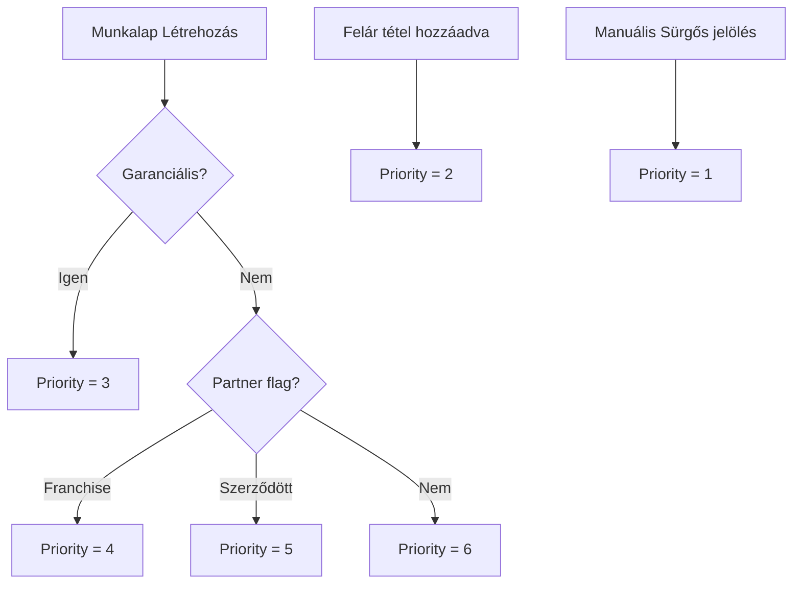

# ADR-041: Szerviz Prioritás Rendszer

**Státusz:** Elfogadva
**Dátum:** 2026-01-10
**Döntéshozók:** G. Zuzu, Javo!

---

## Kontextus

A szerviz műhelyben különböző sürgősségű munkák érkeznek be. A jelenlegi rendszerben nincs lehetőség a prioritás szerinti rendezésre és vizuális megkülönböztetésre, ami nehezíti a munka szervezését:

- Garanciális javítások (beszállítói időlimitekkel)
- Szerződött partnerek gépei (VIP kezelés)
- Felár miatt sürgős munkák (ügyfél fizetett a gyorsabb elvégzésért)
- Franchise partnerek gépei
- Normál munkák (FIFO)

**Üzleti igény:** "Mikor a javításra váró gépek listája megjelenik, azonnal lehessen látni, hogy melyik kategóriába tartozik, mert lehet, hogy a 10. beérkezett gépet kell előre vennie."

---

## Döntés

### Prioritási Kategóriák

| Prioritás | Szint | Szín Kód | Ikon | Auto-Hozzárendelés |
|-----------|-------|----------|------|--------------------|
| **Sürgős** | 1 (Legmagasabb) | Piros | Villámlás | Nem |
| **Felár miatt sürgős** | 2 | Narancs | Pénz ikon | Felár tétel esetén |
| **Garanciális** | 3 | Kék | Garancia pajzs | FR19 jelölés esetén |
| **Franchise Partner** | 4 | Lila | Hálózat ikon | Partner flag alapján |
| **Szerződött Partner** | 5 | Zöld | Csillag | Partner beállítás |
| **Normál** | 6 (Legalacsonyabb) | Szürke | - | Alapértelmezett |

### Adatmodell Bővítés

```sql
-- Munkalap tábla bővítés
ALTER TABLE szerviz_munkalap ADD COLUMN priority_level INTEGER DEFAULT 6;
ALTER TABLE szerviz_munkalap ADD COLUMN priority_reason VARCHAR(50);
ALTER TABLE szerviz_munkalap ADD COLUMN priority_set_by UUID REFERENCES users(id);
ALTER TABLE szerviz_munkalap ADD COLUMN priority_set_at TIMESTAMP;

-- Partner tábla bővítés (alapértelmezett prioritás)
ALTER TABLE partner ADD COLUMN default_service_priority INTEGER DEFAULT 6;
ALTER TABLE partner ADD COLUMN is_contracted_partner BOOLEAN DEFAULT FALSE;

-- Index a gyors lekérdezéshez
CREATE INDEX idx_munkalap_priority ON szerviz_munkalap(priority_level, created_at);
```

### Prioritás Meghatározás Logika



### Várakozási Lista Rendezés

A szerviz várakozási lista az alábbi sorrendben jelenik meg:

1. **Elsődleges rendezés:** `priority_level ASC` (1 = legmagasabb)
2. **Másodlagos rendezés:** `created_at ASC` (régebbi előbb)

```sql
SELECT * FROM szerviz_munkalap
WHERE status IN ('received', 'in_progress')
ORDER BY priority_level ASC, created_at ASC;
```

### UI Megjelenítés

#### Várakozási Lista Nézet

```
┌─────────────────────────────────────────────────────────────────┐
│ Szerviz Várakozási Lista                          [Szűrés ▼]   │
├─────────────────────────────────────────────────────────────────┤
│ ⚡ ML-2024-0156  Makita HR2470  Kovács Kft     Sürgős    2ó    │
│ 💰 ML-2024-0148  Bosch GSH 5   Barna Bt       Felár     4ó    │
│ 🛡️ ML-2024-0142  Makita GA5030 Szabó Péter   Garanc.   1n    │
│ 🌐 ML-2024-0139  Stihl MS 180  KGC Debrecen   Franch.   2n    │
│ ⭐ ML-2024-0135  Hitachi DH40  Partner Kft    Szerz.    3n    │
│ ○  ML-2024-0130  Bosch GBH 2   Kiss János     Normál    4n    │
│ ○  ML-2024-0128  Makita BO3710 Nagy Anna      Normál    5n    │
└─────────────────────────────────────────────────────────────────┘
```

#### Munkalap Részlet Nézet

```
┌────────────────────────────────────────┐
│ Prioritás                              │
│ ┌──────────────────────────────────┐   │
│ │ [Sürgős ▼]  ⚡ Piros badge       │   │
│ └──────────────────────────────────┘   │
│ Beállította: Kata (Pultos)             │
│ Időpont: 2026-01-10 14:32              │
│                                        │
│ [Prioritás módosítása]                 │
└────────────────────────────────────────┘
```

### Jogosultságok

| Szerep | Prioritás olvasás | Prioritás módosítás | Partner default beállítás |
|--------|-------------------|---------------------|---------------------------|
| Pultos | ✅ | ✅ (saját munkalapok) | ❌ |
| Szervizes | ✅ | ✅ | ❌ |
| Boltvezető | ✅ | ✅ | ❌ |
| Központi Admin | ✅ | ✅ | ✅ |

### Audit Trail

Minden prioritás változás naplózásra kerül:

```json
{
  "action": "priority_change",
  "munkalap_id": "ML-2024-0156",
  "old_priority": 6,
  "new_priority": 1,
  "reason": "Ügyfél kérte, holnapra kell",
  "changed_by": "user_123",
  "changed_at": "2026-01-10T14:32:00Z"
}
```

---

## Következmények

### Pozitív

- **Gyorsabb döntéshozatal:** Vizuális prioritás jelölés azonnal mutatja a fontosságot
- **Automatizálás:** Garanciális és partner munkák automatikusan magasabb prioritást kapnak
- **Átláthatóság:** Audit trail mutatja, ki és miért módosította a prioritást

### Negatív

- **Potenciális visszaélés:** "Sürgős" jelölés túlzott használata → megoldás: audit trail + vezetői felülvizsgálat
- **Bonyolultság:** 6 prioritási szint → megoldás: egyszerű vizuális jelölés

---

## Kapcsolódó Dokumentumok

- **PRD:** FR91, FR92, FR93
- **Modulok:** Szerviz Modul, Partner Modul
