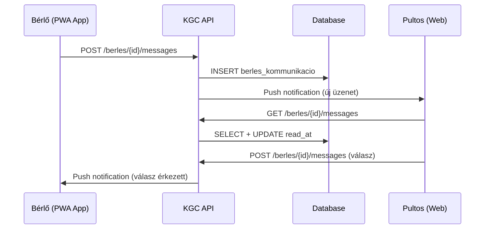

# ADR-042: Bérlői Kommunikáció Modul

**Státusz:** Elfogadva
**Dátum:** 2026-01-10
**Döntéshozók:** G. Zuzu, Javo!

---

## Kontextus

Az ügyfelekkel (bérlőkkel) való kommunikáció jelenleg telefonon és emailen keresztül történik, ami:

- Nincs központilag naplózva
- Nem látható más kollégának
- "Úgy emlékszem hívtam a múlt héten" - nehéz visszakeresni
- Nem kapcsolódik közvetlenül a bérléshez

**Üzleti igény:** "Az lenne az igazi, ha az appon keresztül velük is lehetne kommunikálni: 'Tudod, hogy meddig marad még nálad a gép?' - ügyfélnél megmaradnak az előzmények és nem kell hívogatni."

**Fontos megkülönböztetés:** Ez a modul NEM a Chatwoot-tal integrált general support, hanem kifejezetten **bérlés-specifikus** kommunikációs csatorna.

---

## Döntés

### Architektúra Megközelítés

**Döntés:** Saját fejlesztésű lightweight messaging modul a bérléshez kapcsoltan.

**Indoklás:**
- Chatwoot = általános support (FAQ, panaszok, értékesítés előtti kérdések)
- Bérlői Chat = tranzakció-specifikus (egy konkrét bérléshez kapcsolódó üzenetek)
- Nincs szükség teljes chat infrastruktúrára (nincs typing indicator, read receipts, stb.)
- Egyszerű message thread bérlési rekordhoz csatolva

### Adatmodell

```sql
-- Bérlési kommunikáció tábla
CREATE TABLE berles_kommunikacio (
    id UUID PRIMARY KEY DEFAULT gen_random_uuid(),
    berles_id UUID NOT NULL REFERENCES berles(id),
    sender_type VARCHAR(20) NOT NULL, -- 'customer' | 'employee'
    sender_id UUID, -- user_id ha employee, NULL ha customer (ügyfél azonosítás berles.ugyfel_id-ből)
    message TEXT NOT NULL,
    created_at TIMESTAMP DEFAULT NOW(),
    read_at TIMESTAMP, -- mikor olvasta a másik fél

    -- RLS
    partner_id UUID NOT NULL REFERENCES partner(id)
);

-- Index a gyors lekérdezéshez
CREATE INDEX idx_berles_komm_berles ON berles_kommunikacio(berles_id, created_at);
CREATE INDEX idx_berles_komm_unread ON berles_kommunikacio(berles_id) WHERE read_at IS NULL;
```

### Kommunikációs Flow



### API Endpoints

```yaml
# Bérlői Kommunikáció API
paths:
  /api/v1/berles/{berles_id}/messages:
    get:
      summary: Bérléshez tartozó üzenetek listázása
      parameters:
        - name: berles_id
          in: path
          required: true
      responses:
        200:
          description: Üzenet lista
          content:
            application/json:
              schema:
                type: array
                items:
                  $ref: '#/components/schemas/BerlesMessage'
    post:
      summary: Új üzenet küldése
      requestBody:
        content:
          application/json:
            schema:
              type: object
              properties:
                message:
                  type: string
                  maxLength: 2000
      responses:
        201:
          description: Üzenet elküldve

  /api/v1/berles/{berles_id}/messages/mark-read:
    post:
      summary: Üzenetek olvasottnak jelölése
      responses:
        200:
          description: Sikeres

components:
  schemas:
    BerlesMessage:
      type: object
      properties:
        id:
          type: string
          format: uuid
        sender_type:
          type: string
          enum: [customer, employee]
        sender_name:
          type: string
          description: "Dolgozó esetén: név + szerep"
        message:
          type: string
        created_at:
          type: string
          format: date-time
        read_at:
          type: string
          format: date-time
          nullable: true
```

### UI Megjelenítés

#### Bérlő Nézet (PWA App)

```
┌────────────────────────────────────────┐
│ Bérlés #B-2024-0542                    │
│ Makita HR2470 - visszahozás: jan. 12  │
├────────────────────────────────────────┤
│                                        │
│ ┌──────────────────────────────────┐   │
│ │ Kata (Pultos) - jan 8, 14:32     │   │
│ │ Szia! Tudod, hogy meddig marad   │   │
│ │ még nálad a gép?                 │   │
│ └──────────────────────────────────┘   │
│                                        │
│         ┌──────────────────────────┐   │
│         │ Én - jan 8, 15:10        │   │
│         │ Még 2 napig kellene,     │   │
│         │ csütörtökön hozom.       │   │
│         └──────────────────────────┘   │
│                                        │
│ ┌──────────────────────────────────┐   │
│ │ Kata (Pultos) - jan 8, 15:15     │   │
│ │ Rendben, meghosszabbítottam.     │   │
│ │ Új visszahozás: jan 14.          │   │
│ └──────────────────────────────────┘   │
│                                        │
├────────────────────────────────────────┤
│ [Üzenet írása...                    ] │
│                                [Küld] │
└────────────────────────────────────────┘
```

#### Pultos Nézet (Web - Bérlés Részlet)

```
┌──────────────────────────────────────────────────────────────────┐
│ Bérlés #B-2024-0542                                              │
│ Ügyfél: Szabó Péter | Gép: Makita HR2470 | Vissza: 2026-01-12   │
├──────────────────────────────────────────────────────────────────┤
│ [Adatok] [Tartozékok] [Fizetések] [Kommunikáció 💬 (3)]          │
├──────────────────────────────────────────────────────────────────┤
│ Kommunikációs Előzmények                                         │
│                                                                  │
│ jan 8, 14:32 - Kata (Pultos)                                    │
│ > Szia! Tudod, hogy meddig marad még nálad a gép?               │
│                                                                  │
│ jan 8, 15:10 - Szabó Péter (Ügyfél)                             │
│ > Még 2 napig kellene, csütörtökön hozom.                       │
│                                                                  │
│ jan 8, 15:15 - Kata (Pultos)                                    │
│ > Rendben, meghosszabbítottam. Új visszahozás: jan 14.          │
│                                                                  │
│ ┌──────────────────────────────────────────────────────────────┐│
│ │ Új üzenet küldése...                                         ││
│ └──────────────────────────────────────────────────────────────┘│
│                                                         [Küldés] │
└──────────────────────────────────────────────────────────────────┘
```

### Értesítések

| Esemény | Címzett | Csatorna |
|---------|---------|----------|
| Új ügyfél üzenet | Bolt összes pultosa | Push + In-app badge |
| Új dolgozó üzenet | Bérlő | Push notification (PWA) |
| 24h olvasatlan | Boltvezető | Email összefoglaló |

### Jogosultságok

| Szerep | Saját bolt üzenetei | Más bolt üzenetei |
|--------|---------------------|-------------------|
| Pultos | ✅ Olvas + Ír | ❌ |
| Szervizes | ✅ Olvas | ❌ |
| Boltvezető | ✅ Olvas + Ír | ❌ |
| Központi Admin | ✅ Olvas (audit) | ✅ Olvas (audit) |
| Bérlő | ✅ Saját bérlések | ❌ |

### Korlátozások

- Max üzenet hossz: 2000 karakter
- Max üzenet/nap/bérlés: 50 (spam védelem)
- Üzenet törlés: Nem lehetséges (audit trail)
- Fájl csatolás: Nem támogatott (MVP)

---

## Alternatívák (Elvetett)

### A: Chatwoot Integráció

**Elvetés oka:** Chatwoot general support-ra van optimalizálva, nem tranzakció-specifikus kommunikációra. Nem tudunk egyszerűen bérléshez kapcsolni üzeneteket.

### B: Harmadik fél chat SDK (Sendbird, Stream)

**Elvetés oka:** Túl komplex és drága ehhez a use case-hez. Nem kell typing indicator, file sharing, group chat.

---

## Következmények

### Pozitív

- **Visszakereshetőség:** Minden kommunikáció a bérléshez kapcsoltan megmarad
- **Átláthatóság:** Bármely kolléga látja az előzményeket
- **Egyszerűség:** Lightweight megoldás, gyorsan implementálható

### Negatív

- **Korlátozott funkciók:** Nincs fájl csatolás, nincs valós idejű typing indicator
- **Külön csatorna:** Ügyfélnek meg kell tanulnia, hogy ez nem az általános support

---

## Kapcsolódó Dokumentumok

- **PRD:** FR98, FR99, FR100
- **ADR-015:** CRM/Support Integráció (Chatwoot)
- **ADR-016:** Koko AI Chatbot
