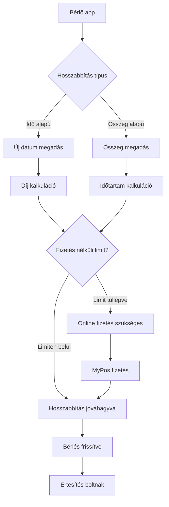
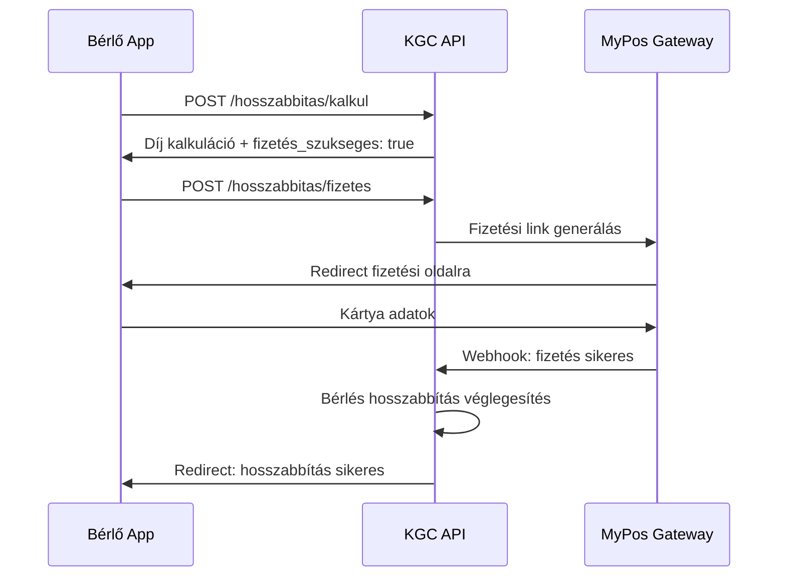

# ADR-043: Bérlés Hosszabbítás Self-Service

**Státusz:** Elfogadva
**Dátum:** 2026-01-10
**Döntéshozók:** G. Zuzu, Javo!

---

## Kontextus

A bérlés késése jelenleg manuálisan kezelt:
1. Rendszer figyelmeztetést küld a lejárat előtt
2. Ha késik, a kolléga felhívja az ügyfelet
3. Ügyfél mond valamit ("holnap hozom")
4. Kolléga kézzel beírja a szerződésre

**Problémák:**
- Sok telefonálás és adminisztráció
- Ügyfél nem tudja maga meghosszabbítani
- Nincs online fizetési lehetőség
- Megbízható vevők is ugyanúgy kezelve

**Üzleti igény:** "Jó lenne, ha adódna egy lehetőség, hogy 02-án 12-ig szeretném, ha maradna a gép. Kétirányú lehetne a hosszabbítás, vagy idő alapján kalkulál összeget vagy összeg alapján időt."

---

## Döntés

### Funkcionalitás Áttekintés



### Kétirányú Kalkuláció

#### 1. Idő Alapú (Alapértelmezett)

Ügyfél megadja az új visszahozási dátumot → Rendszer kalkulálja a díjat.

```typescript
interface IdoAlapuHosszabbitas {
  berles_id: string;
  uj_visszahozas: Date;
}

// Példa
{
  "berles_id": "B-2024-0542",
  "uj_visszahozas": "2026-01-15T12:00:00Z"
}

// Response
{
  "hosszabbitas_napok": 3,
  "alkalmazott_kedvezmeny": "heti_kedvezmeny",
  "kedvezmeny_szazalek": 10,
  "brutto_dij": 15000,
  "kedvezmeny_osszeg": 1500,
  "fizetendo": 13500,
  "fizetes_szukseges": true, // mert túllépi a limitet
  "max_fizetes_nelkul_napok": 3
}
```

#### 2. Összeg Alapú

Ügyfél megadja, mennyit tud fizetni → Rendszer kalkulálja az időtartamot.

```typescript
interface OsszegAlapuHosszabbitas {
  berles_id: string;
  befizetheto_osszeg: number;
}

// Példa
{
  "berles_id": "B-2024-0542",
  "befizetheto_osszeg": 10000
}

// Response
{
  "uj_visszahozas": "2026-01-14T12:00:00Z",
  "hosszabbitas_napok": 2,
  "alkalmazott_kedvezmeny": "nincs",
  "felhasznalt_osszeg": 10000,
  "maradek": 0
}
```

### Fizetés Nélküli Hosszabbítási Limit

| Kategória | Alapértelmezett Limit | Módosítható |
|-----------|----------------------|-------------|
| Új ügyfél | 3 nap | ❌ |
| Visszatérő ügyfél | 5 nap | ❌ |
| Megbízható ügyfél (flag) | 7-14 nap | ✅ Központi Admin |
| Céges szerződés | Szerződés szerint | ✅ Központi Admin |

```sql
-- Ügyfél tábla bővítés
ALTER TABLE ugyfel ADD COLUMN megbizhato_vevo BOOLEAN DEFAULT FALSE;
ALTER TABLE ugyfel ADD COLUMN max_fizetes_nelkuli_hosszabbitas_nap INTEGER DEFAULT 3;
ALTER TABLE ugyfel ADD COLUMN osszesen_berlesi_napok INTEGER DEFAULT 0; -- visszatérő kalkulációhoz
```

### Kedvezmények Kezelése

A hosszabbítás díjkalkuláció figyelembe veszi a meglévő kedvezményeket:

| Kedvezmény Típus | Szabály |
|------------------|---------|
| Hétvége | 1,5 nap = 1 napi díj (szombat déltől hétfő reggelig) |
| Heti | 5 nap ára = 7 napra |
| Havi | 20 nap ára = 30 napra |

### Online Fizetés Integráció

Meglévő MyPos integráció (ADR-005) bővítése:



### Jogi Figyelmeztetés

A hosszabbítási felületen kötelezően megjelenő figyelmeztetés:

```
┌────────────────────────────────────────────────────────────────┐
│ ⚠️ FONTOS TÁJÉKOZTATÁS                                         │
│                                                                │
│ A bérleti szerződés érvényes a megadott visszahozási dátumig. │
│ Ha a bérleti díj nincs rendezve és a gép nem kerül vissza,    │
│ a jogellenes eltulajdonítás szabályai alkalmazandók.          │
│                                                                │
│ A fizetés elmulasztása esetén:                                 │
│ • Késedelmi kamat felszámítása (napi 0.5%)                    │
│ • Felszólító levél, majd fizetési meghagyás                   │
│ • Szükség esetén rendőrségi feljelentés                       │
│                                                                │
│ [✓] Elolvastam és elfogadom a feltételeket                    │
└────────────────────────────────────────────────────────────────┘
```

### API Endpoints

```yaml
paths:
  /api/v1/berles/{berles_id}/hosszabbitas/kalkul:
    post:
      summary: Hosszabbítás díjkalkuláció
      requestBody:
        content:
          application/json:
            schema:
              oneOf:
                - $ref: '#/components/schemas/IdoAlapuKalkul'
                - $ref: '#/components/schemas/OsszegAlapuKalkul'
      responses:
        200:
          description: Kalkuláció eredmény
          content:
            application/json:
              schema:
                $ref: '#/components/schemas/KalkulacioEredmeny'

  /api/v1/berles/{berles_id}/hosszabbitas/vegrehajt:
    post:
      summary: Hosszabbítás végrehajtása (fizetés nélküli limiten belül)
      requestBody:
        content:
          application/json:
            schema:
              type: object
              properties:
                uj_visszahozas:
                  type: string
                  format: date-time
                jogi_elfogadas:
                  type: boolean
                  description: Kötelező true
      responses:
        200:
          description: Hosszabbítás sikeres
        402:
          description: Fizetés szükséges

  /api/v1/berles/{berles_id}/hosszabbitas/fizetes:
    post:
      summary: Hosszabbítás online fizetéssel
      requestBody:
        content:
          application/json:
            schema:
              type: object
              properties:
                uj_visszahozas:
                  type: string
                  format: date-time
                jogi_elfogadas:
                  type: boolean
      responses:
        200:
          description: Fizetési link
          content:
            application/json:
              schema:
                type: object
                properties:
                  payment_url:
                    type: string
                  transaction_id:
                    type: string
```

### Adatmodell Bővítés

```sql
-- Hosszabbítás napló
CREATE TABLE berles_hosszabbitas_log (
    id UUID PRIMARY KEY DEFAULT gen_random_uuid(),
    berles_id UUID NOT NULL REFERENCES berles(id),
    eredeti_visszahozas TIMESTAMP NOT NULL,
    uj_visszahozas TIMESTAMP NOT NULL,
    hosszabbitas_napok INTEGER NOT NULL,
    dij_osszeg DECIMAL(10,2),
    kedvezmeny_tipus VARCHAR(50),
    kedvezmeny_osszeg DECIMAL(10,2),
    fizetesi_mod VARCHAR(20), -- 'online' | 'fizetes_nelkuli' | 'kesobb'
    tranzakcio_id VARCHAR(100), -- MyPos transaction ID
    jogi_elfogadas_at TIMESTAMP NOT NULL,
    created_at TIMESTAMP DEFAULT NOW(),

    -- RLS
    partner_id UUID NOT NULL REFERENCES partner(id)
);

-- Bérlés tábla bővítés
ALTER TABLE berles ADD COLUMN utolso_hosszabbitas_at TIMESTAMP;
ALTER TABLE berles ADD COLUMN osszesen_hosszabbitas_nap INTEGER DEFAULT 0;
```

### UI Mockup (Bérlő App)

```
┌────────────────────────────────────────┐
│ ← Bérlés Hosszabbítás                  │
├────────────────────────────────────────┤
│                                        │
│ Makita HR2470                          │
│ Jelenlegi visszahozás: jan 12, 12:00   │
│                                        │
│ ┌──────────────────────────────────┐   │
│ │ Hosszabbítás módja:              │   │
│ │ ○ Új dátum megadása              │   │
│ │ ● Összeg alapján                 │   │
│ └──────────────────────────────────┘   │
│                                        │
│ Mennyit tudsz most befizetni?          │
│ ┌──────────────────────────────────┐   │
│ │ [10 000] Ft                      │   │
│ └──────────────────────────────────┘   │
│                                        │
│ Kalkuláció:                            │
│ • Új visszahozás: jan 14, 12:00        │
│ • Hosszabbítás: +2 nap                 │
│ • Díj: 10 000 Ft (5000 Ft/nap)        │
│                                        │
│ [Hosszabbítás és Fizetés]              │
│                                        │
│ ⚠️ 3 napon belüli visszahozás esetén   │
│ nincs szükség előzetes fizetésre.      │
└────────────────────────────────────────┘
```

---

## Következmények

### Pozitív

- **Kevesebb adminisztráció:** Ügyfél maga intézi, nem kell telefonálni
- **Gyorsabb cash flow:** Online fizetés azonnal beérkezik
- **Rugalmasság:** Kétirányú kalkuláció (idő vagy összeg alapú)
- **Megbízható vevők előnye:** Hosszabb fizetés nélküli limit

### Negatív

- **MyPos integráció bővítés:** Fejlesztési erőforrás szükséges
- **Jogi szöveg karbantartás:** Ügyvéddel egyeztetni

### Kockázatok

| Kockázat | Valószínűség | Hatás | Mitigáció |
|----------|--------------|-------|-----------|
| Ügyfél nem fizet, gép nem jön vissza | Közepes | Magas | Jogi figyelmeztetés + korai felszólítás |
| Online fizetés hiba | Alacsony | Közepes | Fallback: telefonos hosszabbítás |
| Kedvezmény kalkuláció hiba | Alacsony | Közepes | Unit tesztek + manuális ellenőrzés |

---

## Kapcsolódó Dokumentumok

- **PRD:** FR101, FR102, FR103, FR104, FR105, FR106
- **ADR-005:** MyPos Payment Integráció (bővítendő)
- **ADR-006:** Bérlés Audit Trail
