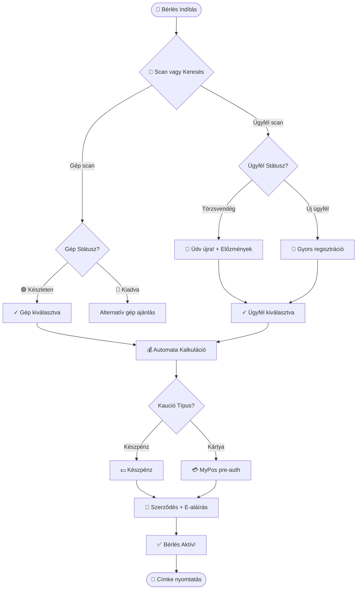
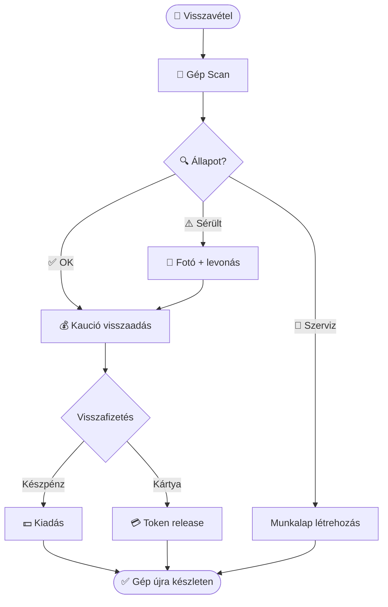
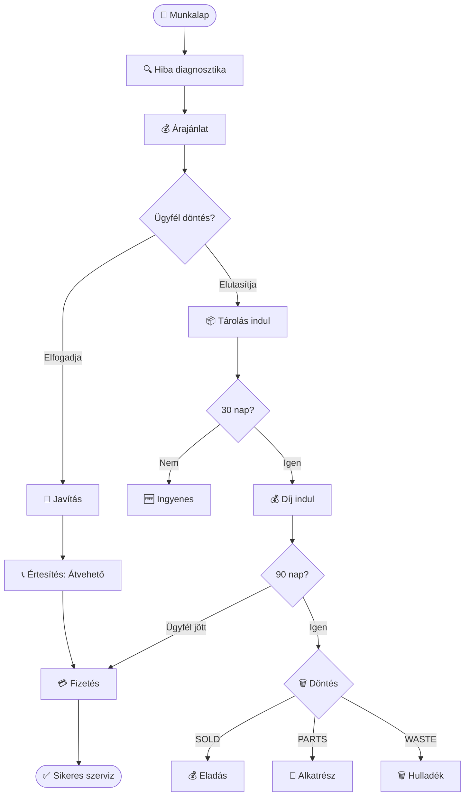
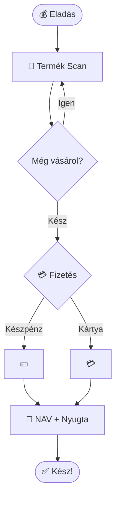

# UX Design Specification - KGC ERP v7.0

**Szerző:** Javo!
**Dátum:** 2026-01-03
**UX Facilitátor:** Sally (UX Designer)
**Verzió:** 2.0 (Teljes átdolgozás Fit-Gap döntésekkel)

---

## Összefoglaló

Ez a dokumentum a KGC ERP v7.0 UX specifikációját tartalmazza, amely a **raktározási**, **bérlési** és **szerviz** folyamatokra fókuszál, az **egyszerűség**, **gyorsaság** és **hatékonyság** prioritásaival.

### UX Design Prioritások

| Prioritás | Leírás |
|-----------|--------|
| **Egyszerűség** | Minimális kattintás, tiszta interface, intuitív flow |
| **Gyorsaság** | < 30 mp árumozgatás, < 10 perc bérlés felvétel |
| **Hatékonyság** | Vonalkód scan, auto-complete, smart defaults |

### Fókusz Területek

1. **Raktározás (Inventory)** - K-P-D kód rendszer, multi-warehouse
2. **Bérlés (Rental)** - 60+ lépéses folyamat egyszerűsítése
3. **Szerviz (Service)** - Munkalap-bérlés kapcsolat, tárolási díj
4. **Számla Láthatóság** - RBAC-alapú visibility toggle (NEW)
5. **Boltvezető Jogkörök** - Middle role ±20% kedvezmény (NEW)

### Új Követelmények (Fit-Gap 2026-01-03)

| Funkció | UX Hatás |
|---------|----------|
| **Számla Láthatóság** | Toggle gomb, típus-alapú default, badge |
| **Tárolási Díj** | 30/90 nap timer, értesítés UI, megsemmisítés flow |
| **Boltvezető** | Kedvezmény slider (±20%), korlátozott HR menü |
| **Webes Foglalás** | Max 3 gép limit, 1 óra countdown |
| **Avizó** | PDF upload, auto-match UI, ±0.5% tolerance |

---

## Executive Summary

### Projekt Vízió

A KGC ERP v7.0 egy teljes körű kiskereskedelmi/bérlési/szerviz menedzsment rendszer, amely franchise hálózatokat szolgál ki. A rendszer célja a **60+ lépéses bérlési folyamat drasztikus egyszerűsítése**, miközben megőrzi a NAV compliance-t és offline működési képességet.

**Kulcs UX célok:**
- < 10 perc bérlés felvétel (jelenlegi ~25 perc helyett)
- < 30 másodperc árumozgatás vonalkóddal
- Zéró adatvesztés offline módban
- Franchise-specifikus testreszabhatóság kód nélkül

### Célfelhasználók

#### Elsődleges Felhasználók

| Persona | Jellemzők | Igények |
|---------|-----------|---------|
| **Pultos (Operátor)** | 20-35 év, tablet használat, gyors tempó | Egyszerű UI, nagy gombok, scan-first |
| **Szerviz Technikus** | 30-50 év, műszaki háttér, workshop | Munkalap részletek, alkatrész keresés |
| **Boltvezető** 🆕 | 30-45 év, döntéshozó, napi riportok | Dashboard, kedvezmény kezelés, HR |

#### Másodlagos Felhasználók

| Persona | Jellemzők | Igények |
|---------|-----------|---------|
| **Franchise Admin** | Tulajdonos, stratégiai döntések | Össz-bolt riportok, konfiguráció |
| **Könyvelő** | Havi zárás, NAV | Számla export, pénzügyi riportok |

### Kulcs UX Kihívások

1. **Folyamat Komplexitás**
   - Jelenlegi: 60+ lépéses bérlési flow
   - Cél: < 15 lépés intelligens defaultokkal
   - Megoldás: Wizard pattern + auto-complete + scan-first

2. **Offline Resilience**
   - Kritikus: Internet kimaradás nem állíthatja le az üzletet
   - Megoldás: PWA + localStorage + background sync
   - UX: Offline státusz jelzés, szinkron progress bar

3. **Szerepkör-alapú Komplexitás**
   - 7 különböző szerepkör, eltérő jogosultságokkal
   - Boltvezető 🆕: Új middle role ±20% kedvezmény joggal
   - Megoldás: Adaptív UI, role-based menu filtering

4. **Számla Láthatóság RBAC** 🆕
   - Költségszámlák rejtése operátorok elől
   - Típus-alapú default (ügyfél=publikus, költség=rejtett)
   - UX: Visibility toggle gomb, badge indicator

5. **Szerviz Tárolási Díj** 🆕
   - 30 nap ingyenes → 31-90 nap fizetős → 90+ megsemmisítés
   - 3x értesítés (14/7/1 nap)
   - UX: Timer display, értesítés UI, megsemmisítés döntés flow

### Design Lehetőségek

1. **Vonalkód-Központú Interakció**
   - Minden tranzakció scan-nel kezdődik
   - Automatikus kontextus felismerés (bérlés vs eladás vs szerviz)
   - Hangjelzéses feedback

2. **Intelligens Dashboard Widgetek**
   - Franchise testreszabható layout
   - Real-time KPI-k
   - Quick action gombok

3. **Koko AI Chatbot Integráció**
   - Természetes nyelvi keresés ("Kovács úr bérlései")
   - Context-aware ajánlások
   - Workflow guidance

4. **Visual Status System**
   - Színkódolt státuszok (zöld/sárga/piros)
   - Progress bar-ok hosszú folyamatoknál
   - Animált transition-ök

---

<!-- Step 2 completed - Executive Summary -->

## Core User Experience

### Defining Experience

A KGC ERP v7.0 központi élménye a **Scan-First Interaction** paradigmára épül. Minden tranzakció (bérlés, eladás, szerviz) egyetlen vonalkód scan-nel indul, ami automatikusan felismeri a kontextust és betölti a releváns adatokat.

**Core Loop:**
1. 📱 Scan (gép/ügyfél/alkatrész)
2. 🎯 Kontextus felismerés (mi ez? kié? mi a státusz?)
3. ⚡ Automatikus adatkitöltés
4. ✅ Felhasználó megerősítés
5. 💾 Mentés + következő lépés

**Scan Fallback Stratégia** *(Party Mode)*:
- Sikertelen scan → Azonnali vizuális feedback (piros villanás)
- 1-tap manual entry opció
- Kamera-alapú scan alternatíva mobilon

### Platform Strategy

| Platform | Prioritás | Optimalizáció |
|----------|-----------|---------------|
| **PWA Tablet** | P0 | Touch-first, nagy gombok, landscape |
| **PWA Desktop** | P1 | Admin felületek, riportok |
| **PWA Mobile** | P2 | Raktár mozgás, gyors lookup |

**Kritikus képességek:**
- Offline-first PWA Service Worker-rel
- USB/Bluetooth barcode scanner integráció
- Thermál nyomtató támogatás (címke, nyugta)
- Kamera fallback vonalkód olvasáshoz

**Offline Conflict Handling** *(Party Mode)*:
- Last-Write-Wins stratégia
- Nem-blokkoló banner notification (nincs modal popup)
- "Sync Előzmények" menüpont a conflict log-hoz

### Effortless Interactions

**Zéró-effort műveletek:**

1. **Gép Azonosítás**: Scan → Teljes gép profil (előzmények, státusz, ár)
2. **Ügyfél Keresés**: Scan törzsvendég kártya VAGY telefon → Partner adatlap
3. **Kaució Kalkuláció**: Gép kategória → Automatikus kaució összeg + fizetési mód
4. **Árajánlat**: Robbantott ábra kiválasztás → Alkatrész + munkadíj automatikus
5. **Szerződés Generálás**: Pre-filled adatok → 1 kattintás → E-aláírás

**Törzsvendég Személyes Élmény** *(Party Mode)*:
- Scan után: "Üdv újra, Kovács úr!" személyes üdvözlés
- Előzmény preview: utolsó 3 tranzakció megjelenítése
- Kedvenc gépek kiemelése

**Kedvezmény UI** *(Party Mode)*:
- Slider komponens (±20% határokon belül)
- Real-time ár preview
- Ok dokumentálás kötelező (legördülő + szabad szöveg)
- Audit trail minden kedvezményről

### Critical Success Moments

| Pillanat | Miért kritikus | UX Megoldás |
|----------|----------------|-------------|
| **Első Scan** | Bizalom felépítése | Azonnali hang + vizuális feedback |
| **Kaució Tranzakció** | Pénzügyi biztonság | Progress indicator, egyértelmű státusz |
| **Offline→Online Sync** | Adatbiztonság | Non-blocking banner, sync progress |
| **Törzsvendég Felismerés** | Személyes élmény | Név + előzmény azonnali megjelenítés |
| **Megsemmisítés Döntés** 🆕 | Jogi védelem | 2-lépéses flow (javaslat + jóváhagyás) |

**Megsemmisítés Döntési Flow** *(Party Mode)*:
1. **Javaslat**: Boltvezető jelöli (SOLD/PARTS/WASTE)
2. **Jóváhagyás**: Franchise Admin megerősít
3. **Auto-escalation**: 48h után SUPER_ADMIN-nak
4. **Default**: 72h után automatikus PARTS (legbiztonságosabb)

### Experience Principles

1. **🎯 Scan-First**: Minden vonalkóddal kezdődik, billentyűzet csak fallback
2. **⚡ Zero-Wait**: Async műveletek, nincs blocking spinner
3. **🧠 Smart Defaults**: ML-alapú előrejelzés gyakori értékekre
4. **📴 Offline-Ready**: 100% funkcionalitás internet nélkül
5. **👤 Role-Adaptive**: UI elemek szerepkör alapján jelennek meg/tűnnek el
6. **🎨 Visual Status**: Zöld/Sárga/Piros színkódok, animált átmenetek
7. **🔄 Graceful Degradation** *(Party Mode)*: Minden funkciónak van fallback-je

---

<!-- Step 3 completed - Core User Experience (with Party Mode enhancements) -->

## Desired Emotional Response

### Primary Emotional Goals

| Felhasználó | Elsődleges Érzés | Miért kritikus |
|-------------|------------------|----------------|
| **Pultos** | ⚡ **Magabiztos Gyorsaság** | Gyors tempójú pult, hiba nélkül |
| **Szerviz Technikus** | 🎯 **Kontrollérzet** | Munkalap részletek, alkatrész elérhetőség |
| **Boltvezető** | 🏆 **Döntéshozói Hatalom** | Kedvezmények, HR döntések jogköre |
| **Törzsvendég** | 🤝 **Megbecsülés** | Személyes üdvözlés, előzmények ismerete |

**Közös érzelmi cél: "Ez a rendszer ENGEM segít, nem nekem nehezít."**

### Emotional Journey Mapping

```
📍 BELÉPÉS          → Bizalom: "Ismer, azonnal dolgozhatom"
   ↓
📱 SCAN             → Gyorsaság: "Egy mozdulattal minden betölt"
   ↓
💼 TRANZAKCIÓ       → Kontroll: "Nincs felesleges lépés"
   ↓
✅ BEFEJEZÉS        → Elégedettség: "Sikerült, következő!"
   ↓
📴 OFFLINE HELYZET  → Nyugalom: "Nincs pánik, működik tovább"
   ↓
🔄 SYNC             → Megnyugvás: "Automatikus, nem kell vele foglalkozni"
```

### Micro-Emotions

| Pozitív (Célzott) | Negatív (Kerülendő) | UX Megoldás |
|-------------------|---------------------|-------------|
| **Magabiztosság** | Bizonytalanság | Egyértelmű státusz jelzők, nagy gombok |
| **Hatékonyság** | Frusztráció | < 3 kattintás bármely művelethez |
| **Megbízhatóság** | Szkepticizmus | Offline sync vizuális progress bar |
| **Büszkeség** | Szégyen | Hibánál segítő javaslatok, nem vádlás |
| **Megbecsülés** | Láthatatlanság | Törzsvendég személyes köszöntés |
| **Kontroll** | Kiszolgáltatottság | Role-adaptive UI, csak releváns elemek |

**Soft Error Pattern** *(Party Mode - Sally)*:
- ❌ Kerülendő: "Hibás vonalkód!"
- ✅ Célzott: "Nem találom ezt a kódot. Próbáld újra, vagy írd be kézzel: [____]"
- A hiba sosem a felhasználót hibáztatja, hanem segítő javaslatot ad

### Design Implications

| Érzelem | UX Design Megközelítés |
|---------|------------------------|
| **Magabiztosság** | Hangjelzéses scan feedback, színkódolt státuszok |
| **Gyorsaság** | Async műveletek, optimistic UI updates |
| **Kontroll** | Role-based menu filtering, ±20% kedvezmény slider |
| **Nyugalom offline** | Non-blocking banner (nincs modal), automatikus sync |
| **Megbecsülés** | Név megjelenítés, utolsó 3 tranzakció preview |
| **Döntéshozói hatalom** | Dashboard KPI-k, egy kattintásos jóváhagyások |

**Flow State Támogatás** *(Party Mode - John)*:
- A UI ne szakítsa meg a flow-t modal-okkal
- Anticipatory Design: A rendszer előre lássa, mit akar a user
- Ismétlődő bérlés = előző beállítások automatikus betöltése

**Törzsvendég Narratíva** *(Party Mode - Sophia)*:
- "Kovács úr, a múltkori Stihl MS 180 remekül működött?" → [Igen, újra azt] [Mást szeretnék]
- Érzelmi üzenet: **visszatérő barát**, nem újabb tranzakció
- "Hazajöttél" érzés a 15 éve járó törzsvendégnek

**Decision Support UI** *(Party Mode - Maya)*:
- Kedvezménynél: hasonló esetek statisztikája megjelenítése
- Peer Comparison: "A többi boltvezető átlagosan X%-ot adott ilyen esetben"
- Undo Grace Period: 5 perc visszavonási lehetőség kritikus döntéseknél

### Emotional Design Principles

1. **🔊 Azonnali Feedback**: Minden interakció < 100ms vizuális/hangjelzés
2. **🚫 Nincs Akadály**: Modal popup-ok minimalizálása, non-blocking értesítések
3. **👤 Személyes Élmény**: Név + előzmény megjelenítés minden ügyfélnél
4. **🛡️ Biztonságérzet**: Offline működés átláthatósága, sync státusz
5. **🎯 Relevancia**: Csak a szerepkörnek megfelelő UI elemek láthatók
6. **💚 Pozitív Megerősítés**: Sikeres művelet után zöld pipa + hang
7. **🤝 Segítőkészség** *(Party Mode)*: Soft Error pattern - hiba = segítség, nem vádlás
8. **⏪ Biztonságos Döntés** *(Party Mode)*: Undo grace period kritikus műveleteknél

---

<!-- Step 4 completed - Desired Emotional Response (with Party Mode enhancements) -->

## UX Pattern Analysis & Inspiration

### Inspiring Products Analysis

#### 1. Square POS - "Zero Learning Curve"

| Aspektus | Pattern | KGC Alkalmazás |
|----------|---------|----------------|
| **Onboarding** | Nincs tutorial, azonnal használható | Első nap produktív pénztáros |
| **Checkout** | 3 tap maximum bármely tranzakcióhoz | < 10 perc bérlés felvétel |
| **Offline** | Automatikus queue, zöld/sárga badge | Seamless offline→online sync |
| **Error** | "Card declined? Try again or use cash" | Soft Error pattern megerősítése |

#### 2. Toast POS - "Stress-Proof Design"

| Aspektus | Pattern | KGC Alkalmazás |
|----------|---------|----------------|
| **Gombok** | 60x60px minimum, kontrasztos | Gyors pénztáros UI tablet-en |
| **Státusz** | Színkódolt rendelés státusz | Bérlés/szerviz státusz vizualizáció |
| **Rövidítések** | Quick action bar alul | Gyakori műveletek (scan, bérlés, szerviz) |
| **Hang** | Különböző hangok eseményekhez | Scan sikeres vs. hiba megkülönböztetés |

#### 3. ServiceTitan - "Technician-First Mobile"

| Aspektus | Pattern | KGC Alkalmazás |
|----------|---------|----------------|
| **Munkalap** | Kép upload egyből | Szerviz előtte/utána fotó |
| **Alkatrész** | Robbantott ábra tap-to-select | Árajánlat alkatrész kiválasztás |
| **Időkövetés** | Auto-timer munkalap megnyitáskor | Munkaidő tracking szervizhez |
| **Aláírás** | Ujjal a képernyőn | E-aláírás bérlési szerződéshez |

**SVG Robbantott Ábra Pattern** *(Party Mode - Winston)*:
```
Makita PDF → SVG import → Hotspot overlay:
1. SVG import Makita alkatrész PDF-ből
2. Kattintható zónák (hotspot) overlay
3. Tap → Alkatrész kód → Árajánlat sor automatikus
```

### Transferable UX Patterns

#### Navigation Patterns

| Pattern | Forrás | KGC Alkalmazás |
|---------|--------|----------------|
| **Bottom Tab Bar** | Square/Toast | Fő modulok: Bérlés, Eladás, Szerviz, Dashboard |
| **Swipe Actions** | iOS Mail | Gyors műveletek listaelemeken (törölés, szerkesztés) |
| **Breadcrumb** | ServiceTitan | Hosszú flow-knál (bérlés wizard) pozíció jelzés |

#### Interaction Patterns

| Pattern | Forrás | KGC Alkalmazás |
|---------|--------|----------------|
| **Scan-to-Start** | Shopify POS | Minden tranzakció scan-nel indul |
| **Pull-to-Refresh** | iOS standard | Készlet/státusz frissítés |
| **Long-press Context** | Android | Részletek/opciók megjelenítése (500ms) |
| **Optimistic UI** | Modern SaaS | Azonnali feedback, háttér sync |

#### Visual Patterns

| Pattern | Forrás | KGC Alkalmazás |
|---------|--------|----------------|
| **Traffic Light Status** | Általános | Zöld/Sárga/Piros státusz rendszer |
| **Card-based Layout** | Material Design | Dashboard widgetek, lista elemek |
| **Skeleton Loading** | Facebook | K-P-D kód specifikus placeholder |
| **Empty State Illustration** | Shopify | "Nincs nyitott bérlés" pozitív üzenet |

**5 Perc Onboarding** *(Party Mode - John)*:
- **Interactive Walkthrough**: Első bejelentkezéskor 5 lépéses guided tour
- **Role-specific Tutorial**: Pultos ≠ Szervizes ≠ Boltvezető
- **Próba Mód (Sandbox)**: Sandbox környezet éles adatok nélkül az első napra
- Szezonális diákmunkások gyors betanítása

**Loyalty Tier UI** *(Party Mode - Mary)*:

| Loyalty Tier | Kritérium | UX Megjelenés |
|--------------|-----------|---------------|
| **Bronz** | 3+ bérlés/év | Név megjelenítés |
| **Ezüst** | 10+ bérlés/év | Név + kedvenc gépek |
| **Arany** | 20+ bérlés/év | Név + előzmények + auto-5% |

### Anti-Patterns to Avoid

| Anti-Pattern | Probléma | KGC Megoldás |
|--------------|----------|--------------|
| **Modal Hell** | Megszakítja a flow-t | Non-blocking banner notifications |
| **Infinite Scroll** | Elveszett pozíció | Pagination + "Vissza a tetejére" |
| **Hidden Navigation** | Hamburger menü rejtett | Látható bottom tab bar |
| **Form Validation Modal** | Frusztráló | Inline validation real-time |
| **Auto-logout rövid** | Adatvesztés | 30 perc + draft mentés |
| **Konfirmáció minden műveletre** | Lassú | Csak destruktív műveleteknél |
| **Piros hibaszín egyedül** | Stressz | Szín + ikon + szöveg kombó |

**Tiered Confirmation Pattern** *(Party Mode - Sally)*:
```
Kockázat-alapú megerősítés:
├── Alacsony kockázat (scan, keresés): Nincs confirm
├── Közepes kockázat (bérlés, eladás): 1-tap confirm
└── Magas kockázat (törlés, megsemmisítés): 2-step + ok megadás
```

### Design Inspiration Strategy

#### Adopt (Változtatás nélkül)

| Pattern | Indoklás |
|---------|----------|
| **Bottom Tab Bar** | Bevált, gyors elérés, tablet-optimális |
| **Scan-to-Start** | Core experience alappillére |
| **Traffic Light Status** | Univerzális, nyelvfüggetlen |
| **Optimistic UI** | Zero-Wait elvhez illeszkedik |

#### Adapt (Módosítással)

| Pattern | Módosítás | Indoklás |
|---------|-----------|----------|
| **Card Layout** | Nagy touch target (60x60px) | Tablet + kesztyűs használat |
| **Skeleton Loading** | K-P-D kód specifikus placeholder | Domain-aware loading |
| **Long-press** | 300ms → 500ms | Véletlen aktiválás elkerülése |
| **Robbantott ábra** | SVG hotspot + alkatrész mapping | Makita PDF újrahasznosítás |

#### Avoid (Kerülendő)

| Pattern | Indoklás |
|---------|----------|
| **Hamburger menü** | Kritikus funkciók rejtése |
| **Tutorial carousel** | Operátorok nem olvasnak |
| **Floating Action Button** | Fedhet fontos tartalmat |
| **Dark patterns** | Etikai és brand kockázat |
| **Confirmation Fatigue** | Reflexes OK-nyomás kockázata |

---

<!-- Step 5 completed - UX Pattern Analysis & Inspiration (with Party Mode enhancements) -->

## Design System Foundation

### Design System Choice

**Választott rendszer:** shadcn/ui + Tailwind CSS (Themeable System)

| Értékelés | Rendszer | Pontszám |
|-----------|----------|----------|
| ⭐⭐⭐⭐⭐ | **shadcn/ui + Tailwind** | JAVASOLT |
| ⭐⭐⭐⭐ | PrimeVue/PrimeReact | Alternatíva |
| ⭐⭐⭐ | Material UI (MUI) | Túl "Google-ös" |
| ⭐⭐⭐ | Ant Design | Kínai lokalizáció-centrikus |

### Rationale for Selection

| Előny | KGC Relevancia |
|-------|----------------|
| **Copy-paste komponensek** | Teljes kontroll, nem npm függőség |
| **Tailwind alapú** | Utility-first, gyors prototípus |
| **Radix UI primitívek** | Accessibility beépített (WCAG 2.1) |
| **Theming CSS Variables** | Franchise white-label egyszerű |
| **Tree-shaking** | PWA bundle size optimális |
| **Headless approach** | Teljes UI kontroll |

### Implementation Approach

| Fázis | Tevékenység | Kimenet |
|-------|-------------|---------|
| **1. Alapok** | Tailwind + shadcn/ui setup | Base config |
| **2. Tokens** | Design tokens definiálása | CSS variables |
| **3. Core** | Közös komponensek (Button, Card, Input) | Component library |
| **4. Domain** | KGC-specifikus (ScanInput, StatusBadge) | Domain components |
| **5. Theming** | Franchise CSS override rendszer | Theme files |

**Tech Stack** *(Party Mode - Winston)*:
```
Frontend Stack:
├── shadcn/ui (UI komponensek)
├── Tailwind CSS (styling)
├── React Hook Form (form state)
├── Zod (validation schemas)
└── @tanstack/react-query (server state + offline)
```

### Customization Strategy

#### Design Tokens

| Token Kategória | Példák |
|-----------------|--------|
| **Colors** | Primary, Success (zöld), Warning (sárga), Danger (piros) |
| **Spacing** | 4px grid (4, 8, 12, 16, 24, 32, 48, 64) |
| **Typography** | Inter font, 14/16/18/24/32px scale |
| **Radius** | 4px (subtle), 8px (default), 12px (prominent) |
| **Shadows** | sm/md/lg/xl elevation system |
| **Touch Targets** | Minimum 44x44px (Apple HIG), KGC: 60x60px |

#### Franchise Theming

```css
/* franchise-a.css (KGC Default) */
:root {
  --primary: 220 90% 45%;      /* KGC kék */
  --background: 0 0% 100%;
  --radius: 0.5rem;
}

/* franchise-b.css (Partner) */
:root {
  --primary: 142 70% 45%;      /* Partner zöld */
  --background: 0 0% 98%;
  --radius: 0.75rem;
}
```

#### KGC-Specifikus Komponensek

| Komponens | Funkció |
|-----------|---------|
| **ScanInput** | Vonalkód input focus + fallback |
| **StatusBadge** | Traffic light (zöld/sárga/piros) |
| **OfflineBanner** | Sync státusz jelzés |
| **LoyaltyTier** | Bronz/Ezüst/Arany badge |
| **DiscountSlider** | ±20% slider + audit log |
| **TimerDisplay** | Tárolási díj countdown |

**Storybook + Testing** *(Party Mode - Amelia)*:
- **Storybook**: Minden komponens dokumentálva + theming preview
- **Design Token Playground**: CSS variable editor franchise-oknak
- **Component Testing**: Playwright visual regression tesztek

**Theme Wizard** *(Party Mode - John)*:

| Franchise Onboarding | Funkció |
|---------------------|---------|
| **Logo Upload** | PNG/SVG → automatikus favicon generálás |
| **Színpaletta** | Primary/Secondary color picker + preview |
| **Font Választás** | 5 pre-approved font közül |
| **Preview Mode** | Élő előnézet ál-adatokkal |

**Koko AI Widget Komponensek** *(Party Mode - Sally)*:

| Komponens | Funkció |
|-----------|---------|
| **KokoWidget** | Floating AI chat gomb (jobb alsó sarok) |
| **KokoTooltip** | Context-aware súgó (? ikon mellett) |
| **KokoSuggestion** | Inline ajánlások (pl. "Próbáld: scan") |

---

<!-- Step 6 completed - Design System Foundation (with Party Mode enhancements) -->

## Core User Experience - Részletes Mechanika

### Defining Experience - "Scan to Act"

**Egy vonalkód, végtelen kontextus** - A KGC ERP definiáló élménye: egyetlen vonalkód scan meghatározza a teljes tranzakciós kontextust.

| Scan Típus | Kontextus Felismerés | Automatikus Akció |
|------------|---------------------|-------------------|
| **Gép vonalkód** | Készleten van? Kié? Állapot? | Bérlés/Eladás/Szerviz ajánlat |
| **Ügyfél kártya** | Törzsvendég? Nyitott bérlés? | Partner profil + előzmények |
| **Alkatrész kód** | Raktáron? Ár? Gép kompatibilitás? | Árajánlat sor hozzáadás |
| **Munkalap QR** | Státusz? Technikus? Határidő? | Munkalap megnyitás |

**Barcode Prefix Routing** *(Party Mode - Winston)*:
```
Vonalkód Prefix → API Routing (< 200ms):
├── "K-" → Készlet (gép) → /api/inventory/{code}
├── "P-" → Partner (ügyfél) → /api/partners/{code}
├── "A-" → Alkatrész → /api/parts/{code}
├── "M-" → Munkalap → /api/workorders/{code}
└── "?" → Unknown → Fallback search
```

### User Mental Model

| Mentális Modell | Elvárás | KGC Megoldás |
|-----------------|---------|--------------|
| "Scanner = azonosítás" | Mint a boltban | Scan → minden adat betölt |
| "A rendszer tudja" | Nem kell választani | Kontextus-alapú UI adaptáció |
| "Gyorsnak kell lennie" | Ügyfél vár | < 1 sec response time |
| "Offline is működjön" | Vidéki bolt, rossz net | IndexedDB cache |

**Context Switch Suggestion** *(Party Mode - John)*:
```
Kontextus Konfliktus Kezelés:
┌──────────────────────────────────────────┐
│ ⚠️ Ez a gép ELADÁSRA van jelölve,       │
│    de te a SZERVIZ modulban vagy.        │
│                                          │
│ [Maradok szervizben] [Váltok eladásra]  │
└──────────────────────────────────────────┘
```
- Nem blokkoló - csak javaslat
- "Ne mutasd újra" opció power user-eknek

### Success Criteria

| Kritérium | Mérőszám | Cél |
|-----------|----------|-----|
| **Scan Response** | Időtartam | < 1 másodperc |
| **Context Accuracy** | Helyes kontextus % | > 99% |
| **Auto-fill Rate** | Automatikusan kitöltött mezők | > 80% |
| **User Correction** | Módosítások száma | < 2 / tranzakció |
| **Offline Success** | Sikeres offline tranzakciók | 100% |

**Performance Budget** *(Party Mode - Murat)*:

| Metrika | Budget | Riasztás |
|---------|--------|----------|
| **Scan → Context** | < 200ms | > 500ms |
| **Context → UI Render** | < 300ms | > 800ms |
| **Teljes E2E** | < 1000ms | > 1500ms |
| **Offline Fallback** | < 100ms | > 200ms |

- Lighthouse CI integrálás build pipeline-ba
- Weekly performance report a dashboard-on

### Novel UX Patterns

| Elem | Novel vagy Established? | Indoklás |
|------|-------------------------|----------|
| **Vonalkód scan** | ✅ Established | POS rendszerek standard |
| **Kontextus felismerés** | 🆕 Novel | Automatikus típus detektálás |
| **Role-adaptive UI** | 🆕 Novel | Szerepkör alapú dinamikus UI |
| **Offline-first** | ✅ Established | PWA pattern, de nem ERP-ben |
| **Törzsvendég UX** | 🆕 Novel | Személyes üdvözlés + előzmények |

### Experience Mechanics

#### 1. Initiation (Kezdeményezés)

| Trigger | Akció |
|---------|-------|
| **Fizikai scanner** | USB/Bluetooth scan esemény |
| **Kamera gomb** | Mobilon tap → kamera |
| **Kézi bevitel** | Fallback input field |
| **Globális hotkey** | F2 = scan focus |

#### 2. Interaction (Interakció)

```
SCAN → [< 1 sec feldolgozás] → KONTEXTUS PANEL
       ↓
    ┌─────────────────────────────────────┐
    │ 🔧 STIHL MS 180                     │
    │ K-P-D: 001-001-0042                 │
    │ Státusz: 🟢 Készleten               │
    │ Utolsó: Bérlés (Kovács úr, 3 napja) │
    │                                      │
    │ [Bérlés] [Eladás] [Szerviz]         │
    └─────────────────────────────────────┘
```

#### 3. Feedback (Visszajelzés)

| Állapot | Vizuális | Hang |
|---------|----------|------|
| **Sikeres scan** | Zöld villanás | ✓ beep |
| **Ismeretlen kód** | Narancssárga + input | ? tone |
| **Hiba** | Piros + súgó | × buzz |
| **Offline** | Kék badge | - (csendes) |

#### 4. Completion (Befejezés)

| Befejezés Típus | Jelzés | Következő Lépés |
|-----------------|--------|-----------------|
| **Tranzakció kész** | ✅ Zöld pipa + hang | Új scan várakozás |
| **Részben kész** | 📝 "Folyamatban" badge | Progress wizard |
| **Elmentve offline** | 📴 Sync pending badge | Automatikus háttér sync |

**Success Celebration Pattern** *(Party Mode - Sally)*:
```
Success Celebration (50-100ms):
1. ✅ Zöld pipa animáció (Lottie)
2. 🔊 Pozitív hang (különböző a típustól függően)
3. 📊 Mini összefoglaló card:
   "Bérlés rögzítve: Stihl MS 180 → Kovács János"
   "Kaució: 50.000 Ft (MyPos)"
4. ⏱️ 3 sec után auto-close VAGY tap to dismiss
```

---

<!-- Step 7 completed - Core User Experience Detailed Mechanics (with Party Mode enhancements) -->

## Visual Design Foundation

### Color System

#### Primary Palette (KGC Default Theme)

| Szín | HSL Érték | Felhasználás |
|------|-----------|--------------|
| **Primary** | `220 90% 45%` | Fő akció gombok, kiemelt elemek |
| **Primary Light** | `220 90% 55%` | Hover állapotok |
| **Primary Dark** | `220 90% 35%` | Active/pressed állapotok |
| **Background** | `0 0% 100%` | Fő háttér |
| **Surface** | `0 0% 98%` | Kártyák, modal háttér |
| **Border** | `0 0% 90%` | Szegélyek, elválasztók |

#### Semantic Colors

| Szemantika | Szín | HSL | Felhasználás |
|------------|------|-----|--------------|
| **Success** | Zöld | `142 70% 45%` | Sikeres műveletek, készleten státusz |
| **Warning** | Sárga | `45 90% 50%` | Figyelmeztetések, lejáró határidők |
| **Danger** | Piros | `0 80% 50%` | Hibák, törlés, kritikus állapotok |
| **Info** | Kék | `200 80% 50%` | Információk, offline státusz |

#### Traffic Light Status System

```
Státusz Színek (konzisztens az egész UI-ban):
├── 🟢 ZÖLD: Készleten, Aktív, Sikeres, Elérhető
├── 🟡 SÁRGA: Figyelem, Hamarosan lejár, Folyamatban
├── 🔴 PIROS: Hiba, Lejárt, Kritikus, Nem elérhető
└── 🔵 KÉK: Információ, Offline, Szinkron státusz
```

**Dark Mode Stratégia** *(Party Mode - Caravaggio)*:
```css
/* Automatikus téma detektálás */
@media (prefers-color-scheme: dark) {
  :root {
    --background: 220 15% 12%;
    --surface: 220 15% 16%;
    --text-primary: 0 0% 95%;
    --text-secondary: 0 0% 75%;
  }
}

/* Manuális toggle is elérhető beállításokban */
[data-theme="dark"] { ... }
```
- Franchise beállítás: "Force Light" / "Force Dark" / "System Default"
- Accessibility: Minimum 4.5:1 kontraszt arány mindkét módban

**Colorblindness Accessibility** *(Party Mode - Winston)*:
```
Színvakság támogatás (férfiak ~8%-a érintett):
├── Szín + Ikon kombináció minden státusznál
├── Pattern overlay opció (csíkozás, pöttyözés)
├── "High Contrast" mód beállításokban
└── Szín-független jelzések:
    ✓ Siker = Zöld + ✓ pipa ikon
    ! Figyelem = Sárga + ⚠ háromszög
    ✕ Hiba = Piros + ✕ X ikon
```

### Typography System

#### Font Stack

| Típus | Font | Fallback | Felhasználás |
|-------|------|----------|--------------|
| **Primary** | Inter | system-ui, sans-serif | UI szövegek, gombok |
| **Mono** | JetBrains Mono | ui-monospace, monospace | Kódok, K-P-D azonosítók |

#### Type Scale (Major Third - 1.25 ratio)

| Elem | Méret | Line Height | Weight | Felhasználás |
|------|-------|-------------|--------|--------------|
| **h1** | 32px | 1.2 | 700 | Oldal címek |
| **h2** | 24px | 1.3 | 600 | Szekció címek |
| **h3** | 18px | 1.4 | 600 | Card címek |
| **body** | 16px | 1.5 | 400 | Fő szöveg |
| **small** | 14px | 1.5 | 400 | Másodlagos szöveg |
| **caption** | 12px | 1.4 | 400 | Címkék, meta info |

**Magyar Lokalizációs Tipográfia** *(Party Mode - Maya)*:
```javascript
// Magyar szám formázás
const formatter = new Intl.NumberFormat('hu-HU', {
  style: 'currency',
  currency: 'HUF',
  maximumFractionDigits: 0
});
// Output: "50 000 Ft" (szóközzel, nem vesszővel)

// Monospace számokhoz: tabular-nums
.price { font-feature-settings: "tnum"; }
```
- Hosszú magyar szavak: CSS `hyphens: auto` + `lang="hu"`
- Dátum formátum: `2026. jan. 03.` (magyar konvenció)

### Spacing & Layout Foundation

#### Spacing Scale (4px Base)

| Token | Érték | Felhasználás |
|-------|-------|--------------|
| **space-1** | 4px | Ikon-szöveg gap |
| **space-2** | 8px | Elemek közötti alapértelmezett |
| **space-3** | 12px | Card belső padding (tight) |
| **space-4** | 16px | Card belső padding (default) |
| **space-6** | 24px | Szekciók közötti |
| **space-8** | 32px | Nagyobb blokkok között |
| **space-12** | 48px | Page szintű padding |
| **space-16** | 64px | Hero szekciók |

#### Touch Target Sizing

| Kategória | Minimum | Javasolt | Felhasználás |
|-----------|---------|----------|--------------|
| **Standard** | 44x44px | 60x60px | Gombok, lista elemek |
| **Dense** | 36x36px | 44x44px | Toolbar ikonok |
| **Large** | 60x60px | 80x80px | Fő akció gombok (scan, befejez) |

#### Grid System

| Breakpoint | Oszlopok | Gap | Felhasználás |
|------------|----------|-----|--------------|
| **Mobile** (<640px) | 4 | 16px | Telefon, portrait tablet |
| **Tablet** (640-1024px) | 8 | 24px | Tablet landscape |
| **Desktop** (>1024px) | 12 | 32px | Admin felületek |

**Responsive Breakpoints** *(Party Mode - Sally)*:
```css
/* Tailwind breakpoints */
:root {
  --breakpoint-sm: 640px;   /* Tablet portrait */
  --breakpoint-md: 768px;   /* Tablet landscape */
  --breakpoint-lg: 1024px;  /* Laptop */
  --breakpoint-xl: 1280px;  /* Desktop */
  --breakpoint-2xl: 1536px; /* Large desktop */
}

/* Orientation lock recommendation */
@media (orientation: portrait) and (max-width: 768px) {
  .app-container {
    /* Teljes funkcionalitás portrait-ban is */
    /* DE: Bérlési wizard-nál landscape javaslat */
  }
}
```
- PWA: Landscape preferált tablet-en
- Mobil: Portrait működik, de limited view

### Accessibility Considerations

#### WCAG 2.1 AA Compliance

| Követelmény | Implementáció |
|-------------|---------------|
| **Kontraszt** | Minimum 4.5:1 szövegekhez, 3:1 nagy elemekhez |
| **Focus** | Látható focus ring minden interaktív elemen |
| **Touch Target** | Minimum 44x44px, KGC: 60x60px |
| **Color Independence** | Szín + ikon + szöveg kombinációk |
| **Motion** | `prefers-reduced-motion` támogatás |
| **Screen Reader** | Aria-label minden interaktív elemhez |

#### Keyboard Navigation

| Művelet | Billentyű |
|---------|-----------|
| **Scan Focus** | F2 |
| **Következő elem** | Tab |
| **Aktiválás** | Enter / Space |
| **Bezárás** | Escape |
| **Gyors keresés** | Ctrl+K |

#### Motion & Animation

```css
/* Animációk tiszteletben tartása */
@media (prefers-reduced-motion: reduce) {
  *, *::before, *::after {
    animation-duration: 0.01ms !important;
    transition-duration: 0.01ms !important;
  }
}

/* Standard átmenetek */
:root {
  --transition-fast: 150ms ease-out;
  --transition-normal: 250ms ease-out;
  --transition-slow: 350ms ease-out;
}
```

---

<!-- Step 8 completed - Visual Design Foundation (with Party Mode enhancements) -->

## Design Direction Decision

### Design Directions Explored

6 különböző design irányt értékeltünk ki a KGC ERP v7.0-hoz:

| # | Irány | Leírás | Ideális Felhasználás |
|---|-------|--------|----------------------|
| 1 | **Scanner Focus** | Minimál POS, központi scan terület (60%) | Gyors pénztáros műveletek |
| 2 | **Dashboard First** | Widget-grid, információ-gazdag | Boltvezető riportok |
| 3 | **Card Flow** | Wizard-szerű vertikális flow | Bérlési folyamat |
| 4 | **Split View** | 50/50 master-detail elrendezés | Szerviz munkalap |
| 5 | **Traffic Light** | Kanban-szerű státusz oszlopok | Raktár áttekintés |
| 6 | **Hybrid Adaptive** | Szerepkör-alapú dinamikus UI | Multi-role rendszer |

### Chosen Direction

**Hybrid Adaptive (#6)** mint alap architektúra, kontextus-specifikus al-irányokkal:

| Kontextus | Alkalmazott Irány | Indoklás |
|-----------|-------------------|----------|
| **Operátor nézet** | Scanner Focus | Gyors tranzakciók, minimál UI |
| **Boltvezető nézet** | Dashboard First | KPI-k, döntéstámogatás |
| **Bérlési wizard** | Card Flow | Lineáris folyamat, lépésenkénti |
| **Szerviz munkalap** | Split View | Lista + részletek egyszerre |
| **Raktár áttekintés** | Traffic Light | Vizuális státusz prioritás |

### Design Rationale

1. **Scan-First Core**: Minden nézet támogatja a központi scan paradigmát
2. **Role Adaptation**: 7 szerepkör = 7 optimalizált élmény
3. **Kontextus Váltás**: Seamless transition irányok között
4. **Franchise Ready**: Minden irány egyszerűen témázható

### Implementation Approach

#### Composable Layout System *(Party Mode - Winston)*

```typescript
// Layout Composition Pattern
const layouts = {
  'scanner-focus': { sidebar: false, scanArea: 'hero', list: 'minimal' },
  'dashboard': { sidebar: true, widgets: true, scanArea: 'compact' },
  'card-flow': { sidebar: false, wizard: true, scanArea: 'sticky' },
  'split-view': { sidebar: false, master: 0.4, detail: 0.6 },
  'traffic-light': { sidebar: false, kanban: true, scanArea: 'floating' },
};

// Role-based default
const defaultLayout = useRole() === 'OPERATOR' ? 'scanner-focus' : 'dashboard';
```

#### Layout Transition Strategy *(Party Mode - Sally)*

```
Layout Transition (300ms ease-out):
├── Shared Header: Fix navigáció minden nézetben
├── Content Morph: Animált layout váltás
├── Persistent Scan: Scan input MINDIG elérhető (sticky)
├── Context Breadcrumb: "Operátor > Bérlés > Wizard" trail
└── Scan Anywhere: F2 hotkey bármely nézetből
```

#### Franchise Layout Templates *(Party Mode - John)*

| Franchise Típus | Default Layout Set |
|-----------------|-------------------|
| **Kis bolt (1-2 fő)** | Scanner Focus mindenhol |
| **Közepes (3-5 fő)** | Role-based defaults |
| **Nagy (5+ fő)** | Full Hybrid Adaptive |

#### Layout Preference *(Party Mode - Winston)*

- Felhasználónként menthető preferált nézet
- Role default felülírható
- Franchise admin korlátozhatja az opciókat

#### Layout Technical Strategy *(Party Mode - Murat)*

```javascript
// Dynamic Layout Import (bundle optimization)
const LayoutScanner = lazy(() => import('./layouts/ScannerFocus'));
const LayoutDashboard = lazy(() => import('./layouts/Dashboard'));

// Preload on role detection
useEffect(() => {
  if (role === 'OPERATOR') {
    import('./layouts/ScannerFocus'); // eager load
  }
}, [role]);
```

#### Layout Testing Strategy *(Party Mode - Amelia)*

```
Visual Regression Test Matrix:
├── 6 layout × 7 role = 42 kombináció
├── 5 breakpoint × 42 = 210 screenshot
├── Light/Dark × 210 = 420 visual test
└── Playwright snapshot comparison CI-ban
```

#### Layout Analytics *(Party Mode - Maya)*

```
Layout Analytics Events:
├── layout_view: { layout, role, duration }
├── layout_switch: { from, to, trigger: 'auto'|'manual' }
├── layout_preference_save: { layout, role }
└── Heatmap: 3 hónap után adatvezérelt optimalizálás
```

---

<!-- Step 9 completed - Design Direction Decision (with Party Mode enhancements) -->

## User Journey Flows

### Kritikus Journey-k

| Journey | Cél | Lépésszám (Régi → Új) |
|---------|-----|----------------------|
| **Bérlés Felvétel** | < 10 perc bérlés | 62 → 8 lépés |
| **Bérlés Visszavétel** | Kaució + szerviz trigger | 15 → 5 lépés |
| **Szerviz Munkalap** | Tárolási díj + megsemmisítés | 20 → 8 lépés |
| **Gyors Eladás** | < 30 sec scan-to-receipt | 8 → 4 lépés |

### Bérlés Felvétel Journey



**Lépésszám Optimalizáció:**

| Fázis | Régi | Új | Hogyan? |
|-------|------|----|---------|
| Gép keresés | 8 | 1 | Scan + auto kontextus |
| Ügyfél azonosítás | 12 | 2 | Scan/tel + auto-complete |
| Kalkuláció | 15 | 0 | Teljesen automatikus |
| Kaució | 10 | 2 | MyPos 1-tap |
| Szerződés | 12 | 2 | Pre-filled + e-sign |
| Címke | 5 | 1 | Auto-print |
| **Összesen** | **62** | **8** | **87% csökkentés** |

### Bérlés Visszavétel Journey



### Szerviz Munkalap Journey (Tárolási Díj Flow)



### Gyors Eladás Journey



### VIP Fast Track *(Party Mode - John)*

Törzsvendégeknek 3 lépéses express flow:

```
Törzsvendég Express:
1. 📱 Scan törzsvendég kártya → "Üdv újra, Kovács úr!"
2. 🔄 "Ugyanazt a gépet?" → [Igen, 1-tap] → Auto-fill minden
3. ✍️ E-aláírás → ✅ Kész!
```

| Tier | Kritérium | Express Funkciók |
|------|-----------|------------------|
| **Bronz** | 3+ bérlés/év | Név + előzmények |
| **Ezüst** | 10+ bérlés/év | + Kedvenc gépek |
| **Arany** | 20+ bérlés/év | + Auto-5% + 1-tap repeat |

### Journey Patterns

#### Navigációs Minták

| Pattern | Leírás | Használat |
|---------|--------|-----------|
| **Scan-to-Context** | Scan → Auto kontextus → Releváns UI | Minden journey belépés |
| **Breadcrumb Trail** | Pozíció jelzés | Wizard flow-k |
| **Back with State** | Vissza megőrzi adatokat | Form-ok |

#### Döntési Minták

| Pattern | Leírás | Használat |
|---------|--------|-----------|
| **Binary Choice** | Két nagy gomb | Kaució, Fizetés |
| **Tiered Confirm** | Kockázat-alapú | Törlés, Megsemmisítés |
| **Smart Default** | ML-alapú előválasztás | Gyakori értékek |

#### Feedback Minták

| Pattern | Leírás | Használat |
|---------|--------|-----------|
| **Instant Beep** | Hang + szín < 100ms | Scan eredmény |
| **Progress Step** | Lépés számláló (3/7) | Wizard |
| **Success Celebration** | Animáció + hang | Befejezés |

### Emotional Journey Layer *(Party Mode - Sally)*

```
Emotional State Mapping minden lépéshez:
├── 😊 Confident: Scan sikeres, minden világos
├── 🤔 Uncertain: Döntési pont, több opció
├── 😰 Anxious: Pénzügyi tranzakció, hiba
├── 😌 Relieved: Sikeres befejezés
└── 🎉 Delighted: Váratlan pozitív élmény
```

### XState Machine Definition *(Party Mode - Winston)*

```typescript
// Bérlés State Machine (XState kompatibilis)
const rentalMachine = createMachine({
  id: 'rental',
  initial: 'idle',
  states: {
    idle: { on: { SCAN: 'identifying' } },
    identifying: {
      on: {
        ASSET_FOUND: 'assetSelected',
        CUSTOMER_FOUND: 'customerSelected',
        NOT_FOUND: 'manualEntry'
      }
    },
    calculating: { invoke: { src: 'calculateDeposit' } },
    signing: { on: { SIGNED: 'completed' } },
    completed: { type: 'final' }
  }
});
```

### Error Recovery Matrix *(Party Mode - Amelia)*

| Journey | Edge Case | Expected Behavior |
|---------|-----------|-------------------|
| Bérlés | Gép offline sync közben | Queue-ba, folytatható |
| Bérlés | Kaució sikertelen | Retry + alternatív mód |
| Szerviz | 90 nap letelt, nincs döntés | Auto-escalate + default PARTS |
| Eladás | NAV timeout | Offline queue + retry |

### Journey Analytics *(Party Mode - Maya)*

```javascript
// Journey Funnel Tracking
const journeyEvent = {
  journey_id: 'rental_create',
  step: 'asset_scan',
  step_index: 2,
  duration_ms: 1250,
  outcome: 'success' | 'error' | 'skip' | 'back',
  context: { role, device, offline }
};
```

### Journey Resume *(Party Mode - Murat)*

```typescript
// Offline Journey Persistence
const journeyPersistence = {
  storage: 'IndexedDB',
  key: `journey_${journeyId}_${timestamp}`,
  data: { currentState, context, offline: true },
  ttl: 24 * 60 * 60 * 1000 // 24 óra
};

// Auto-resume on reconnect
window.addEventListener('online', resumeJourneys);
```

### Contextual Help *(Party Mode - Sophia)*

```
Help Integration minden journey lépéshez:
├── [?] ikon bonyolult mezőknél
├── Koko AI: "Mit tegyek most?" válasz
├── Video tooltip: 5 sec GIF
└── Escape hatch: "Segítség kell" → Support
```

### Flow Optimalizációs Elvek

1. **Lépés Minimalizálás**: < 10 lépés bármely journey-hez
2. **Zero-Wait UI**: Async műveletek, optimistic updates
3. **Error Recovery**: Minden hiba = segítő javaslat
4. **Context Preservation**: Oldal frissítés nem veszíti el adatokat
5. **Offline Graceful**: Journey offline is befejezhető

---

<!-- Step 10 completed - User Journey Flows (with Party Mode enhancements) -->

## Component Strategy

### Design System Components (shadcn/ui)

#### Elérhető Alapkomponensek

| Kategória | Komponensek | KGC Használat |
|-----------|-------------|---------------|
| **Layout** | Card, Separator, Aspect Ratio | Dashboard, listák |
| **Forms** | Input, Button, Select, Checkbox, Radio | Minden form |
| **Feedback** | Alert, Toast, Progress, Skeleton | Státusz jelzés |
| **Overlay** | Dialog, Sheet, Popover, Tooltip | Modalok, context menu |
| **Navigation** | Tabs, Breadcrumb, Navigation Menu | Routing, wizard |
| **Data Display** | Table, Badge, Avatar | Listák, státusz |

### Custom Components (KGC-specifikus)

#### 1. ScanInput *(Compound Component)*

```typescript
<ScanInput>
  <ScanInput.Field placeholder="Scan vagy keresés..." />
  <ScanInput.History limit={3} />
  <ScanInput.CameraFallback />
</ScanInput>
```

| Aspektus | Specifikáció |
|----------|--------------|
| **Purpose** | Vonalkód bevitel scan-nel vagy kézzel |
| **States** | Idle, Focus, Scanning, Success, Error, Offline |
| **Variants** | Hero (nagy), Compact (kis), Sticky (fix) |
| **Accessibility** | `aria-label`, F2 hotkey, auto-focus |

#### 2. StatusBadge

| Aspektus | Specifikáció |
|----------|--------------|
| **Purpose** | Traffic light státusz jelzés |
| **States** | Success, Warning, Danger, Info, Neutral |
| **Variants** | Dot, Label, Full (ikon + szöveg) |
| **Accessibility** | `role="status"`, szín + ikon kombó |

#### 3. OfflineBanner

| Aspektus | Specifikáció |
|----------|--------------|
| **Purpose** | Offline státusz és sync állapot |
| **States** | Offline, Syncing, Error, Hidden |
| **Position** | Top sticky, non-blocking |
| **Accessibility** | `role="alert"`, `aria-live="polite"` |

#### 4. LoyaltyTier

| Aspektus | Specifikáció |
|----------|--------------|
| **Purpose** | Törzsvendég tier megjelenítés |
| **States** | Bronze, Silver, Gold, Loading |
| **Variants** | Compact (badge), Full (részletek) |

#### 5. DiscountSlider *(Compound Component)*

```typescript
<DiscountSlider>
  <DiscountSlider.Range min={-20} max={20} />
  <DiscountSlider.Preview price={15000} />
  <DiscountSlider.ReasonSelect required />
  <DiscountSlider.AuditLog />
</DiscountSlider>
```

| Aspektus | Specifikáció |
|----------|--------------|
| **Purpose** | Kedvezmény beállítás audit trail-lel |
| **Constraints** | Role-based min/max (operátor: 0%, boltvezető: ±20%) |
| **Audit** | Minden változás loggolva |

#### 6. TimerDisplay

| Aspektus | Specifikáció |
|----------|--------------|
| **Purpose** | Tárolási díj countdown |
| **States** | Free (0-30), Paid (31-90), Critical (>75), Expired |
| **Accessibility** | `role="timer"`, `aria-live` |

#### 7. SignaturePad

| Aspektus | Specifikáció |
|----------|--------------|
| **Purpose** | E-aláírás rögzítés |
| **Output** | Base64 PNG + timestamp + IP |
| **Touch** | Multi-touch tablet támogatás |

#### 8. KokoWidget

| Aspektus | Specifikáció |
|----------|--------------|
| **Purpose** | AI chatbot integráció |
| **States** | Collapsed, Expanded, Loading, Error |
| **Position** | Bottom-right fixed, z-index: 1000 |

### State Matrix *(Party Mode - Sally)*

Minden komponenshez 6 állapot:

```
Component States:
├── Default: Normál működés
├── Loading: Skeleton placeholder
├── Empty: Pozitív üzenet + CTA
├── Error: Soft error + retry
├── Disabled: Halványabb vizuálisan
└── Offline: Kék badge + queue indicator
```

### Component Architecture *(Party Mode - Winston)*

```
src/components/
├── ui/                    # shadcn/ui (copy-paste)
│   ├── button.tsx
│   └── ...
├── kgc/                   # KGC egyedi
│   ├── ScanInput/
│   │   ├── index.tsx      # Compound export
│   │   ├── Field.tsx
│   │   ├── History.tsx
│   │   └── CameraFallback.tsx
│   └── ...
└── composite/             # Összetett
    ├── RentalWizard.tsx
    └── CustomerCard.tsx
```

### Component Testing *(Party Mode - Amelia)*

```typescript
// Component Test Template
describe('ScanInput', () => {
  // Unit
  it('accepts barcode input');
  it('validates K-P-D format');

  // Accessibility
  it('has proper aria-labels');
  it('supports keyboard navigation');

  // Visual regression
  it('matches snapshot in all states');

  // Integration
  it('triggers onScan callback');
});
```

### Bundle Budget *(Party Mode - Murat)*

```
Component Bundle Limits:
├── Core (ScanInput, StatusBadge): < 5KB gzipped
├── Forms (DiscountSlider, SignaturePad): < 10KB
├── AI (KokoWidget): < 15KB (lazy loaded)
└── Total KGC components: < 50KB

// CI enforcement
"bundlewatch": {
  "files": [{ "path": "dist/kgc/*.js", "maxSize": "50KB" }]
}
```

### Customization Matrix *(Party Mode - John)*

| Komponens | Testreszabható | Franchise Control |
|-----------|----------------|-------------------|
| **ScanInput** | Placeholder text | ✅ |
| **StatusBadge** | Színek (theme) | ✅ |
| **LoyaltyTier** | Tier nevek, küszöbök | ✅ |
| **KokoWidget** | AI persona név | ✅ |
| **DiscountSlider** | Max % per role | ✅ |

### Component Analytics *(Party Mode - Maya)*

```typescript
// Analytics HOC minden komponenshez
const withAnalytics = (Component, name) => (props) => {
  useEffect(() => {
    trackEvent('component_render', {
      component: name,
      variant: props.variant,
      context: getCurrentRoute()
    });
  }, []);
  return <Component {...props} />;
};
```

### Storybook Documentation *(Party Mode - Sophia)*

```
Storybook Structure:
├── Introduction/
├── Foundation/
│   ├── Colors
│   ├── Typography
│   └── Spacing
├── Components/
│   ├── ScanInput/
│   │   ├── Default.stories.tsx
│   │   ├── States.stories.tsx
│   │   └── Docs.mdx
│   └── ...
└── Patterns/
    ├── Scan Flow
    └── Form Patterns
```

### Implementation Roadmap

#### Phase 1 - Core (MVP)

| Komponens | Journey | Prioritás |
|-----------|---------|-----------|
| **ScanInput** | Minden | P0 |
| **StatusBadge** | Minden | P0 |
| **OfflineBanner** | Minden | P0 |
| **SignaturePad** | Bérlés | P0 |

#### Phase 2 - Enhanced

| Komponens | Journey | Prioritás |
|-----------|---------|-----------|
| **LoyaltyTier** | Bérlés, Eladás | P1 |
| **DiscountSlider** | Bérlés, Eladás | P1 |
| **TimerDisplay** | Szerviz | P1 |

#### Phase 3 - AI & Advanced

| Komponens | Journey | Prioritás |
|-----------|---------|-----------|
| **KokoWidget** | Minden | P2 |
| **BarcodeScanner** (kamera) | Mobil | P2 |

---

<!-- Step 11 completed - Component Strategy (with Party Mode enhancements) -->

## UX Consistency Patterns

### Button Hierarchy

| Típus | Használat | Szín | Példák |
|-------|-----------|------|--------|
| **Primary** | Fő akció, 1 per képernyő | `--primary` (zöld) | "Bérlés indítása", "Mentés" |
| **Secondary** | Másodlagos akciók | `--secondary` (szürke) | "Mégse", "Vissza" |
| **Tertiary** | Link-szerű akciók | transparent + underline | "Részletek", "Tovább" |
| **Destructive** | Törlés, visszavonás | `--destructive` (piros) | "Törlés", "Visszavonás" |
| **Ghost** | Ikonos akciók | transparent | Szerkesztés ikon, Bezárás |

**Gomb Állapotok:**
- `default` → `hover` (+10% lightness) → `active` (-5% lightness) → `disabled` (50% opacity)
- Loading: Spinner + "Feldolgozás..." szöveg
- Touch target: minimum 44×44px (mobil)

### Micro-interaction Library *(Party Mode - Sally)*

```typescript
// Gomb animációk központi definíciója
export const buttonAnimations = {
  tap: { scale: 0.98, transition: { duration: 0.1 } },
  hover: { scale: 1.02, transition: { duration: 0.15 } },
  success: {
    backgroundColor: ['var(--primary)', 'var(--success)', 'var(--primary)'],
    transition: { duration: 0.6 }
  },
  error: {
    x: [0, -5, 5, -5, 5, 0],
    transition: { duration: 0.4 }
  },
  loading: {
    opacity: [1, 0.7, 1],
    transition: { repeat: Infinity, duration: 1 }
  }
};

// Haptic feedback patterns (PWA)
export const hapticPatterns = {
  success: [50],           // Rövid vibráció
  error: [50, 50, 50],     // Háromszori rövid
  warning: [100],          // Hosszabb
  scan: [25]               // Nagyon rövid
};
```

### Feedback Patterns

#### Toast Notifications

| Típus | Ikon | Szín | Időtartam | Hang |
|-------|------|------|-----------|------|
| **Success** | ✓ | `--success` (zöld) | 3s | `success.mp3` |
| **Error** | ✕ | `--destructive` (piros) | 5s | `error.mp3` |
| **Warning** | ⚠ | `--warning` (sárga) | 4s | `warning.mp3` |
| **Info** | ℹ | `--info` (kék) | 3s | - |
| **Offline** | ☁ | `--muted` (szürke) | persistent | - |

**Toast Pozíció:** Top-center (mobil), Top-right (desktop)

#### Sound Feedback *(Party Mode - Murat)*

```typescript
// PWA Sound Strategy
const soundAssets = {
  scan: {
    success: '/sounds/scan-success.mp3',
    error: '/sounds/scan-error.mp3',
    preload: true,
    cacheStrategy: 'cache-first'
  },
  notification: {
    success: '/sounds/success.mp3',
    error: '/sounds/error.mp3',
    warning: '/sounds/warning.mp3',
    preload: false,
    cacheStrategy: 'network-first'
  }
};

// ServiceWorker precache
self.addEventListener('install', (event) => {
  event.waitUntil(
    caches.open('sounds-v1').then(cache =>
      cache.addAll(Object.values(soundAssets.scan))
    )
  );
});
```

**Scan Sounds:**
- Sikeres scan: `scan-success.mp3` (rövid "beep")
- Hibás scan: `scan-error.mp3` (dupla alacsony hang)
- Ismeretlen vonalkód: `scan-unknown.mp3` (kérdő hang)

**Beállítások:**
- User preferencia: Hang ki/be kapcsoló
- Csendes mód: Auto-detect (system setting)

### Form Patterns

#### Input States

| Állapot | Keret | Háttér | Ikon |
|---------|-------|--------|------|
| **Default** | `--border` | `--background` | - |
| **Focus** | `--ring` (2px) | `--background` | - |
| **Valid** | `--success` | `--background` | ✓ |
| **Invalid** | `--destructive` | `--destructive/10` | ✕ |
| **Disabled** | `--muted` | `--muted/50` | 🔒 |
| **Loading** | `--primary` | `--background` | ⏳ |

#### Validation Strategy

```typescript
// Real-time validation (optimista)
const validationTiming = {
  onBlur: true,           // Első validáció blur-nál
  onChange: 'afterError', // Change után csak ha már volt hiba
  debounce: 300,          // ms delay
  showSuccess: true       // Zöld pipa sikeres mezőnél
};
```

#### Smart Defaults *(PRD alapján)*

| Mező | Smart Default | Forrás |
|------|---------------|--------|
| **Bérlés dátum** | Ma | Rendszeridő |
| **Tervezett visszahozás** | +1 nap (hétvége: +3) | Üzleti szabály |
| **Ügyfél** | Utolsó ügyfél (ha 5 percen belül) | Session cache |
| **Telephely** | Bejelentkezett telephely | Auth context |

### Pattern Registry *(Party Mode - Winston)*

```typescript
// Központi Pattern Registry - Franchise override támogatás
interface PatternRegistry {
  id: string;
  category: 'button' | 'feedback' | 'form' | 'navigation' | 'modal';
  baseConfig: PatternConfig;
  franchiseOverrides?: Record<string, Partial<PatternConfig>>;
}

const patternRegistry: PatternRegistry[] = [
  {
    id: 'toast-notification',
    category: 'feedback',
    baseConfig: {
      position: 'top-center',
      duration: { success: 3000, error: 5000 },
      animation: 'slide-down'
    },
    franchiseOverrides: {
      'franchise-premium': {
        animation: 'fade-in',
        showConfetti: true  // Premium franchise extra
      }
    }
  }
];
```

### Navigation Patterns

#### Bottom Tab Bar (Mobil)

```
┌─────────────────────────────────────────┐
│  [Kezdőlap]  [Bérlés]  [Szerviz]  [+]  │
│     🏠         📦        🔧       ➕    │
└─────────────────────────────────────────┘
```

- Aktív tab: Filled ikon + label
- Inaktív tab: Outline ikon only
- Badge: Piros kör szám (pending items)
- FAB (+): Gyors scan indítás

#### Breadcrumb (Desktop)

```
Kezdőlap > Bérlések > #B-2024-001 > Szerkesztés
```

- Clickable minden elem
- Current: Bold, not clickable
- Mobile: Csak "< Vissza" gomb

#### Context Menu

- Right-click (desktop) / Long-press (mobil)
- Maximum 7 elem per menu
- Destructive akciók piros színnel, alul

### Keyboard Shortcut Map *(Party Mode - John)*

```typescript
// Power user keyboard shortcuts
const keyboardShortcuts = {
  global: {
    '/': 'Globális keresés',
    'Ctrl+K': 'Command palette',
    'Escape': 'Modal bezárás / Keresés törlés'
  },
  scan: {
    'Enter': 'Scan indítás (ha input fókuszban)',
    'Tab': 'Következő mező'
  },
  navigation: {
    'Alt+1': 'Kezdőlap',
    'Alt+2': 'Bérlések',
    'Alt+3': 'Szerviz',
    'Alt+N': 'Új tranzakció'
  },
  list: {
    'j/k': 'Fel/le navigáció',
    'Enter': 'Elem megnyitás',
    'e': 'Szerkesztés',
    'd': 'Részletek'
  }
};

// Shortcut overlay (? gombra)
const ShortcutOverlay = () => (
  <Dialog trigger={<Button variant="ghost">?</Button>}>
    <ShortcutList shortcuts={keyboardShortcuts} />
  </Dialog>
);
```

### Modal & Overlay Patterns

#### Modal Types

| Típus | Max Width | Close | Use Case |
|-------|-----------|-------|----------|
| **Alert** | 400px | X + ESC | Megerősítés |
| **Form** | 600px | X + ESC + Cancel | Adatbevitel |
| **Full** | 90vw | X + ESC | Komplex form |
| **Drawer** | 400px (side) | X + ESC + Swipe | Részletek |
| **Bottom Sheet** | 100vw | Swipe down | Mobil akciók |

#### Modal Rules

- Maximum 1 modal egyszerre (stacking tilos)
- Focus trap: Tab nem lép ki
- Backdrop click = bezárás (kivéve form unsaved)
- ESC = bezárás mindenhol

### Empty & Loading States

#### Empty States

```markdown
┌─────────────────────────────────┐
│         [Illustration]          │
│                                 │
│    Még nincs bérlésed          │
│                                 │
│    Indíts egy új bérlést       │
│    a vonalkód beolvasásával    │
│                                 │
│      [Új bérlés indítása]      │
└─────────────────────────────────┘
```

- Illustration: Kontextusfüggő SVG
- Title: Rövid, pozitív
- Description: Actionable útmutatás
- CTA: Primary gomb ha releváns

#### Loading States

| Kontextus | Pattern | Időkorlát |
|-----------|---------|-----------|
| **Page load** | Skeleton | 3s max |
| **Button action** | Inline spinner | 10s max |
| **List refresh** | Pull-to-refresh | 5s max |
| **Scan process** | Progress indicator | 2s max |
| **Offline sync** | Background indicator | No limit |

**Skeleton Design:**
- Animált shimmer effect
- Tükrözi a valós content szerkezetét
- Gyors content swap (no flash)

### Search & Filtering

#### Universal Search

```typescript
interface SearchConfig {
  placeholder: 'Keresés vonalkóddal vagy névvel...';
  debounce: 300;
  minChars: 2;
  barcodeDetection: true;  // Auto-detect barcode format
  recentSearches: 5;       // Tárolt keresések száma
  quickFilters: ['Ma', 'Héten', 'Aktív', 'Lezárt'];
}
```

#### Filter Patterns

- Chip-based filters (mobil)
- Dropdown multi-select (desktop)
- Clear all: Visible ha 1+ filter aktív
- Filter count badge: "(3 szűrő aktív)"

### Pattern Lint Rules *(Party Mode - Amelia)*

```typescript
// ESLint rules a pattern konzisztenciáért
module.exports = {
  rules: {
    'kgc/button-hierarchy': 'error',      // Max 1 primary per view
    'kgc/toast-duration': 'warn',         // Standard durations
    'kgc/modal-stacking': 'error',        // No nested modals
    'kgc/form-validation': 'warn',        // Consistent validation
    'kgc/keyboard-accessibility': 'error' // Required shortcuts
  }
};

// Playwright E2E checks
test('pattern-consistency', async ({ page }) => {
  // Check primary button count
  const primaryButtons = await page.locator('[data-variant="primary"]');
  expect(await primaryButtons.count()).toBeLessThanOrEqual(1);
});
```

### Offline Patterns

#### Offline Indicator

```
┌─ Offline Banner ─────────────────────────┐
│  ☁ Offline módban dolgozol               │
│  4 művelet szinkronizálásra vár          │
└──────────────────────────────────────────┘
```

- Pozíció: Top, persistent
- Szín: `--muted` háttér
- Akció: "Részletek" link sync queue-hoz

#### Offline Actions

| Művelet | Offline? | Sync Priority |
|---------|----------|---------------|
| **Bérlés indítás** | ✅ | High |
| **Bérlés lezárás** | ✅ | High |
| **Ügyfél létrehozás** | ✅ | Medium |
| **Készlet lekérdezés** | ⚠️ Cached | - |
| **Fizetés** | ❌ Online only | - |

### Pattern Analytics *(Party Mode - Maya)*

```typescript
// Pattern használat tracking
interface PatternAnalytics {
  trackPatternUsage(pattern: string, context: {
    variant?: string;
    outcome: 'success' | 'error' | 'abandoned';
    duration?: number;
    deviceType: 'mobile' | 'desktop';
  }): void;
}

// Metrics dashboard adatok
const patternMetrics = {
  'toast-notification': {
    dismissRate: 0.15,        // 15% dismiss before auto-hide
    avgViewTime: 2.3,         // seconds
    clickThrough: 0.08        // 8% action click
  },
  'form-validation': {
    firstErrorRate: 0.23,     // 23% error first submit
    recoveryTime: 4.5,        // seconds to fix
    abandonRate: 0.05         // 5% abandon after error
  }
};
```

### Pattern Documentation Template *(Party Mode - Sophia)*

```markdown
# Pattern: [Pattern Name]

## Overview
- **Category:** [button | feedback | form | navigation | modal]
- **Status:** [stable | beta | deprecated]
- **Last Updated:** [date]

## Usage Guidelines
When to use this pattern and when NOT to use it.

## Visual Specification
- Colors, spacing, typography
- Light/Dark mode differences
- Responsive breakpoints

## Behavior
- Interaction states
- Animation timing
- Accessibility requirements

## Code Example
\`\`\`tsx
<PatternComponent variant="primary" />
\`\`\`

## Franchise Customization
Which aspects can be overridden per franchise.

## Testing Checklist
- [ ] Keyboard navigation
- [ ] Screen reader
- [ ] Touch target size
- [ ] Offline behavior
```

---

<!-- Step 12 completed - UX Consistency Patterns (with Party Mode enhancements) -->

## Responsive Design & Accessibility

### Responsive Strategy

#### Mobile-First Approach (320px - 767px)

| Aspektus | Stratégia |
|----------|-----------|
| **Layout** | Single column, vertical scroll |
| **Navigation** | Bottom Tab Bar (4 tab + FAB) |
| **Touch Targets** | Minimum 44×44px |
| **Information Density** | Scan-centric, minimal distraction |
| **Primary Interaction** | Thumb-zone optimized |

**Mobile-specifikus jellemzők:**
- Swipe gestures: Pull-to-refresh, swipe-to-dismiss
- Bottom Sheet modals (mobil natív érzés)
- Hardver vonalkód olvasó integráció
- Offline banner top pozíció
- Haptic feedback scan műveletekhez

#### Tablet Strategy (768px - 1023px)

| Aspektus | Stratégia |
|----------|-----------|
| **Layout** | Master-Detail split view |
| **Navigation** | Left sidebar (collapsible) |
| **Touch Targets** | 44×44px maintained |
| **Information Density** | Moderate - list + detail panel |
| **Primary Use Case** | Inventory check, report viewing |

**Tablet-specifikus jellemzők:**
- Split-screen: Lista bal oldalon, részletek jobb oldalon
- Landscape orientation support
- Keyboard accessory bar (external keyboard)
- Multi-column forms

#### Desktop Strategy (1024px+)

| Aspektus | Stratégia |
|----------|-----------|
| **Layout** | Multi-panel dashboard |
| **Navigation** | Left sidebar (expanded) + Top bar |
| **Content Density** | High - data tables, charts |
| **Primary Use Case** | Admin, riporting, tömeges műveletek |
| **Keyboard** | Full keyboard shortcuts |

**Desktop-specifikus jellemzők:**
- Data tables: Sorter, filter, export
- Multi-select bulk operations
- Command palette (Ctrl+K)
- Side-by-side comparison views
- Wide modals (600px max)

### Progressive Enhancement Matrix *(Party Mode - Sally)*

```typescript
// Fokozatos képesség-bővítés eszköztípus alapján
const progressiveEnhancement = {
  baseline: {
    // Minden eszközön működik
    features: ['scan-input', 'basic-forms', 'status-display'],
    interaction: 'tap-only',
    animations: 'none'
  },
  enhanced: {
    // Modern mobil (2020+)
    features: ['haptic-feedback', 'pull-to-refresh', 'swipe-gestures'],
    interaction: 'gestures',
    animations: 'subtle'
  },
  full: {
    // Desktop + modern tablet
    features: ['keyboard-shortcuts', 'drag-drop', 'context-menu'],
    interaction: 'pointer + keyboard',
    animations: 'full'
  }
};

// Capability detection
const detectCapabilities = () => ({
  touch: 'ontouchstart' in window,
  hover: window.matchMedia('(hover: hover)').matches,
  pointer: window.matchMedia('(pointer: fine)').matches,
  reducedMotion: window.matchMedia('(prefers-reduced-motion)').matches
});
```

### Breakpoint Strategy

```scss
// Tailwind CSS breakpoints (mobile-first)
$breakpoints: (
  'sm': 640px,   // Large phone (landscape)
  'md': 768px,   // Tablet portrait
  'lg': 1024px,  // Tablet landscape / Small desktop
  'xl': 1280px,  // Desktop
  '2xl': 1536px  // Large desktop
);

// KGC Custom breakpoints
$kgc-breakpoints: (
  'mobile': 320px,
  'mobile-lg': 480px,
  'tablet': 768px,
  'desktop': 1024px,
  'desktop-lg': 1440px
);
```

**Breakpoint Behavior:**

| Breakpoint | Navigation | Grid | Cards |
|------------|------------|------|-------|
| **< 640px** | Bottom Tab | 1 col | Full width |
| **640-767px** | Bottom Tab | 1-2 col | Full width |
| **768-1023px** | Sidebar (collapsed) | 2-3 col | 50% width |
| **1024px+** | Sidebar (expanded) | 3-4 col | 33% width |

### Responsive Architecture Pattern *(Party Mode - Winston)*

```typescript
// Server-driven responsive hints
interface ResponsiveHints {
  deviceClass: 'mobile' | 'tablet' | 'desktop';
  capabilities: string[];
  preferredLayout: LayoutType;
}

// Client Hints HTTP headers
const clientHints = {
  'Sec-CH-UA-Mobile': '?1',
  'Sec-CH-UA-Platform': '"Android"',
  'Sec-CH-Viewport-Width': '412',
  'Sec-CH-DPR': '2.625'
};

// Layout registry per device class
const layoutRegistry = {
  mobile: {
    scanView: 'FullScreenScanLayout',
    listView: 'StackedCardLayout',
    detailView: 'BottomSheetLayout'
  },
  tablet: {
    scanView: 'SplitScanLayout',
    listView: 'MasterDetailLayout',
    detailView: 'SidePanelLayout'
  },
  desktop: {
    scanView: 'InlineScanLayout',
    listView: 'DataTableLayout',
    detailView: 'ModalLayout'
  }
};
```

### Accessibility Strategy

#### WCAG 2.1 Level AA Compliance

| Követelmény | Implementáció |
|-------------|---------------|
| **Színkontraszt** | 4.5:1 normál szöveg, 3:1 nagy szöveg |
| **Billentyűzet navigáció** | Tab order, focus visible, skip links |
| **Screen Reader** | ARIA labels, semantic HTML |
| **Touch Target** | 44×44px minimum |
| **Text Resize** | 200% zoom support |
| **Motion** | `prefers-reduced-motion` respect |

#### Color Accessibility

```typescript
// Színkontraszt ellenőrzés
const contrastRatios = {
  // Primary palette
  '--primary-on-background': 7.2,     // ✅ AAA
  '--destructive-on-background': 5.1, // ✅ AA
  '--success-on-background': 4.8,     // ✅ AA
  '--warning-on-background': 3.1,     // ⚠️ Large text only

  // Traffic Light System
  '--status-green': 4.5,   // ✅ AA
  '--status-yellow': 3.0,  // ⚠️ + icon required
  '--status-red': 5.2,     // ✅ AA
  '--status-blue': 4.6     // ✅ AA
};

// Színvakság támogatás
const colorBlindPatterns = {
  status: 'color + icon + text',  // Nem csak színre támaszkodunk
  charts: 'pattern fills + labels',
  errors: 'icon + border + message'
};
```

#### Keyboard Navigation

```typescript
// Focus management
const focusConfig = {
  focusVisible: true,              // :focus-visible ring
  focusRing: '2px solid var(--ring)', // Látható focus
  skipLink: true,                  // "Skip to content" link
  trapFocus: 'modal',              // Modal focus trap
  roving: 'tabs, menus, lists'     // Roving tabindex
};

// Tab order prioritások
const tabOrder = [
  'skip-link',      // Első elem
  'main-nav',       // Navigation
  'search-input',   // Global search
  'scan-input',     // Primary action
  'main-content',   // Content area
  'actions'         // Action buttons
];
```

#### Screen Reader Support

```html
<!-- ARIA landmark structure -->
<header role="banner">
  <nav role="navigation" aria-label="Fő navigáció">...</nav>
</header>
<main role="main" aria-label="Tartalom">
  <section aria-labelledby="section-title">...</section>
</main>
<aside role="complementary" aria-label="Oldalsáv">...</aside>
<footer role="contentinfo">...</footer>

<!-- Live regions -->
<div aria-live="polite" aria-atomic="true">
  <!-- Toast notifications -->
</div>
<div aria-live="assertive">
  <!-- Critical alerts -->
</div>
```

#### Motion & Animation

```css
/* Reduced motion support */
@media (prefers-reduced-motion: reduce) {
  *,
  *::before,
  *::after {
    animation-duration: 0.01ms !important;
    animation-iteration-count: 1 !important;
    transition-duration: 0.01ms !important;
    scroll-behavior: auto !important;
  }
}

/* Safe animations (always OK) */
.safe-transition {
  transition: opacity 150ms ease-out;
}
```

### Responsive Component API *(Party Mode - John)*

```typescript
// Breakpoint-aware hook
const useBreakpoint = () => {
  const [breakpoint, setBreakpoint] = useState<'mobile' | 'tablet' | 'desktop'>('mobile');

  useEffect(() => {
    const mediaQueries = {
      desktop: window.matchMedia('(min-width: 1024px)'),
      tablet: window.matchMedia('(min-width: 768px)')
    };

    const updateBreakpoint = () => {
      if (mediaQueries.desktop.matches) setBreakpoint('desktop');
      else if (mediaQueries.tablet.matches) setBreakpoint('tablet');
      else setBreakpoint('mobile');
    };

    updateBreakpoint();
    Object.values(mediaQueries).forEach(mq =>
      mq.addEventListener('change', updateBreakpoint)
    );

    return () => Object.values(mediaQueries).forEach(mq =>
      mq.removeEventListener('change', updateBreakpoint)
    );
  }, []);

  return breakpoint;
};

// Responsive component pattern
const ResponsiveDataDisplay = ({ data }) => {
  const breakpoint = useBreakpoint();

  const components = {
    mobile: <CardStack data={data} />,
    tablet: <MasterDetail data={data} />,
    desktop: <DataTable data={data} />
  };

  return components[breakpoint];
};

// Accessibility context
const A11yContext = createContext({
  announceToScreenReader: (message: string) => {},
  prefersReducedMotion: false,
  highContrastMode: false
});
```

### Testing Strategy

#### Responsive Testing Matrix

| Eszköz | OS | Browser | Prioritás |
|--------|-----|---------|-----------|
| **iPhone SE** | iOS 16+ | Safari | P0 |
| **iPhone 14** | iOS 16+ | Safari | P0 |
| **Samsung Galaxy A** | Android 12+ | Chrome | P0 |
| **iPad 10th** | iPadOS 16+ | Safari | P1 |
| **Desktop** | Windows 11 | Chrome, Edge | P0 |
| **Desktop** | macOS | Safari, Chrome | P1 |

#### Accessibility Test Automation *(Party Mode - Amelia)*

```typescript
// Playwright a11y testing suite
import { test, expect } from '@playwright/test';
import AxeBuilder from '@axe-core/playwright';

test.describe('Accessibility Compliance', () => {
  test('WCAG 2.1 AA - Scan Page', async ({ page }) => {
    await page.goto('/scan');
    const results = await new AxeBuilder({ page })
      .withTags(['wcag2a', 'wcag2aa', 'wcag21aa'])
      .analyze();

    expect(results.violations).toEqual([]);
  });

  test('Keyboard Navigation - Full Flow', async ({ page }) => {
    await page.goto('/');

    // Skip link működik
    await page.keyboard.press('Tab');
    await expect(page.locator('[data-skip-link]')).toBeFocused();

    // Tab order helyes
    const focusOrder = ['skip-link', 'nav', 'search', 'scan-input'];
    for (const element of focusOrder) {
      await page.keyboard.press('Tab');
      await expect(page.locator(`[data-focus="${element}"]`)).toBeFocused();
    }
  });

  test('Screen Reader - ARIA Live Regions', async ({ page }) => {
    await page.goto('/scan');

    // Trigger scan
    await page.fill('[data-testid="scan-input"]', 'K-001');

    // Verify announcement
    const liveRegion = page.locator('[aria-live="polite"]');
    await expect(liveRegion).toContainText('Termék betöltve');
  });
});

// Visual regression for responsive
test('Responsive Snapshots', async ({ page }) => {
  const viewports = [
    { width: 375, height: 667, name: 'iphone-se' },
    { width: 768, height: 1024, name: 'ipad' },
    { width: 1440, height: 900, name: 'desktop' }
  ];

  for (const vp of viewports) {
    await page.setViewportSize({ width: vp.width, height: vp.height });
    await expect(page).toHaveScreenshot(`scan-page-${vp.name}.png`);
  }
});
```

#### Accessibility Testing Tools

| Eszköz | Típus | Használat |
|--------|-------|-----------|
| **axe DevTools** | Automated | CI/CD pipeline |
| **Lighthouse** | Automated | Performance + A11y audit |
| **WAVE** | Manual | Page-by-page review |
| **VoiceOver** | Screen Reader | iOS/macOS testing |
| **NVDA** | Screen Reader | Windows testing |
| **Colour Contrast Analyser** | Manual | Color validation |

### Device & Accessibility Analytics *(Party Mode - Maya)*

```typescript
// Device usage tracking
interface DeviceMetrics {
  viewportWidth: number;
  devicePixelRatio: number;
  touchCapable: boolean;
  connectionType: string;
  prefersReducedMotion: boolean;
  screenReaderActive: boolean;  // Heuristic detection
}

// A11y feature usage
const accessibilityMetrics = {
  keyboardOnlyUsers: {
    percentage: 0,  // Track sessions with no mouse events
    journeyCompletion: 0
  },
  zoomUsers: {
    percentage: 0,  // Track viewport scale > 1
    maxZoomLevel: 0
  },
  reducedMotionUsers: {
    percentage: 0,
    deviceBreakdown: {}
  }
};

// Breakpoint transition tracking
const trackBreakpointChange = (from: string, to: string, context: string) => {
  analytics.track('breakpoint_transition', {
    from,
    to,
    context,  // e.g., 'device_rotation', 'resize'
    timestamp: Date.now()
  });
};
```

### Performance Budget by Device *(Party Mode - Murat)*

```typescript
// Performance budgets per device class
const performanceBudgets = {
  mobile: {
    firstContentfulPaint: 1800,  // ms
    largestContentfulPaint: 2500,
    totalBlockingTime: 200,
    cumulativeLayoutShift: 0.1,
    bundleSize: 150,  // KB gzipped
    imageWeight: 200   // KB total
  },
  tablet: {
    firstContentfulPaint: 1500,
    largestContentfulPaint: 2000,
    totalBlockingTime: 150,
    cumulativeLayoutShift: 0.1,
    bundleSize: 200,
    imageWeight: 300
  },
  desktop: {
    firstContentfulPaint: 1200,
    largestContentfulPaint: 1500,
    totalBlockingTime: 100,
    cumulativeLayoutShift: 0.1,
    bundleSize: 300,
    imageWeight: 500
  }
};

// Lighthouse CI config
const lighthouseConfig = {
  ci: {
    collect: {
      numberOfRuns: 3,
      settings: {
        preset: 'desktop',  // or 'mobile'
        throttling: {
          cpuSlowdownMultiplier: 4  // Simulates mid-tier mobile
        }
      }
    },
    assert: {
      assertions: {
        'categories:accessibility': ['error', { minScore: 0.9 }],
        'categories:performance': ['warn', { minScore: 0.8 }]
      }
    }
  }
};
```

### Implementation Guidelines

#### Responsive Development

```typescript
// Mobile-first media queries
const responsiveUtils = {
  // Container queries (CSS containment)
  containerQuery: '@container (min-width: 400px)',

  // Fluid typography
  fontSize: 'clamp(1rem, 2.5vw, 1.25rem)',

  // Aspect ratio boxes
  aspectRatio: 'aspect-[16/9]',

  // Safe area insets (notch)
  safeArea: 'env(safe-area-inset-bottom)'
};

// Touch-friendly spacing
const touchSpacing = {
  buttonPadding: 'py-3 px-4',  // 12px vertical
  listItemHeight: 'min-h-[56px]',
  inputHeight: 'h-12',  // 48px
  iconButton: 'w-11 h-11'  // 44px
};
```

#### Accessibility Development

```typescript
// Accessible component patterns
const a11yPatterns = {
  // Button with loading state
  button: {
    ariaDisabled: 'true when loading',
    ariaLabel: 'action description',
    ariaBusy: 'true when loading'
  },

  // Form with validation
  form: {
    ariaDescribedby: 'error-message-id',
    ariaInvalid: 'true when error',
    ariaRequired: 'true when required'
  },

  // Modal dialog
  modal: {
    role: 'dialog',
    ariaModal: 'true',
    ariaLabelledby: 'modal-title-id'
  }
};

// Focus management utility
const useFocusManagement = () => {
  const trapFocus = (container: HTMLElement) => {...};
  const restoreFocus = (previousElement: HTMLElement) => {...};
  const skipToMain = () => {...};
};
```

#### PWA Offline Accessibility

```typescript
// Offline accessibility considerations
const offlineA11y = {
  // Announce offline status
  offlineAnnouncement: {
    role: 'alert',
    ariaLive: 'assertive',
    message: 'Jelenleg offline módban dolgozol'
  },

  // Cached content indicator
  cachedIndicator: {
    ariaLabel: 'Elérhető offline',
    visualIcon: '☁'
  },

  // Sync status for screen readers
  syncStatus: {
    ariaLive: 'polite',
    message: '3 művelet szinkronizálásra vár'
  }
};
```

### Accessibility Documentation Standard *(Party Mode - Sophia)*

#### Keyboard Shortcuts Quick Reference

| Action | Shortcut | Context |
|--------|----------|---------|
| Globális keresés | `/` vagy `Ctrl+K` | Bárhol |
| Scan input fókusz | `Enter` | Listákban |
| Navigáció | `Alt+1-4` | Bárhol |
| Mégse/Bezárás | `Escape` | Modal, keresés |
| Mentés | `Ctrl+S` | Form |

#### Screen Reader Tips

- **NVDA**: `Insert+Space` toggles forms mode
- **VoiceOver**: `VO+U` opens rotor for landmarks
- **JAWS**: `Insert+F6` lists headings

#### Known Limitations

1. Barcode scanner hardware requires mouse/touch fallback
2. Signature pad needs keyboard alternative (type name)
3. Chart data available in table format

---

<!-- Step 13 completed - Responsive Design & Accessibility (with Party Mode enhancements) -->

---

## Új Modulok UI Specifikáció (Fit-Gap 2026-01-04)

> *"A járművek, az ÁFA szabályok, és a tárolási díjak mind-mind olyan területek, ahol a felhasználó könnyen eltévedhet. A mi dolgunk, hogy ezeket a bonyolult üzleti logikákat egyszerű, intuitív felületekké alakítsuk."* — Sally, UX Designer

### Modul 1: Járműnyilvántartás UI (ADR-027)

#### User Story

> **Mint** Boltvezető,
> **szeretném** látni az összes bérgép járművet (utánfutók, aggregátorok) és céges autókat egy helyen,
> **hogy** időben megújíthassam a lejáró dokumentumokat (műszaki, biztosítás, matrica).

#### Felhasználói Fájdalom

Képzeld el a Boltvezetőt, aki reggel 7-kor nyitja a boltot. Kapott egy figyelmeztető emailt, hogy "valami lejár", de nem emlékszik mi. Jelenleg egy Excel táblázatban keresgél, ami sosem aktuális. Ha lekési a műszakit, a rendőr megbírságolja a céget.

#### UI Architektúra

```
┌─────────────────────────────────────────────────────────────────┐
│ 🚗 JÁRMŰNYILVÁNTARTÁS                              [+ Új Jármű] │
├─────────────────────────────────────────────────────────────────┤
│ [🚐 Bérgép Járművek] [🚗 Céges Autók]            🔍 Keresés...  │
├─────────────────────────────────────────────────────────────────┤
│                                                                 │
│  ⚠️ LEJÁRÓ DOKUMENTUMOK (3)                        [Mind ▾]    │
│  ┌─────────────────────────────────────────────────────────┐   │
│  │ 🔴 ABC-123 Utánfutó    Műszaki: 2026-01-15 (11 nap!)   │   │
│  │ 🟡 XYZ-789 Kisteher    KGFB: 2026-02-01 (28 nap)       │   │
│  │ 🟡 DEF-456 Aggregátor  Biztosítás: 2026-02-05 (32 nap) │   │
│  └─────────────────────────────────────────────────────────┘   │
│                                                                 │
│  📋 ÖSSZES JÁRMŰ                                                │
│  ┌──────────┬────────────┬─────────┬──────────┬─────────────┐  │
│  │ Rendszám │ Típus      │ Műszaki │ Bizt.    │ Státusz     │  │
│  ├──────────┼────────────┼─────────┼──────────┼─────────────┤  │
│  │ ABC-123  │ Utánfutó   │ 🔴 11d  │ ✅ OK    │ [Részletek] │  │
│  │ DEF-456  │ Aggregátor │ ✅ OK   │ 🟡 32d   │ [Részletek] │  │
│  │ GHI-789  │ Kistehera. │ ✅ OK   │ ✅ OK    │ [Részletek] │  │
│  └──────────┴────────────┴─────────┴──────────┴─────────────┘  │
└─────────────────────────────────────────────────────────────────┘
```

#### Komponensek

| Komponens | Leírás | Viselkedés |
|-----------|--------|------------|
| **VehicleCard** | Jármű kártya lejáratokkal | Színkódolt státusz (🔴<30d, 🟡<60d, ✅OK) |
| **ExpiryAlert** | Lejáró dokumentum banner | Auto-sort sürgősség szerint |
| **VehicleForm** | Új jármű / szerkesztés modal | Típus-alapú mezők (bérgép vs céges) |
| **ReminderConfig** | Emlékeztető beállítások | 30/60 nap előre toggle |

#### Jármű Típusok és Mezők

```typescript
// Bérgép járművek (rental_vehicles)
interface BergepJarmu {
  rendszam: string;
  tipus: 'utanfuto' | 'aggregator' | 'egyeb';
  forgalmi_ervenyes: Date;      // Forgalmi engedély
  muszaki_ervenyes: Date;       // Műszaki vizsga
  biztositas_ervenyes: Date;    // Felelősségbiztosítás
  megjegyzes?: string;
  aktiv: boolean;
}

// Céges járművek (company_vehicles)
interface CegesJarmu {
  rendszam: string;
  tipus: 'szemelygepkocsi' | 'kisteherauto' | 'egyeb';
  kgfb_ervenyes: Date;          // Kötelező gépjármű felelősségbiztosítás
  casco_ervenyes?: Date;        // CASCO (opcionális)
  muszaki_ervenyes: Date;
  palyamatrica_ervenyes?: Date; // Autópálya matrica
  megjegyzes?: string;
  aktiv: boolean;
}
```

#### Emlékeztető Flow

```
┌─────────────┐     ┌─────────────┐     ┌─────────────┐
│   60 nap    │ ──▶ │   30 nap    │ ──▶ │  LEJÁRT!    │
│   🟡 Sárga  │     │   🔴 Piros  │     │   ⛔ Block  │
│   Email     │     │ Email+Push  │     │ Dashboard   │
└─────────────┘     └─────────────┘     └─────────────┘
```

---

### Modul 2: 0% ÁFA Döntési Flow UI (ADR-028)

#### User Story

> **Mint** Pultos/Értékesítő,
> **szeretném** ha a rendszer automatikusan meghatározná az ÁFA kulcsot,
> **hogy** ne kelljen fejben tartanom a bonyolult szabályokat (fordított ÁFA, FAD, kaució).

#### Felhasználói Fájdalom

A Pultos soha nem tudja biztosan, hogy mikor kell 0%-ot alkalmazni. A "fordított adózás" hangzik valahogy, de mit jelent? Az "acél alapanyag" az hulladék vagy nem? Ha rosszul számláznak, NAV bírság jön.

#### ÁFA Döntési Fa (Vizuális)

```
┌──────────────────────────────────────────────────────────────┐
│                     🧮 ÁFA MEGHATÁROZÁS                      │
├──────────────────────────────────────────────────────────────┤
│                                                              │
│  ┌─────────────┐                                             │
│  │ Tétel típus │                                             │
│  └──────┬──────┘                                             │
│         │                                                    │
│    ┌────┴────┬─────────────┐                                │
│    ▼         ▼             ▼                                │
│ ┌──────┐ ┌──────┐    ┌──────────┐                           │
│ │KAUCIÓ│ │ FAD  │    │ NORMÁL   │                           │
│ │      │ │termék│    │ termék   │                           │
│ └──┬───┘ └──┬───┘    └────┬─────┘                           │
│    │        │              │                                │
│    ▼        ▼              ▼                                │
│ ┌──────┐ ┌──────────┐  ┌──────────┐                         │
│ │ 0%   │ │Partner   │  │Ügyfél    │                         │
│ │ ÁFA  │ │FAD       │  │típus?    │                         │
│ │      │ │jogosult? │  │          │                         │
│ └──────┘ └────┬─────┘  └────┬─────┘                         │
│               │             │                               │
│          ┌────┴────┐   ┌────┴────┐                          │
│          ▼         ▼   ▼         ▼                          │
│       ┌─────┐  ┌─────┐ ┌─────┐ ┌─────────┐                  │
│       │IGEN │  │ NEM │ │Magán│ │  Cég    │                  │
│       │     │  │     │ │     │ │         │                  │
│       └──┬──┘  └──┬──┘ └──┬──┘ └────┬────┘                  │
│          ▼        ▼       ▼         ▼                       │
│       ┌─────┐  ┌─────┐ ┌─────┐  ┌──────────┐                │
│       │ 0%  │  │ ⚠️  │ │ 27% │  │Fordított │                │
│       │ ÁFA │  │BLOCK│ │ ÁFA │  │ÁFA nyil.?│                │
│       │(FAD)│  │     │ │     │  └────┬─────┘                │
│       └─────┘  └─────┘ └─────┘       │                      │
│                                 ┌────┴────┐                 │
│                                 ▼         ▼                 │
│                              ┌─────┐  ┌─────┐               │
│                              │ VAN │  │NINCS│               │
│                              └──┬──┘  └──┬──┘               │
│                                 ▼        ▼                  │
│                              ┌─────┐  ┌─────┐               │
│                              │ 0%  │  │ 27% │               │
│                              │(AAM)│  │ ÁFA │               │
│                              └─────┘  └─────┘               │
└──────────────────────────────────────────────────────────────┘
```

#### UI Megjelenítés az Értékesítés Folyamatban

```
┌─────────────────────────────────────────────────────────────────┐
│ 📦 ÉRTÉKESÍTÉS - Tétel hozzáadása                               │
├─────────────────────────────────────────────────────────────────┤
│                                                                 │
│  Termék: [Acél lemez 2mm - FAD jelölésű                    🔍] │
│                                                                 │
│  ┌─────────────────────────────────────────────────────────┐   │
│  │ 💡 ÁFA MEGHATÁROZÁS                                     │   │
│  │ ─────────────────────────────────────────────────────── │   │
│  │ ✅ FAD termék (fémkereskedés/acél alapanyag)           │   │
│  │ ✅ Partner: FGSZ Zrt. - FAD jogosult                   │   │
│  │                                                         │   │
│  │ 📋 Eredmény: 0% ÁFA (fordított adózás - FAD)           │   │
│  │              NAV kód: "AAM"                             │   │
│  └─────────────────────────────────────────────────────────┘   │
│                                                                 │
│  Mennyiség: [10]  Egységár: [5.000 Ft]  Összesen: 50.000 Ft    │
│                                                                 │
│            [Mégse]                    [✓ Hozzáad]              │
└─────────────────────────────────────────────────────────────────┘
```

#### FAD Figyelmeztetés Modal

```
┌─────────────────────────────────────────────────────────────────┐
│ ⚠️ FAD TERMÉK FIGYELMEZTETÉS                              [X]  │
├─────────────────────────────────────────────────────────────────┤
│                                                                 │
│  A kiválasztott termék FAD jelölésű (fémkereskedés/acél        │
│  alapanyag), de a partner NEM rendelkezik FAD jogosultsággal.  │
│                                                                 │
│  ┌─────────────────────────────────────────────────────────┐   │
│  │ Partner: Kiss János (Magánszemély)                      │   │
│  │ FAD státusz: ❌ Nem jogosult                            │   │
│  └─────────────────────────────────────────────────────────┘   │
│                                                                 │
│  ❌ Ez a tranzakció NEM folytatható ezzel a partnerrel.        │
│                                                                 │
│  Lehetőségek:                                                   │
│  • Válasszon másik partnert (FAD jogosultat)                   │
│  • Válasszon másik terméket (nem FAD)                          │
│                                                                 │
│                    [Partner módosítása]  [Vissza]              │
└─────────────────────────────────────────────────────────────────┘
```

#### Komponensek

| Komponens | Leírás | Viselkedés |
|-----------|--------|------------|
| **VatDecisionCard** | ÁFA meghatározás összefoglaló | Auto-display tétel hozzáadásnál |
| **FadWarningModal** | FAD jogosultság hiba | BLOCK - nem engedi tovább |
| **PartnerVatBadge** | Partner ÁFA státusz badge | Fordított/FAD/Normál jelölés |
| **InvoiceVatSummary** | Számla ÁFA bontás | NAV kódok megjelenítése |

---

### Modul 3: Tárolási Díj Differenciálás UI (ADR-026)

#### User Story

> **Mint** Szerviz technikus,
> **szeretném** látni a munkalapon a tárolási díjat és a gép kategóriáját,
> **hogy** az ügyfélnek azonnal meg tudjam mondani mennyibe kerül a tárolás.

#### Díjszámítási Logika

```typescript
interface TarolasiDijConfig {
  ingyenes_napok: 30;
  dij_per_kategoria: {
    kis_gep: 100;      // Ft/nap - bevizsgálási díj < 5.000 Ft
    nagy_gep: 500;     // Ft/nap - bevizsgálási díj >= 5.000 Ft (traktor is)
  };
  kategoria_hatar: 5000;  // Ft - bevizsgálási díj küszöb
}
```

#### Munkalap UI Bővítés

```
┌─────────────────────────────────────────────────────────────────┐
│ 🔧 MUNKALAP #ML-2026-0142                            [Nyomtatás]│
├─────────────────────────────────────────────────────────────────┤
│ Ügyfél: Kovács János        Tel: +36 30 123 4567               │
│ Gép: Stihl MS 261 Láncfűrész                                   │
│ Státusz: ✅ KÉSZ - Átvételre vár                                │
├─────────────────────────────────────────────────────────────────┤
│                                                                 │
│  📅 IDŐPONTOK                                                   │
│  ├─ Felvétel: 2025-12-01                                       │
│  ├─ Elkészült: 2025-12-15                                      │
│  └─ Tárolás kezdete: 2025-12-15 (20 napja)                     │
│                                                                 │
│  ┌─────────────────────────────────────────────────────────┐   │
│  │ 💰 TÁROLÁSI DÍJ INFORMÁCIÓ                              │   │
│  │ ─────────────────────────────────────────────────────── │   │
│  │                                                         │   │
│  │  Gép kategória:  🔹 KIS GÉP                            │   │
│  │  (Bevizsgálás: 3.500 Ft < 5.000 Ft)                    │   │
│  │                                                         │   │
│  │  Ingyenes tárolás: 30 nap (2025-12-15 → 2026-01-14)    │   │
│  │  ━━━━━━━━━━━━━━━━━━━━━━━━━━━━ 67%                       │   │
│  │  Hátralévő ingyenes napok: 10 nap                       │   │
│  │                                                         │   │
│  │  Ha nem veszi át 2026-01-14-ig:                        │   │
│  │  Tárolási díj: 100 Ft/nap                              │   │
│  │                                                         │   │
│  │  📧 Értesítések:                                        │   │
│  │  ├─ 7 nap előtt: 2026-01-07 (küldve ✅)                 │   │
│  │  └─ 1 nap előtt: 2026-01-13 (ütemezve ⏳)               │   │
│  └─────────────────────────────────────────────────────────┘   │
│                                                                 │
│  💵 KÖLTSÉGEK                                                   │
│  ├─ Munka: 12.500 Ft                                           │
│  ├─ Alkatrészek: 4.200 Ft                                      │
│  ├─ Tárolási díj: 0 Ft (ingyenes időszak)                      │
│  └─ ÖSSZESEN: 16.700 Ft                                        │
│                                                                 │
└─────────────────────────────────────────────────────────────────┘
```

#### Nagy Gép Példa (Traktor)

```
┌─────────────────────────────────────────────────────────────────┐
│  ┌─────────────────────────────────────────────────────────┐   │
│  │ 💰 TÁROLÁSI DÍJ INFORMÁCIÓ                              │   │
│  │ ─────────────────────────────────────────────────────── │   │
│  │                                                         │   │
│  │  Gép kategória:  🔸 NAGY GÉP / TRAKTOR                 │   │
│  │  (Bevizsgálás: 15.000 Ft >= 5.000 Ft)                  │   │
│  │                                                         │   │
│  │  ⚠️ FIZETŐS TÁROLÁS AKTÍV                              │   │
│  │                                                         │   │
│  │  Ingyenes időszak lejárt: 2025-12-20                   │   │
│  │  Tárolási napok: 15 nap                                │   │
│  │  Díj: 500 Ft/nap × 15 = 7.500 Ft                       │   │
│  │                                                         │   │
│  │  🔴 Aktuális tárolási díj: 7.500 Ft                    │   │
│  └─────────────────────────────────────────────────────────┘   │
└─────────────────────────────────────────────────────────────────┘
```

#### Komponensek

| Komponens | Leírás | Viselkedés |
|-----------|--------|------------|
| **StorageFeeCard** | Tárolási díj összefoglaló kártya | Gép kategória + progress bar |
| **CategoryBadge** | Kis gép / Nagy gép badge | Auto a bevizsgálási díj alapján |
| **StorageTimer** | Hátralévő napok countdown | Progress bar + szín (🟢→🟡→🔴) |
| **NotificationTimeline** | Értesítések státusza | Küldve / Ütemezve / Lejárt |

---

### Modul 4: Avizó Feldolgozás Admin UI

#### User Story

> **Mint** Pénzügyi admin,
> **szeretném** egyszerűen feldolgozni a beérkező avizó PDF-eket (FGSZ, MÁV),
> **hogy** automatikusan párosítsam a számláinkkal és gyorsan lezárjam az elszámolásokat.

#### Avizó Feldolgozás Workflow

```
┌─────────────────────────────────────────────────────────────────┐
│ 📄 AVIZÓ FELDOLGOZÁS                               [Új Avizó ▾]│
├─────────────────────────────────────────────────────────────────┤
│                                                                 │
│  [PDF Feltöltés]  [Email Import]  [Előzmények]                 │
│                                                                 │
├─────────────────────────────────────────────────────────────────┤
│                                                                 │
│  ┌─────────────────────────────────────────────────────────┐   │
│  │  📎 FGSZ 2025.12.31.pdf                         [×]    │   │
│  │     Feltöltve: 2026-01-04 09:15                        │   │
│  │     Méret: 245 KB                                       │   │
│  │     ✅ OCR feldolgozva                                  │   │
│  └─────────────────────────────────────────────────────────┘   │
│                                                                 │
│  ┌─────────────────────────────────────────────────────────┐   │
│  │ 🏢 PARTNER AZONOSÍTÁS                                   │   │
│  │ ─────────────────────────────────────────────────────── │   │
│  │ Felismert partner: FGSZ Zrt.                           │   │
│  │ Partner ID: 54732                                       │   │
│  │ Adapter: [FGSZ ▾] (auto-detected)                       │   │
│  │                                                         │   │
│  │ Átutalás ID: 4287137716                                │   │
│  │ Dátum: 2025.12.31                                       │   │
│  │ Összeg: 362.381 HUF                                     │   │
│  └─────────────────────────────────────────────────────────┘   │
│                                                                 │
│  📋 TÉTELEK PÁROSÍTÁSA                                          │
│  ┌──────────────┬─────────────┬───────────┬─────────┬───────┐  │
│  │ Avizó számla │ KGC számla  │ Av. összeg│ KGC össz│Eltérés│  │
│  ├──────────────┼─────────────┼───────────┼─────────┼───────┤  │
│  │ SZ512239/25  │ SZ512239/25 │  86.138 Ft│ 86.138  │ ✅ 0% │  │
│  │ SZ512240/25  │ SZ512240/25 │ 125.000 Ft│ 125.100 │ ⚠️0.08%│ │
│  │ SZ512241/25  │ SZ512241/25 │  89.243 Ft│ 89.243  │ ✅ 0% │  │
│  │ SZ512242/25  │ ❓ Nincs    │  62.000 Ft│    -    │🔴 N/A │  │
│  └──────────────┴─────────────┴───────────┴─────────┴───────┘  │
│                                                                 │
│  ┌─────────────────────────────────────────────────────────┐   │
│  │ 📊 ÖSSZESÍTÉS                                           │   │
│  │ ─────────────────────────────────────────────────────── │   │
│  │ Tételek: 4 db                                           │   │
│  │ ✅ Auto-párosított: 3 db (tolerancián belül ±0.5%)     │   │
│  │ ⚠️ Manuális ellenőrzés: 0 db                           │   │
│  │ 🔴 Nem párosított: 1 db                                 │   │
│  └─────────────────────────────────────────────────────────┘   │
│                                                                 │
│          [Mégse]      [Manuális párosítás]    [✓ Jóváhagyás]   │
└─────────────────────────────────────────────────────────────────┘
```

#### Adapter Választó

```
┌─────────────────────────────────────────────────────────────────┐
│ 🔌 AVIZÓ ADAPTER                                                │
├─────────────────────────────────────────────────────────────────┤
│                                                                 │
│  Válaszd ki az avizó forrását:                                 │
│                                                                 │
│  ┌───────────────────────────────────────────────────────────┐ │
│  │ [●] FGSZ Zrt.                                             │ │
│  │     Struktúra: BIZSZÁM | ÖNÖK SZLA | DÁTUM | ÖSSZEG       │ │
│  │     Számlaszám minta: SZ######/YYYY                       │ │
│  └───────────────────────────────────────────────────────────┘ │
│                                                                 │
│  ┌───────────────────────────────────────────────────────────┐ │
│  │ [○] MÁV Személyszállítási Zrt.                            │ │
│  │     Struktúra: Számlaszám | Összeg                        │ │
│  │     Számlaszám minta: S######/YYYY                        │ │
│  └───────────────────────────────────────────────────────────┘ │
│                                                                 │
│  ┌───────────────────────────────────────────────────────────┐ │
│  │ [○] Egyéb / Ismeretlen                                    │ │
│  │     Általános OCR feldolgozás                             │ │
│  │     Manuális tétel azonosítás szükséges                   │ │
│  └───────────────────────────────────────────────────────────┘ │
│                                                                 │
│                              [Alkalmaz]                        │
└─────────────────────────────────────────────────────────────────┘
```

#### Manuális Párosítás Modal

```
┌─────────────────────────────────────────────────────────────────┐
│ 🔍 MANUÁLIS SZÁMLA PÁROSÍTÁS                              [X]  │
├─────────────────────────────────────────────────────────────────┤
│                                                                 │
│  Avizó tétel:                                                   │
│  ├─ Számla: SZ512242/25                                        │
│  └─ Összeg: 62.000 Ft                                          │
│                                                                 │
│  Keresés a rendszerben: [62000              ] 🔍               │
│                                                                 │
│  Találatok:                                                     │
│  ┌─────────────────────────────────────────────────────────┐   │
│  │ [○] SZ512242/2025 - 62.000 Ft (Kovács Kft.) - Kifizetve│   │
│  │ [○] S2512242/2025 - 61.800 Ft (Szabó Bt.) - Nyitott    │   │
│  │ [○] Nincs megfelelő számla                              │   │
│  └─────────────────────────────────────────────────────────┘   │
│                                                                 │
│  💡 A SZ512242/2025 már kiegyenlített státuszú.                │
│     Duplikált befizetés?                                        │
│                                                                 │
│                    [Mégse]               [Párosítás]           │
└─────────────────────────────────────────────────────────────────┘
```

#### Komponensek

| Komponens | Leírás | Viselkedés |
|-----------|--------|------------|
| **AvizoUploader** | PDF feltöltés drag&drop | Max 5MB, PDF only |
| **AdapterSelector** | Partner adapter választó | Auto-detect + manual override |
| **MatchingTable** | Tétel párosítás táblázat | Színkódolt eltérés (✅⚠️🔴) |
| **ToleranceBadge** | ±0.5% tolerancia jelző | Auto-accept ha belül |
| **ManualMatchModal** | Kézi párosítás keresés | Összeg/számlaszám alapján |

#### OCR Feldolgozási Státuszok

```typescript
type OcrStatus =
  | 'uploading'      // Feltöltés folyamatban
  | 'processing'     // OCR feldolgozás
  | 'matching'       // Párosítás futtatása
  | 'review'         // Manuális ellenőrzés szükséges
  | 'approved'       // Jóváhagyva
  | 'rejected';      // Elutasítva

interface AvizoResult {
  status: OcrStatus;
  adapter: 'fgsz' | 'mav' | 'generic';
  tetelek: AvizoTetel[];
  osszeg: number;
  parositas_arany: number;  // 0-100%
}
```

---

### Összefoglaló - Új UI Modulok

| Modul | Prioritás | Komplexitás | Komponensek |
|-------|-----------|-------------|-------------|
| **Járműnyilvántartás** | 🔴 MVP | Közepes | 4 komponens |
| **0% ÁFA Flow** | 🔴 MVP | Magas | 4 komponens |
| **Tárolási Díj** | 🟡 MVP | Alacsony | 4 komponens |
| **Avizó Feldolgozás** | 🟡 MVP+1 | Magas | 5 komponens |

---

<!-- Step 14 completed - Új Modulok UI Specifikáció (Fit-Gap 2026-01-04) -->

---

## 15. Integrációs UI-ok (ADR-015, ADR-016, ADR-017, ADR-018)

### 15.1 CRM/Support Integráció UI (ADR-015)

A Twenty CRM és Chatwoot integrációkhoz szükséges UI elemek.

#### Chatwoot Live Chat Widget

**Elhelyezés:** Webshop/franchise oldalak jobb alsó sarok

```
┌─────────────────────────────────────────────────────┐
│                   KGC WEBOLDAL                       │
│                                                      │
│     [Tartalom...]                                    │
│                                                      │
│                                                      │
│                                 ┌──────────────────┐│
│                                 │ 💬 Segíthetünk?  ││
│                                 │    ───────────── ││
│                                 │ Kérdezz bátran!  ││
│                                 │                  ││
│                                 │ [Üzenet írása...]││
│                                 └──────────────────┘│
└─────────────────────────────────────────────────────┘
```

**Widget Állapotok:**

| Állapot | Megjelenés | Viselkedés |
|---------|------------|------------|
| **Minimalizált** | Kerek gomb (💬) | Kattintásra kinyílik |
| **Kinyitott** | Chat ablak (320x480px) | Üzenet küldés |
| **Aktív beszélgetés** | Zöld indicator (🟢) | Értesítés új üzenetről |
| **Offline** | Szürke (🔘) | "Hagyj üzenetet!" form |

#### KGC ERP - Chatwoot Szerviz Integráció

**Munkalap részletek oldal - Beszélgetés szekció:**

```
┌─────────────────────────────────────────────────────────────────┐
│  MUNKALAP #ML-2026-0142                                          │
├─────────────────────────────────────────────────────────────────┤
│                                                                  │
│  [Állapot] [Részletek] [Alkatrészek] [📧 Beszélgetés]            │
│                                      ▲ ACTIVE TAB               │
│  ─────────────────────────────────────────────────────────────  │
│                                                                  │
│  📧 CHATWOOT BESZÉLGETÉS                                         │
│  ────────────────────────                                        │
│                                                                  │
│  ┌─────────────────────────────────────────────────────────────┐│
│  │ 👤 Ügyfél (Kovács Péter) - 2026-01-04 09:15                 ││
│  │ "A bérelt kompresszor nem indul, nem ad nyomást."           ││
│  ├─────────────────────────────────────────────────────────────┤│
│  │ 🤖 Koko (AI) - 2026-01-04 09:16                              ││
│  │ "Köszönjük jelzését! Munkatársunk hamarosan felveszi        ││
│  │ Önnel a kapcsolatot."                                        ││
│  ├─────────────────────────────────────────────────────────────┤│
│  │ 👨‍🔧 Szervizes (Péter) - 2026-01-04 10:22                    ││
│  │ "Megérkezett a gép, tünet: olajszivárgás. Javítás kb 2 nap."││
│  └─────────────────────────────────────────────────────────────┘│
│                                                                  │
│  [📝 Üzenet küldése...]           [📎 Csatolmány] [Küldés 📤]   │
│                                                                  │
│  💡 Válaszod automatikusan megjelenik az ügyfél chat-jében.     │
│                                                                  │
└─────────────────────────────────────────────────────────────────┘
```

#### Twenty CRM Ügyfél Profil Widget

**Partner részletek oldal - CRM szekció:**

```
┌─────────────────────────────────────────────────────────────────┐
│  PARTNER: Kovács Építő Kft.                                      │
├─────────────────────────────────────────────────────────────────┤
│                                                                  │
│  [Alapadatok] [Bérlések] [Számlák] [🏢 CRM]                      │
│                                           ▲ ACTIVE TAB          │
│  ─────────────────────────────────────────────────────────────  │
│                                                                  │
│  🏢 TWENTY CRM PROFIL                                            │
│  ────────────────────                                            │
│                                                                  │
│  ┌─────────────────────────┐  ┌──────────────────────────────┐  │
│  │ SALES PIPELINE          │  │ UTOLSÓ INTERAKCIÓK           │  │
│  │ ─────────────────────── │  │ ──────────────────────────── │  │
│  │ Stage: 🟢 Aktív ügyfél  │  │ 📧 Email - 2026-01-02        │  │
│  │ Value: 12.5M Ft/év     │  │    Re: 2026 évi szerződés    │  │
│  │ Owner: Kiss Gábor       │  │                              │  │
│  │                         │  │ 📞 Hívás - 2025-12-28        │  │
│  │ [Megnyitás Twenty-ben ↗]│  │    Éves kedvezmény egyeztetés│  │
│  └─────────────────────────┘  └──────────────────────────────┘  │
│                                                                  │
│  📊 ÜGYFÉL ÉRTÉKELÉS                                             │
│  ─────────────────────                                           │
│  • Éves forgalom: 12.5M Ft                                       │
│  • Fizetési morál: ⭐⭐⭐⭐⭐ (Mindig pontos)                     │
│  • Bérlési gyakoriság: Heti 2-3x                                 │
│  • Törzsvásárló státusz: 🥇 GOLD                                  │
│                                                                  │
└─────────────────────────────────────────────────────────────────┘
```

#### Komponensek

| Komponens | Leírás | Technikai részletek |
|-----------|--------|---------------------|
| **ChatwootWidget** | Live chat beágyazás | Chatwoot SDK, iframe |
| **ConversationThread** | Beszélgetés megjelenítő | WebSocket real-time |
| **TwentyCRMCard** | CRM profil összefoglaló | GraphQL API lekérdezés |
| **InteractionTimeline** | Interakciók idővonalon | Twenty Events API |

---

### 15.2 Koko AI Chatbot UI (ADR-016)

Multi-channel AI chatbot felület és admin dashboard.

#### Koko Chat Interface (Web)

```
┌─────────────────────────────────────────────────────────────────┐
│  🤖 KOKO - KGC Asszisztens                              [✕]     │
├─────────────────────────────────────────────────────────────────┤
│                                                                  │
│  ┌─────────────────────────────────────────────────────────────┐│
│  │ 🤖 Koko                                        10:15         ││
│  │ Üdvözöllek! Miben segíthetek?                               ││
│  │                                                              ││
│  │ Gyakori kérdések:                                            ││
│  │ [📅 Nyitvatartás] [💰 Árak] [🔧 Szerviz] [📦 Bérlés]         ││
│  └─────────────────────────────────────────────────────────────┘│
│                                                                  │
│  ┌─────────────────────────────────────────────────────────────┐│
│  │ 👤 Ön                                          10:16         ││
│  │ Mennyibe kerül egy kompresszor bérlése?                      ││
│  └─────────────────────────────────────────────────────────────┘│
│                                                                  │
│  ┌─────────────────────────────────────────────────────────────┐│
│  │ 🤖 Koko                                        10:16         ││
│  │ A kompresszor bérlési díj a típustól függ:                   ││
│  │                                                              ││
│  │ • 50L 1.5kW: 5.900 Ft/nap                                    ││
│  │ • 100L 2.2kW: 8.500 Ft/nap                                   ││
│  │ • 200L 3kW: 12.500 Ft/nap                                    ││
│  │                                                              ││
│  │ Szeretné foglalni? [Igen, foglalok] [Másik gép érdekel]     ││
│  │                                                              ││
│  │ ┌─────────────────────────┐                                  ││
│  │ │ 🎯 Biztonság: 92%       │ ← AI confidence indicator       ││
│  │ └─────────────────────────┘                                  ││
│  └─────────────────────────────────────────────────────────────┘│
│                                                                  │
├─────────────────────────────────────────────────────────────────┤
│  [📝 Írja be kérdését...]                                [📤]   │
│                                                                  │
│  💡 Elégedett a válasszal? [👍] [👎] ← Feedback gyűjtés         │
└─────────────────────────────────────────────────────────────────┘
```

#### Koko Admin Approval Dashboard

**Admin felület - Jóváhagyásra váró válaszok:**

```
┌─────────────────────────────────────────────────────────────────┐
│  🤖 KOKO ADMIN - Jóváhagyások                    📊 Dashboard    │
├─────────────────────────────────────────────────────────────────┤
│                                                                  │
│  📋 VÁRAKOZÓ JÓVÁHAGYÁSOK (12)                                   │
│  ──────────────────────────────                                  │
│                                                                  │
│  ┌─────────────────────────────────────────────────────────────┐│
│  │ #1 - Confidence: 68% 🟡                    [Discord]         ││
│  │ ──────────────────────────────────────────────────────────  ││
│  │                                                              ││
│  │ 👤 Kérdés: "Lehet-e hétvégén visszahozni a gépet?"           ││
│  │                                                              ││
│  │ 🤖 Javasolt válasz:                                          ││
│  │ ┌──────────────────────────────────────────────────────────┐││
│  │ │ Igen, hétvégén is visszahozható a gép a következő         │││
│  │ │ helyszínekre: KGC Buda (Szo: 8-12), KGC Pest (Szo: 9-13). │││
│  │ │ ⚠️ Vasárnap zárva tartunk.                                 │││
│  │ └──────────────────────────────────────────────────────────┘││
│  │                                                              ││
│  │ [📝 Szerkesztés] [✅ Jóváhagyás] [❌ Elutasítás + Eszkaláció]││
│  └─────────────────────────────────────────────────────────────┘│
│                                                                  │
│  ┌─────────────────────────────────────────────────────────────┐│
│  │ #2 - Confidence: 52% 🟠                    [Web chat]        ││
│  │ ──────────────────────────────────────────────────────────  ││
│  │                                                              ││
│  │ 👤 Kérdés: "A Makita DTW285-ös ütve van csomóban?"           ││
│  │                                                              ││
│  │ 🤖 Javasolt válasz:                                          ││
│  │ ┌──────────────────────────────────────────────────────────┐││
│  │ │ A Makita DTW285 ütvecsavarozó készletek elérhetők. Az    │││
│  │ │ aktuális készletért kérem hívja boltunkat.                │││
│  │ └──────────────────────────────────────────────────────────┘││
│  │                                                              ││
│  │ [📝 Szerkesztés] [✅ Jóváhagyás] [❌ Elutasítás + Eszkaláció]││
│  └─────────────────────────────────────────────────────────────┘│
│                                                                  │
└─────────────────────────────────────────────────────────────────┘
```

#### Koko Tudásbázis Kezelő

```
┌─────────────────────────────────────────────────────────────────┐
│  📚 KOKO TUDÁSBÁZIS                              [+ Új bejegyzés]│
├─────────────────────────────────────────────────────────────────┤
│                                                                  │
│  🔍 [Keresés...]                [Kategória: Mind ▼] [Nyelv: HU ▼]│
│                                                                  │
│  ┌─────────────────────────────────────────────────────────────┐│
│  │ 📂 Bérlés (42 bejegyzés)                                     ││
│  │  ├─ 📄 Bérlési feltételek                                    ││
│  │  ├─ 📄 Kaució szabályok                                      ││
│  │  ├─ 📄 Hétvégi/ünnepnapi visszavétel                         ││
│  │  └─ 📄 Hosszú távú kedvezmények                              ││
│  │                                                              ││
│  │ 📂 Szerviz (28 bejegyzés)                                    ││
│  │  ├─ 📄 Garanciális javítás folyamat                          ││
│  │  ├─ 📄 Makita szerviz díjak                                  ││
│  │  └─ 📄 Átfutási idők                                          ││
│  │                                                              ││
│  │ 📂 Árak (156 bejegyzés)                                       ││
│  │  ├─ 📄 Kompresszorok bérlési díj                             ││
│  │  └─ 📄 Generátorok bérlési díj                               ││
│  └─────────────────────────────────────────────────────────────┘│
│                                                                  │
│  📊 STATISZTIKÁK                                                 │
│  ├─ Auto-válaszolási arány: 72%                                  │
│  ├─ Átlag konfidencia: 81%                                       │
│  └─ Felhasználói elégedettség: 4.2/5 ⭐                          │
│                                                                  │
└─────────────────────────────────────────────────────────────────┘
```

#### Komponensek

| Komponens | Leírás | Technikai részletek |
|-----------|--------|---------------------|
| **KokoChatBubble** | Chat buborék (AI/user) | Markdown render, timestamp |
| **ConfidenceIndicator** | AI bizonyosság jelző | Színkód: 🟢>80%, 🟡50-80%, 🟠<50% |
| **QuickReplyButtons** | Gyors válasz gombok | Előre definiált opciók |
| **ApprovalCard** | Admin jóváhagyó kártya | Edit + Approve + Reject |
| **KnowledgeBaseTree** | Tudásbázis fa nézet | Collapsible tree view |
| **FeedbackButtons** | 👍👎 feedback | Click → DB log |

---

### 15.3 3D Fotózás UI (ADR-020) - MVP+1

360° fotózás és AI sérülésdetektálás felülete.

#### 360° Fotózási Flow

```
┌─────────────────────────────────────────────────────────────────┐
│  📸 360° FOTÓZÁS - BÉRLÉS KIADÁS                                 │
├─────────────────────────────────────────────────────────────────┤
│                                                                  │
│  Gép: Makita DLX2140TJ1 | Bérlés: #B-2026-0542                   │
│                                                                  │
│  ┌─────────────────────────────────────────────────────────────┐│
│  │                                                              ││
│  │                    📷 KAMERA ELŐNÉZET                        ││
│  │                                                              ││
│  │            [━━━━━━━━━━━━━━━━━━━━━━━━━━━]                     ││
│  │            │                           │                     ││
│  │            │      (Kamera feed)        │                     ││
│  │            │                           │                     ││
│  │            [━━━━━━━━━━━━━━━━━━━━━━━━━━━]                     ││
│  │                                                              ││
│  │            ┌─────────────────────────────┐                   ││
│  │            │     🔄 120° → Fordítsa!     │ ← Irányjelző       ││
│  │            └─────────────────────────────┘                   ││
│  │                                                              ││
│  └─────────────────────────────────────────────────────────────┘│
│                                                                  │
│  📊 HALADÁS: 12/36 fotó (33%)                                    │
│  [████████░░░░░░░░░░░░░░░░░░░░░░░░░░░░]                          │
│                                                                  │
│         ┌─────┬─────┬─────┬─────┬─────┬─────┐                    │
│  Miniatűrök: │ 0°  │ 10° │ 20° │ 30° │ ... │ 350°│               │
│         │ ✅  │ ✅  │ ✅  │ ...│     │     │                    │
│         └─────┴─────┴─────┴─────┴─────┴─────┘                    │
│                                                                  │
│        [📷 FOTÓ KÉSZÍTÉSE]              [🔄 Újrakezdés]          │
│                                                                  │
│  💡 Tipp: Tartsa vízszintesen a telefont, egyenletes világítás! │
└─────────────────────────────────────────────────────────────────┘
```

#### AI Sérülésdetektálás Eredmény

```
┌─────────────────────────────────────────────────────────────────┐
│  🔍 AI ÁLLAPOTVIZSGÁLAT EREDMÉNYE                                │
├─────────────────────────────────────────────────────────────────┤
│                                                                  │
│  Gép: Makita DLX2140TJ1 | Visszavétel: #B-2026-0542              │
│                                                                  │
│  ┌────────────────────────┐  ┌─────────────────────────────────┐│
│  │                        │  │ 📊 ÁLLAPOT ÖSSZESÍTŐ             ││
│  │   [360° Viewer]        │  │ ─────────────────────────────── ││
│  │                        │  │                                  ││
│  │   🔴 Kattintson a      │  │ Általános: ⚠️ KÖZEPES            ││
│  │   jelölésekre          │  │                                  ││
│  │                        │  │ ┌───────────────────────────────┐││
│  │         🔴①            │  │ │ 🔴 #1 KARCOLÁS - Jobb oldal  │││
│  │              🟡②       │  │ │    Súlyosság: KÖZEPES         │││
│  │                        │  │ │    Becsült javítás: 15.000 Ft │││
│  │                        │  │ │    📷 [Fotó: 120°]            │││
│  │                        │  │ └───────────────────────────────┘││
│  │   [◄] [▶] [⟳]          │  │                                  ││
│  └────────────────────────┘  │ ┌───────────────────────────────┐││
│                              │ │ 🟡 #2 KOPÁS - Markolat        │││
│                              │ │    Súlyosság: ENYHE            │││
│                              │ │    📷 [Fotó: 200°]            │││
│                              │ └───────────────────────────────┘││
│                              └─────────────────────────────────┘│
│                                                                  │
│  🆚 ÖSSZEHASONLÍTÁS KIADÁSKORI ÁLLAPOTTAL                        │
│  ──────────────────────────────────────────                      │
│  ┌─────────────────────┐  ┌─────────────────────┐               │
│  │ 📷 KIADÁSKOR        │  │ 📷 VISSZAVÉTELKOR   │               │
│  │ (2026-01-02)        │  │ (2026-01-04)        │               │
│  │                     │  │                     │               │
│  │   [Fotó 120°]       │  │   [Fotó 120°]       │               │
│  │                     │  │   🔴 ← ÚJ KARCOLÁS  │               │
│  └─────────────────────┘  └─────────────────────┘               │
│                                                                  │
│  💰 KAUCIÓ AJÁNLÁS                                               │
│  ─────────────────────                                           │
│  • Eredeti kaució: 50.000 Ft                                     │
│  • Levonás javaslat: 15.000 Ft (karcolás javítás)                │
│  • Visszajár: 35.000 Ft                                          │
│                                                                  │
│  [✅ Elfogadom az AI javaslatot]  [✏️ Módosítás]  [❌ Elutasítom]│
│                                                                  │
└─────────────────────────────────────────────────────────────────┘
```

#### Komponensek

| Komponens | Leírás | Technikai részletek |
|-----------|--------|---------------------|
| **CameraCapture360** | Kamera + guide overlay | MediaDevices API, canvas |
| **Photo360Viewer** | 360° viewer (forgatható) | Three.js / A-Frame |
| **DamageMarker** | Sérülés jelölő overlay | SVG markers, click events |
| **ComparisonSlider** | Kiadás/visszavétel slider | Before-after slider |
| **DepositCalculator** | Kaució számító | AI suggestion + manual |

---

### 15.4 Audit Log Admin UI (ADR-006)

Bérlési eseménynapló admin felülete.

#### Bérlés Audit Log Viewer

```
┌─────────────────────────────────────────────────────────────────┐
│  📋 AUDIT LOG - BÉRLÉS #B-2026-0542                              │
├─────────────────────────────────────────────────────────────────┤
│                                                                  │
│  🔍 Szűrők: [Dátum: Mind ▼] [Típus: Mind ▼] [Személy: Mind ▼]   │
│                                                                  │
│  ═══════════════════════════════════════════════════════════════│
│                                                                  │
│  📅 2026-01-04 16:42                                             │
│  ─────────────────────────────────────────────────────────────  │
│  │ 🔴 VISSZAVÉTEL                                                │
│  │ Fizikailag: Levente                                           │
│  │ Megjegyzés: "Karcolások a burkolaton"                         │
│  │                                                               │
│  │ 💰 Kár rögzítve: 15.000 Ft                                    │
│  │ 📷 [Fotó megtekintése]                                        │
│  │                                                               │
│  │ 🖥️ Rendszerben: admin@kgc.hu | IP: 192.168.1.42              │
│  └───────────────────────────────────────────────────────────── │
│                                                                  │
│  📅 2026-01-04 16:45                                             │
│  ─────────────────────────────────────────────────────────────  │
│  │ 💰 KAUCIÓ BENNTARTÁS                                          │
│  │ Művelet: Levente                                              │
│  │ Összeg: 15.000 Ft (50.000 Ft-ból)                             │
│  │ Indoklás: "Kár kivizsgálás + javítási költség"                │
│  │                                                               │
│  │ 🖥️ Rendszerben: admin@kgc.hu | IP: 192.168.1.42              │
│  └───────────────────────────────────────────────────────────── │
│                                                                  │
│  📅 2026-01-02 09:15                                             │
│  ─────────────────────────────────────────────────────────────  │
│  │ 🟢 KIADÁS                                                     │
│  │ Fizikailag: Péter                                             │
│  │ Megjegyzés: "Gép tiszta állapotban, tartozékok rendben."      │
│  │ 📷 [360° Fotósorozat megtekintése]                            │
│  │                                                               │
│  │ 🖥️ Rendszerben: pultos1@kgc.hu | IP: 192.168.1.15            │
│  └───────────────────────────────────────────────────────────── │
│                                                                  │
│  📅 2026-01-02 09:10                                             │
│  ─────────────────────────────────────────────────────────────  │
│  │ 📝 BÉRLÉS LÉTREHOZVA                                          │
│  │ Létrehozta: pultos1@kgc.hu                                    │
│  │ Ügyfél: Kovács Építő Kft.                                     │
│  │ Gép: Makita DLX2140TJ1                                        │
│  │ Időtartam: 2026-01-02 → 2026-01-04                            │
│  └───────────────────────────────────────────────────────────── │
│                                                                  │
│  [📥 Export CSV] [📄 Export PDF]           Összesen: 4 esemény   │
│                                                                  │
└─────────────────────────────────────────────────────────────────┘
```

#### Audit Kereső (Admin oldal)

```
┌─────────────────────────────────────────────────────────────────┐
│  🔍 AUDIT LOG KERESÉS                                [Admin]     │
├─────────────────────────────────────────────────────────────────┤
│                                                                  │
│  Dátum: [2026-01-01] → [2026-01-04]                              │
│  Esemény: [☑️ Kiadás] [☑️ Visszavétel] [☑️ Kár] [☐ Megjegyzés]  │
│  Bolt: [Mind ▼]                                                  │
│  Dolgozó: [Mind ▼]                                               │
│                                                                  │
│                                      [🔍 Keresés]                │
│                                                                  │
│  ═══════════════════════════════════════════════════════════════│
│                                                                  │
│  📊 TALÁLATOK (42 esemény)                                       │
│                                                                  │
│  ┌──────────────────────────────────────────────────────────┐   │
│  │ Dátum      │ Bérlés     │ Típus      │ Dolgozó  │ Bolt   │   │
│  ├──────────────────────────────────────────────────────────┤   │
│  │ 01-04 16:42│ B-2026-0542│ Visszavétel│ Levente  │ Buda   │   │
│  │ 01-04 16:45│ B-2026-0542│ Kaució     │ Levente  │ Buda   │   │
│  │ 01-04 15:20│ B-2026-0540│ Kiadás     │ Péter    │ Pest   │   │
│  │ 01-04 14:55│ B-2026-0539│ Kiadás     │ Márta    │ Buda   │   │
│  │ ...        │ ...        │ ...        │ ...      │ ...    │   │
│  └──────────────────────────────────────────────────────────┘   │
│                                                                  │
│  [< Előző] Oldal 1/5 [Következő >]                               │
│                                                                  │
└─────────────────────────────────────────────────────────────────┘
```

---

### 15.5 Szállítói Integráció UI (ADR-017)

Beszerzési modul szállítói szinkronizáció és árfigyelés.

#### Árszinkronizáció Dashboard

```
┌─────────────────────────────────────────────────────────────────┐
│  📊 SZÁLLÍTÓI ÁRSZINKRONIZÁCIÓ                        [Admin]    │
├─────────────────────────────────────────────────────────────────┤
│                                                                  │
│  ┌───────────────────────────────────────────────────────────┐  │
│  │ SZÁLLÍTÓ       │ UTOLSÓ SYNC  │ TERMÉKEK │ STÁTUSZ        │  │
│  ├───────────────────────────────────────────────────────────┤  │
│  │ 🔧 Makita       │ 01:00 (auto) │ 1,248    │ ✅ Sikeres     │  │
│  │ 🔧 Bosch        │ 01:15 (auto) │ 892      │ ⚠️ Részleges   │  │
│  │ 🔧 Hikoki       │ 01:22 (auto) │ 456      │ ✅ Sikeres     │  │
│  │ 🌾 Agroforg     │ N/A          │ 0        │ ⏸️ Nincs API   │  │
│  └───────────────────────────────────────────────────────────┘  │
│                                                                  │
│  [🔄 Azonnali szinkronizáció: Mind ▼]            [Futtatás]      │
│                                                                  │
│  ═══════════════════════════════════════════════════════════════│
│                                                                  │
│  ⚠️ ÁRVÁLTOZÁSOK (utolsó 7 nap)                                  │
│  ─────────────────────────────────                               │
│  │                                                               │
│  │ 📈 Makita DTW285Z                                             │
│  │    Régi ár: 89.990 Ft → Új ár: 94.990 Ft (+5.6%)             │
│  │    [Saját ár frissítése ▶]                                    │
│  │                                                               │
│  │ 📉 Bosch GBH 2-26                                             │
│  │    Régi ár: 54.990 Ft → Új ár: 49.990 Ft (-9.1%)             │
│  │    [Saját ár frissítése ▶]                                    │
│  │                                                               │
│  └───────────────────────────────────────────────────────────   │
│                                                                  │
│  📋 SYNC HIBÁK (5)                                               │
│  ─────────────────────                                           │
│  │ Bosch - 5 termék: HTTP 429 (Rate limit exceeded)              │
│  │ [Újrapróbálkozás] [Kihagyás]                                  │
│  └───────────────────────────────────────────────────────────   │
│                                                                  │
└─────────────────────────────────────────────────────────────────┘
```

#### Robbantott Tábla Viewer

```
┌─────────────────────────────────────────────────────────────────┐
│  📐 ROBBANTOTT TÁBLA - Makita DTW285Z                            │
├─────────────────────────────────────────────────────────────────┤
│                                                                  │
│  ┌───────────────────────────────────────────────────────────┐  │
│  │                                                            │  │
│  │          [ROBBANTOTT ÁBRA - Zoomolható/Panolható]         │  │
│  │                                                            │  │
│  │              ①────┐                                        │  │
│  │              ②──┐ │                                        │  │
│  │              ③─┐│ │   (Interaktív SVG/Image)              │  │
│  │                ││ │                                        │  │
│  │               [Motor egység rajz]                          │  │
│  │                                                            │  │
│  │                        ④──┘                                │  │
│  │                     ⑤──┘                                   │  │
│  └───────────────────────────────────────────────────────────┘  │
│                                                                  │
│  📋 ALKATRÉSZLISTA                                               │
│  ─────────────────────                                           │
│  │ #  │ Cikkszám     │ Leírás           │ Db │ Ár     │ Készlet│ │
│  ├────────────────────────────────────────────────────────────┤ │
│  │ ① │ 123-45-678   │ Motor ház        │ 1  │ 12.500 │ ✅ 24  │ │
│  │ ② │ 123-45-679   │ Rotor            │ 1  │ 18.900 │ ✅ 8   │ │
│  │ ③ │ 123-45-680   │ Szénkefe szett   │ 1  │ 2.450  │ ⚠️ 3  │ │
│  │ ④ │ 123-45-681   │ Kapcsoló egység  │ 1  │ 8.900  │ ✅ 15  │ │
│  │ ⑤ │ 123-45-682   │ Tokmány          │ 1  │ 22.500 │ ❌ 0   │ │
│  └────────────────────────────────────────────────────────────┘ │
│                                                                  │
│  [📥 Kosárba: ①②③④⑤]  [📄 PDF letöltés]  [🔄 Szinkron szállítóval]│
│                                                                  │
│  Forrás: API sync (2026-01-04 01:00) | Verzió: 3                 │
│                                                                  │
└─────────────────────────────────────────────────────────────────┘
```

---

### 15.6 Email Feldolgozás UI (ADR-018)

Automatikus email-alapú számlafeldolgozás felülete.

#### Email Thread Viewer

```
┌─────────────────────────────────────────────────────────────────┐
│  📧 EMAIL FELDOLGOZÁS - BESZERZÉS                    [Admin]     │
├─────────────────────────────────────────────────────────────────┤
│                                                                  │
│  📥 BEJÖVŐ LEVELEK (szűrés: Beszerzés)                           │
│                                                                  │
│  ┌─────────────────────────────────────────────────────────────┐│
│  │ ☐ │ 📧 │ Feladó              │ Tárgy              │ Dátum   ││
│  ├─────────────────────────────────────────────────────────────┤│
│  │ ☐ │ 📎 │ szamla@makita.hu    │ Re: Megr. #M-542   │ 01-04   ││
│  │    │    │ 🏷️ Számla | 🔗 Párosítva: M-542         │         ││
│  ├─────────────────────────────────────────────────────────────┤│
│  │ ☐ │ 📎 │ logistics@bosch.com │ Szállítólevél #B95 │ 01-03   ││
│  │    │    │ 🏷️ Szállítólevél | ⚠️ Párosítás szükséges│         ││
│  ├─────────────────────────────────────────────────────────────┤│
│  │ ☑️ │    │ info@hikoki.hu      │ Árlista 2026 Q1    │ 01-02   ││
│  │    │    │ 🏷️ Egyéb | Feldolgozva                   │         ││
│  └─────────────────────────────────────────────────────────────┘│
│                                                                  │
│  [🔄 Frissítés] [🏷️ Címkézés] [📋 Párosítás megrendeléssel]      │
│                                                                  │
└─────────────────────────────────────────────────────────────────┘
```

#### Számla/Szállítólevél Párosítás

```
┌─────────────────────────────────────────────────────────────────┐
│  🔗 DOKUMENTUM PÁROSÍTÁS                                         │
├─────────────────────────────────────────────────────────────────┤
│                                                                  │
│  📧 EMAIL SZÁL: Re: Megrendelés #M-2026-0542                     │
│  ────────────────────────────────────────────                    │
│                                                                  │
│  ┌─────────────────────────────────────────────────────────────┐│
│  │ 📄 2026-01-02 - Szállítólevél (Makita)                       ││
│  │    Csatolmány: szallitolevel_M542.pdf                        ││
│  │    Összeg: 1.245.600 Ft                                      ││
│  │    Státusz: ✅ Párosítva (Megrendelés #M-2026-0542)          ││
│  └─────────────────────────────────────────────────────────────┘│
│                           ↓                                      │
│  ┌─────────────────────────────────────────────────────────────┐│
│  │ 📄 2026-01-04 - Számla (Makita)                              ││
│  │    Csatolmány: szamla_2026_00154.pdf                         ││
│  │    Összeg: 1.245.600 Ft                                      ││
│  │    Eltérés: ✅ 0 Ft (egyezik)                                ││
│  │    Státusz: ✅ Párosítva + Egyeztetve                        ││
│  └─────────────────────────────────────────────────────────────┘│
│                                                                  │
│  📋 MEGRENDELÉS ÖSSZESÍTŐ                                        │
│  ─────────────────────────────                                   │
│  │ Megrendelés: #M-2026-0542                                     │
│  │ Szállító: Makita Magyarország Kft.                            │
│  │ Megrendelve: 2026-01-01 | Összeg: 1.245.600 Ft               │
│  │                                                               │
│  │ Dokumentumok:                                                 │
│  │   ✅ Szállítólevél: megérkezett                               │
│  │   ✅ Számla: megérkezett, egyeztetve                          │
│  │                                                               │
│  │ [📥 PDF letöltés: Szállítólevél] [📥 PDF letöltés: Számla]   │
│  └───────────────────────────────────────────────────────────── │
│                                                                  │
│  [✅ Lezárás - Könyvelésre küldés]  [⚠️ Eltérés jelzése]         │
│                                                                  │
└─────────────────────────────────────────────────────────────────┘
```

#### Komponensek

| Komponens | Leírás | Technikai részletek |
|-----------|--------|---------------------|
| **EmailThreadList** | Email lista + címkék | Gmail API, threading |
| **DocumentClassifier** | Típus badge | Számla/Szállítólevél/Egyéb |
| **AttachmentPreview** | PDF előnézet | PDF.js, image preview |
| **MatchingPanel** | Párosítás UI | Drag & drop, suggestion |
| **DiscrepancyAlert** | Eltérés jelző | Összeg összehasonlítás |

---

### Összefoglaló - Integrációs UI-ok

| Modul | Prioritás | ADR | Fő Komponensek |
|-------|-----------|-----|----------------|
| **CRM/Support** | 🟡 MVP | ADR-015 | ChatwootWidget, TwentyCRMCard |
| **Koko Chatbot** | 🟡 MVP | ADR-016 | KokoChatBubble, ApprovalCard |
| **3D Fotózás** | 🟢 MVP+1 | ADR-020 | CameraCapture360, Photo360Viewer |
| **Audit Log** | 🟡 MVP | ADR-006 | AuditTimeline, EventCard |
| **Szállítói Sync** | 🟢 MVP+1 | ADR-017 | PriceSyncDashboard, PartsExplosionViewer |
| **Email Feldolgozás** | 🟢 MVP+1 | ADR-018 | EmailThreadList, MatchingPanel |

---

<!-- Step 15 completed - Integrációs UI-ok (ADR-015, ADR-016, ADR-017, ADR-018, ADR-006, ADR-020) -->

---

## 16. Rendszer UI-ok (ADR-001, ADR-002)

### 16.1 Franchise/Multi-tenant UI (ADR-001)

Franchise hálózat kezelés és holding struktúra UI elemei.

#### Tenant Választó (Login utáni)

```
┌─────────────────────────────────────────────────────────────────┐
│  🏪 MUNKAHELY VÁLASZTÁS                                          │
├─────────────────────────────────────────────────────────────────┤
│                                                                  │
│  Üdvözöljük, Kiss Gábor!                                         │
│  Válasszon munkahelyet:                                          │
│                                                                  │
│  ┌─────────────────────────────────────────────────────────────┐│
│  │ 🏢 KGC Érd (Központ)                                         ││
│  │    Szerepkör: SUPER_ADMIN                                    ││
│  │    [Belépés →]                                                ││
│  └─────────────────────────────────────────────────────────────┘│
│                                                                  │
│  ┌─────────────────────────────────────────────────────────────┐│
│  │ 🏪 KGC Győr (Franchise)                                       ││
│  │    Szerepkör: STORE_MANAGER                                   ││
│  │    [Belépés →]                                                ││
│  └─────────────────────────────────────────────────────────────┘│
│                                                                  │
│  ┌─────────────────────────────────────────────────────────────┐│
│  │ 🏪 KGC Debrecen (Franchise)                                   ││
│  │    Szerepkör: OPERATOR                                        ││
│  │    [Belépés →]                                                ││
│  └─────────────────────────────────────────────────────────────┘│
│                                                                  │
│  Tipp: Az utoljára használt munkahely automatikusan betöltődik  │
│                                                                  │
└─────────────────────────────────────────────────────────────────┘
```

#### Holding Dashboard (HOLDING_ADMIN)

```
┌─────────────────────────────────────────────────────────────────┐
│  🏛️ HOLDING DASHBOARD - KGC Holding Kft.              [Admin]   │
├─────────────────────────────────────────────────────────────────┤
│                                                                  │
│  📊 ÖSSZESÍTETT STATISZTIKÁK                                     │
│  ───────────────────────────                                     │
│  │ Leányvállalatok: 5                                            │
│  │ Összes dolgozó: 42                                            │
│  │ Aktív bérlések: 127                                           │
│  │ Nyitott munkalapok: 34                                        │
│  └───────────────────────────────────────────────────────────── │
│                                                                  │
│  🏪 LEÁNYVÁLLALATOK                                              │
│  ─────────────────────                                           │
│  ┌───────────────────────────────────────────────────────────┐  │
│  │ Név           │ Típus     │ Dolgozók │ Havi forg. │ Státusz│  │
│  ├───────────────────────────────────────────────────────────┤  │
│  │ KGC Érd       │ Központ   │ 15       │ --         │ ✅     │  │
│  │ KGC Győr      │ Franchise │ 8        │ 4.2M Ft    │ ✅     │  │
│  │ KGC Debrecen  │ Franchise │ 6        │ 3.1M Ft    │ ✅     │  │
│  │ KGC Szeged    │ Franchise │ 7        │ 2.8M Ft    │ ⚠️     │  │
│  │ KGC Pécs      │ Franchise │ 6        │ 2.5M Ft    │ ✅     │  │
│  └───────────────────────────────────────────────────────────┘  │
│                                                                  │
│  📈 KONSZOLIDÁLT RIPORTOK                                        │
│  ─────────────────────────────                                   │
│  [📊 Havi összesítő] [📈 Trendek] [📉 Benchmark]                 │
│                                                                  │
│  ⚠️ NINCS HOZZÁFÉRÉS: Egyedi pénzügyi adatok (Franchise védett) │
│                                                                  │
└─────────────────────────────────────────────────────────────────┘
```

#### Franchise Beállítások (CENTRAL_ADMIN)

```
┌─────────────────────────────────────────────────────────────────┐
│  ⚙️ FRANCHISE BEÁLLÍTÁSOK                            [Central]   │
├─────────────────────────────────────────────────────────────────┤
│                                                                  │
│  🏪 FRANCHISE PARTNEREK                                          │
│  ───────────────────────                                         │
│                                                                  │
│  ┌─────────────────────────────────────────────────────────────┐│
│  │ KGC Győr                                   [Szerkesztés ✏️] ││
│  │ ─────────────────────────────────────────────────────────── ││
│  │                                                              ││
│  │ Csomag: [Komplett ▼]                                         ││
│  │ • ☑️ Kölcsönző modul                                          ││
│  │ • ☑️ Szerviz modul                                            ││
│  │ • ☑️ Értékesítés modul                                        ││
│  │                                                              ││
│  │ Központi szerviz: [☑️ Engedélyezve]                           ││
│  │ Auto-rendelés limit: [500.000 Ft]                             ││
│  │                                                              ││
│  │ Státusz: 🟢 Aktív | Csatlakozás: 2024-06-15                  ││
│  └─────────────────────────────────────────────────────────────┘│
│                                                                  │
│  ┌─────────────────────────────────────────────────────────────┐│
│  │ KGC Szeged                                 [Szerkesztés ✏️] ││
│  │ ─────────────────────────────────────────────────────────── ││
│  │                                                              ││
│  │ Csomag: [Kölcsönző ▼]                                        ││
│  │ • ☑️ Kölcsönző modul                                          ││
│  │ • ☐ Szerviz modul (nincs)                                    ││
│  │ • ☐ Értékesítés modul (nincs)                                ││
│  │                                                              ││
│  │ Központi szerviz: [☑️ Engedélyezve]                           ││
│  │                                                              ││
│  │ Státusz: 🟡 Probaidő | Csatlakozás: 2025-12-01               ││
│  └─────────────────────────────────────────────────────────────┘│
│                                                                  │
│  [+ Új franchise partner hozzáadása]                             │
│                                                                  │
└─────────────────────────────────────────────────────────────────┘
```

#### Országos Készlet Nézet

```
┌─────────────────────────────────────────────────────────────────┐
│  📦 ORSZÁGOS KÉSZLET                                             │
├─────────────────────────────────────────────────────────────────┤
│                                                                  │
│  🔍 [Keresés: "kompresszor"]                      [Szűrés ▼]    │
│                                                                  │
│  ═══════════════════════════════════════════════════════════════│
│                                                                  │
│  📦 Makita MAC610 Kompresszor 6L                                 │
│  ───────────────────────────────                                 │
│  │                                                               │
│  │ ┌────────────────────────────────────────────────────────┐   │
│  │ │ Helyszín       │ Elérhető │ Kiadva │ Szervizben │      │   │
│  │ ├────────────────────────────────────────────────────────┤   │
│  │ │ 📍 KGC Érd     │ 🟢 5     │ 2      │ 1          │      │   │
│  │ │ 📍 KGC Győr    │ 🟢 3     │ 1      │ 0          │      │   │
│  │ │ 📍 KGC Debrecen│ 🟡 1     │ 2      │ 0          │      │   │
│  │ │ 📍 KGC Szeged  │ 🔴 0     │ 1      │ 1          │      │   │
│  │ │ 📍 KGC Pécs    │ 🟢 2     │ 0      │ 0          │      │   │
│  │ └────────────────────────────────────────────────────────┘   │
│  │                                                               │
│  │ ÖSSZESEN: 🟢 11 elérhető | 6 kiadva | 2 szervizben           │
│  │                                                               │
│  │ Utoljára frissítve: 2 perce | [🔄 Frissítés]                 │
│  └───────────────────────────────────────────────────────────── │
│                                                                  │
│  💡 Tipp: Készlet 1-5 perces késleltetéssel frissül              │
│                                                                  │
└─────────────────────────────────────────────────────────────────┘
```

#### Komponensek

| Komponens | Leírás | Technikai részletek |
|-----------|--------|---------------------|
| **TenantSelector** | Munkahely választó | JWT tenant_id, localStorage |
| **HoldingDashboard** | Konszolidált nézet | Aggregált lekérdezések |
| **FranchiseCard** | Partner kártya | Csomag + modulok + státusz |
| **NationalInventory** | Országos készlet | Redis cache, 1-5 perc TTL |
| **TenantSwitcher** | Gyors váltás (header) | Dropdown, role filter |

---

### 16.2 Offline/Sync UI (ADR-002)

PWA offline működés és szinkronizáció UI elemei.

#### Offline Státusz Indikátor (Header)

```
┌─────────────────────────────────────────────────────────────────┐
│  KGC ERP                    [🟢 Online] [🔔] [👤 Kiss Gábor ▼]  │
├─────────────────────────────────────────────────────────────────┤
│                                                                  │
│  (normál online állapot)                                         │
│                                                                  │
└─────────────────────────────────────────────────────────────────┘

┌─────────────────────────────────────────────────────────────────┐
│  KGC ERP              [🟡 Offline - 3 művelet vár] [🔔] [👤 ▼]  │
├─────────────────────────────────────────────────────────────────┤
│                                                                  │
│  ⚠️ OFFLINE MÓD - Adatok mentve, szinkronizálás internettel     │
│                                                                  │
│  [Várakozó műveletek megtekintése →]                             │
│                                                                  │
└─────────────────────────────────────────────────────────────────┘

┌─────────────────────────────────────────────────────────────────┐
│  KGC ERP                [🔵 Szinkronizálás...] [🔔] [👤 ▼]      │
├─────────────────────────────────────────────────────────────────┤
│                                                                  │
│  🔄 SZINKRONIZÁLÁS FOLYAMATBAN (3/5 művelet)                    │
│  [████████████████░░░░░░░░░░░░]  60%                             │
│                                                                  │
└─────────────────────────────────────────────────────────────────┘
```

#### Pending Queue Panel (Várakozó műveletek)

```
┌─────────────────────────────────────────────────────────────────┐
│  📋 VÁRAKOZÓ MŰVELETEK (Offline)                         [✕]    │
├─────────────────────────────────────────────────────────────────┤
│                                                                  │
│  ⚠️ 5 művelet vár szinkronizálásra                               │
│                                                                  │
│  ┌─────────────────────────────────────────────────────────────┐│
│  │ #1 - ÚJ BÉRLÉS                                   09:15      ││
│  │     Kovács Péter | Makita MAC610                            ││
│  │     Státusz: ⏳ Várakozik                                    ││
│  └─────────────────────────────────────────────────────────────┘│
│                                                                  │
│  ┌─────────────────────────────────────────────────────────────┐│
│  │ #2 - ÚJ ÜGYFÉL                                   09:18      ││
│  │     Nagy József | 06-30-123-4567                            ││
│  │     Státusz: ⏳ Várakozik                                    ││
│  └─────────────────────────────────────────────────────────────┘│
│                                                                  │
│  ┌─────────────────────────────────────────────────────────────┐│
│  │ #3 - MUNKALAP FELVÉTEL                           09:22      ││
│  │     ML-2026-OFFLINE-001 | Bosch GBH 2-26                    ││
│  │     Státusz: ⏳ Várakozik                                    ││
│  └─────────────────────────────────────────────────────────────┘│
│                                                                  │
│  💡 Műveletek automatikusan szinkronizálódnak ha van internet.  │
│                                                                  │
│  [🔄 Kézi szinkronizálás próba]                                  │
│                                                                  │
└─────────────────────────────────────────────────────────────────┘
```

#### Offline Figyelmeztetés (NAV számla)

```
┌─────────────────────────────────────────────────────────────────┐
│  ⚠️ FIGYELMEZTETÉS - Korlátozott funkció                        │
├─────────────────────────────────────────────────────────────────┤
│                                                                  │
│  🔴 SZÁMLA KIÁLLÍTÁS NEM LEHETSÉGES                              │
│                                                                  │
│  Internet kapcsolat szükséges a NAV Online számlázáshoz.         │
│                                                                  │
│  Alternatívák:                                                   │
│  • Papír bizonylat kiállítása (vészhelyzet csomag)              │
│  • Előleg nyugta készpénzhez                                     │
│  • Számla később, amikor van internet                            │
│                                                                  │
│        [📄 Papír bizonylat nyomtatása]                           │
│        [Mégse]                                                   │
│                                                                  │
└─────────────────────────────────────────────────────────────────┘
```

#### Konfliktus Feloldás UI (Admin)

```
┌─────────────────────────────────────────────────────────────────┐
│  ⚠️ KONFLIKTUS FELOLDÁS                              [Admin]     │
├─────────────────────────────────────────────────────────────────┤
│                                                                  │
│  ⚠️ 3 nem áttekintett konfliktus                                 │
│                                                                  │
│  ┌─────────────────────────────────────────────────────────────┐│
│  │ #1 - ÜGYFÉL ADATOK                                          ││
│  │ ─────────────────────────────────────────────────────────── ││
│  │                                                              ││
│  │ Érintett: Kovács János (Partner #12345)                     ││
│  │ Időpont: 2026-01-04 14:35                                   ││
│  │                                                              ││
│  │ ┌───────────────────────┐  ┌───────────────────────┐        ││
│  │ │ LOKÁLIS (Offline)     │  │ SZERVER (Online)      │        ││
│  │ │ ───────────────────── │  │ ───────────────────── │        ││
│  │ │ Pista @ 14:32         │  │ Jóska @ 14:34         │        ││
│  │ │                       │  │                       │        ││
│  │ │ Tel: 06-30-123-4567   │  │ Tel: 06-30-987-6543   │        ││
│  │ │ Email: k@gmail.com    │  │ Email: jk@gmail.com   │        ││
│  │ └───────────────────────┘  └───────────────────────┘        ││
│  │                                                              ││
│  │ ✅ AUTOMATIKUS DÖNTÉS: Szerver verzió (+2 perc frissebb)    ││
│  │                                                              ││
│  │ [✅ Elfogadom] [↩️ Lokálisra visszaállít] [👁️ Részletek]    ││
│  └─────────────────────────────────────────────────────────────┘│
│                                                                  │
└─────────────────────────────────────────────────────────────────┘
```

#### PWA Telepítés Banner

```
┌─────────────────────────────────────────────────────────────────┐
│  📱 TELEPÍTSE A KGC ERP ALKALMAZÁST                    [✕]      │
├─────────────────────────────────────────────────────────────────┤
│                                                                  │
│  Gyorsabb indítás, offline működés, push értesítések!            │
│                                                                  │
│  ┌─────────────────────────────────────────────────────────────┐│
│  │                      ┌─────────────────┐                    ││
│  │                      │    📲 KGC       │                    ││
│  │                      │    ERP          │                    ││
│  │                      └─────────────────┘                    ││
│  │                                                              ││
│  │  ✅ Működik internet nélkül is                               ││
│  │  ✅ Gyorsabb mint a böngészőben                              ││
│  │  ✅ Értesítések új eseményekről                              ││
│  └─────────────────────────────────────────────────────────────┘│
│                                                                  │
│        [📲 Telepítés]              [Később]                      │
│                                                                  │
└─────────────────────────────────────────────────────────────────┘
```

#### Vészhelyzet Mód (Áramszünet)

```
┌─────────────────────────────────────────────────────────────────┐
│  🆘 VÉSZHELYZET MÓD                                              │
├─────────────────────────────────────────────────────────────────┤
│                                                                  │
│  Internet és/vagy áram nem elérhető. Használja a papír űrlapokat!│
│                                                                  │
│  📦 VÉSZHELYZET CSOMAG HELYE:                                    │
│  ────────────────────────────                                    │
│  📍 Pult alatti fiók, bal oldal                                  │
│                                                                  │
│  📄 ELÉRHETŐ ŰRLAPOK:                                            │
│  ─────────────────────                                           │
│  • Bérlési bizonylat (kék, 50 db)                                │
│  • Szerviz felvételi lap (zöld, 30 db)                           │
│  • Ügyfél adatlap (fehér, 20 db)                                 │
│  • Készlet ellenőrző (sárga, 10 db)                              │
│                                                                  │
│  📋 TEENDŐK:                                                     │
│  ──────────────                                                  │
│  1. Töltse ki a papír űrlapot                                    │
│  2. Adja az ügyfélnek a másolatot                                │
│  3. Később vigye be a rendszerbe (Digitalizálás menü)            │
│                                                                  │
│  📞 SEGÍTSÉG: +36-1-234-5678 (Központ)                           │
│                                                                  │
└─────────────────────────────────────────────────────────────────┘
```

#### Digitalizálás UI (OCR)

```
┌─────────────────────────────────────────────────────────────────┐
│  📷 PAPÍR BIZONYLAT DIGITALIZÁLÁSA                               │
├─────────────────────────────────────────────────────────────────┤
│                                                                  │
│  Töltse fel a kitöltött papír bizonylatot:                       │
│                                                                  │
│  ┌─────────────────────────────────────────────────────────────┐│
│  │                                                              ││
│  │           📷 [Húzza ide a képet]                             ││
│  │                                                              ││
│  │           vagy                                               ││
│  │                                                              ││
│  │     [📸 Fénykép készítése]  [📂 Fájl kiválasztása]          ││
│  │                                                              ││
│  └─────────────────────────────────────────────────────────────┘│
│                                                                  │
│  💡 Tipp: Jó megvilágításban, egyenesen fotózza le!             │
│                                                                  │
│  ═══════════════════════════════════════════════════════════════│
│                                                                  │
│  📊 FELDOLGOZÁSI EREDMÉNY                                        │
│  ─────────────────────────                                       │
│                                                                  │
│  QR kód: ✅ Beolvasva (Bérlési bizonylat)                        │
│  OCR státusz: 🔄 Feldolgozás...                                  │
│                                                                  │
│  ┌─────────────────────────────────────────────────────────────┐│
│  │ Mező             │ Felismert érték        │ Biztos?         ││
│  ├─────────────────────────────────────────────────────────────┤│
│  │ Ügyfél név       │ Kovács Péter           │ ✅ 95%          ││
│  │ Telefon          │ 06-30-123-4567         │ ✅ 92%          ││
│  │ Gép kód          │ MAC610-003             │ ✅ 98%          ││
│  │ Napi díj         │ 5.900 Ft               │ ⚠️ 78% [?]     ││
│  │ Kaució           │ 15.000 Ft              │ ✅ 91%          ││
│  └─────────────────────────────────────────────────────────────┘│
│                                                                  │
│  ⚠️ 1 mező manuális ellenőrzést igényel                          │
│                                                                  │
│  [✅ Mentés a rendszerbe]  [✏️ Mezők javítása]  [❌ Elvetés]     │
│                                                                  │
└─────────────────────────────────────────────────────────────────┘
```

#### Komponensek

| Komponens | Leírás | Technikai részletek |
|-----------|--------|---------------------|
| **OfflineIndicator** | Header státusz | Service Worker, navigator.onLine |
| **PendingQueuePanel** | Várakozó műveletek | IndexedDB, Background Sync |
| **ConflictResolver** | Konfliktus UI | Last-Write-Wins, diff view |
| **PWAInstallBanner** | Telepítés prompt | beforeinstallprompt event |
| **EmergencyModeScreen** | Vészhelyzet | Statikus HTML, localStorage |
| **OCRUploader** | Digitalizálás | Tesseract.js / Cloud Vision |
| **SyncProgressBar** | Szinkron haladás | WebSocket / polling |

---

### Összefoglaló - Rendszer UI-ok

| Modul | Prioritás | ADR | Fő Komponensek |
|-------|-----------|-----|----------------|
| **Franchise/Multi-tenant** | 🔴 MVP | ADR-001 | TenantSelector, HoldingDashboard |
| **Offline/Sync** | 🔴 MVP | ADR-002 | OfflineIndicator, PendingQueue, OCRUploader |

---

<!-- Step 16 completed - Rendszer UI-ok (ADR-001, ADR-002) -->

---

## 17. Session Kezelés - Megosztott Pult (PIN-alapú)

### Üzleti Követelmény

A KGC boltokban **megosztott pult-gépek** vannak, ahol több pultos dolgozik váltásban. Szükséges:
- Gyors felhasználóváltás (ne kelljen teljes login)
- Azonosított műveletek (audit trail)
- Biztonsági kontroll érzékeny műveletekhez

### Működési Modell

| Esemény | Viselkedés |
|---------|------------|
| **Műszakkezdés** | Teljes login (email + jelszó) |
| **5p inaktivitás** | Auto-lock, PIN kell visszalépéshez |
| **Pultos váltás** | "Másik felhasználó" → PIN választás |
| **Érzékeny művelet** | Jelszó megerősítés szükséges |
| **Műszak vége** | Teljes kijelentkezés |

### Érzékeny Műveletek (Jelszó Megerősítés)

- Kaució visszaadás
- Számla sztornó
- Ár módosítás
- Törlés műveletek

### 17.1 Lock Screen UI

```
┌─────────────────────────────────────────────────────────────────┐
│                                                                  │
│                         🔒 ZÁROLVA                               │
│                                                                  │
│              Utolsó felhasználó: Jóska                           │
│              Zárolva: 14:35 (5 perc inaktivitás)                 │
│                                                                  │
│              ┌─────────────────────────────────┐                 │
│              │                                 │                 │
│              │    PIN: [●][●][○][○]            │                 │
│              │                                 │                 │
│              │    ┌─────┬─────┬─────┐         │                 │
│              │    │  1  │  2  │  3  │         │                 │
│              │    ├─────┼─────┼─────┤         │                 │
│              │    │  4  │  5  │  6  │         │                 │
│              │    ├─────┼─────┼─────┤         │                 │
│              │    │  7  │  8  │  9  │         │                 │
│              │    ├─────┼─────┼─────┤         │                 │
│              │    │     │  0  │  ⌫  │         │                 │
│              │    └─────┴─────┴─────┘         │                 │
│              │                                 │                 │
│              └─────────────────────────────────┘                 │
│                                                                  │
│         [👤 Másik felhasználó]   [🔑 Jelszóval belépés]          │
│                                                                  │
│                    KGC Érd | 2026-01-04                          │
│                                                                  │
└─────────────────────────────────────────────────────────────────┘
```

### 17.2 Felhasználó Váltás UI

```
┌─────────────────────────────────────────────────────────────────┐
│                                                                  │
│                    👥 FELHASZNÁLÓ VÁLTÁS                         │
│                                                                  │
│              Válassz felhasználót:                               │
│                                                                  │
│              ┌─────────────────────────────────┐                 │
│              │ 👤 Jóska (utoljára: 14:30)      │ ← Aktív volt    │
│              ├─────────────────────────────────┤                 │
│              │ 👤 Pista (utoljára: 09:15)      │                 │
│              ├─────────────────────────────────┤                 │
│              │ 👤 Márta (utoljára: tegnap)     │                 │
│              └─────────────────────────────────┘                 │
│                                                                  │
│              [+ Más fiókkal belépés]                             │
│                                                                  │
│              ─────────────────────────────────                   │
│                                                                  │
│              Kiválasztva: Pista                                  │
│                                                                  │
│              PIN: [○][○][○][○]                                   │
│                                                                  │
│              [Numpad...]                                         │
│                                                                  │
│              [Elfelejtett PIN?]                                  │
│                                                                  │
└─────────────────────────────────────────────────────────────────┘
```

### 17.3 Jelszó Megerősítés Modal (Érzékeny Művelet)

```
┌─────────────────────────────────────────────────────────────────┐
│                                                                  │
│  ⚠️ MEGERŐSÍTÉS SZÜKSÉGES                                        │
│  ─────────────────────────────────────────────────────────────  │
│                                                                  │
│  Művelet: KAUCIÓ VISSZAADÁS                                      │
│  Összeg: 50.000 Ft                                               │
│  Ügyfél: Kovács Péter                                            │
│                                                                  │
│  ─────────────────────────────────────────────────────────────  │
│                                                                  │
│  Ez a művelet jelszó megerősítést igényel.                       │
│                                                                  │
│  Jelszó: [••••••••••••••••           ]                           │
│                                                                  │
│        [Mégse]                        [✓ Megerősítés]            │
│                                                                  │
└─────────────────────────────────────────────────────────────────┘
```

### 17.4 Header - Aktív Felhasználó + Lock Timer

```
┌─────────────────────────────────────────────────────────────────┐
│ 🔧 KGC ERP          [🔍 Keresés...]                              │
│                                                                  │
│                    [KGC Érd ▼] [🔔 3] [👤 Jóska ▼] [🔒 4:32]    │
│                                        │            │            │
│                                        │            └─ Auto-lock │
│                                        │               countdown │
│                                        │                         │
│                                        └─ Kattintás: váltás/     │
│                                           kijelentkezés          │
└─────────────────────────────────────────────────────────────────┘

Dropdown (👤 Jóska ▼):
┌─────────────────────────────┐
│ 👤 Jóska                    │
│    jozsi@kgc.hu             │
│    Szerepkör: Pultos        │
│ ─────────────────────────── │
│ 🔄 Felhasználó váltás       │
│ ⚙️ Beállítások              │
│ 🔒 Zárolás most             │
│ ─────────────────────────── │
│ 🚪 Kijelentkezés            │
└─────────────────────────────┘
```

### Konfigurációs Beállítások

```yaml
session_settings:
  auto_lock_minutes: 5              # Inaktivitás után zárolás
  pin_length: 4                     # PIN hossza
  max_pin_attempts: 3               # Max hibás PIN, utána jelszó kell
  max_remembered_users: 5           # Gyors váltásban maradó userek
  session_timeout_hours: 12         # Teljes kijelentkezés

  require_password_for:             # Jelszó megerősítés szükséges
    - kaucio_visszaadas
    - szamla_sztorno
    - ar_modositas
    - torles_muveletek
    - admin_funkciok
```

### Komponensek

| Komponens | Leírás | Technikai részletek |
|-----------|--------|---------------------|
| **LockScreen** | Zárolási képernyő | Overlay, blur background |
| **PinPad** | PIN beviteli numpad | Touch-friendly, haptic |
| **UserSwitcher** | Felhasználó váltó | Remembered users list |
| **PasswordConfirmModal** | Jelszó megerősítés | Modal, sensitive ops |
| **LockTimer** | Header countdown | Auto-lock indicator |
| **SessionManager** | Session állapot | Context/Redux store |

### Biztonsági Megfontolások

| Szempont | Megoldás |
|----------|----------|
| **PIN brute-force** | 3 hibás próba → jelszó szükséges |
| **Session hijack** | Tab-specifikus token + device fingerprint |
| **Audit trail** | Minden művelet user_id + timestamp |
| **Érzékeny műveletek** | Jelszó megerősítés kötelező |
| **Inaktivitás** | 5 perc → auto-lock |

---

<!-- Step 17 completed - Session Kezelés - Megosztott Pult (PIN-alapú) -->
